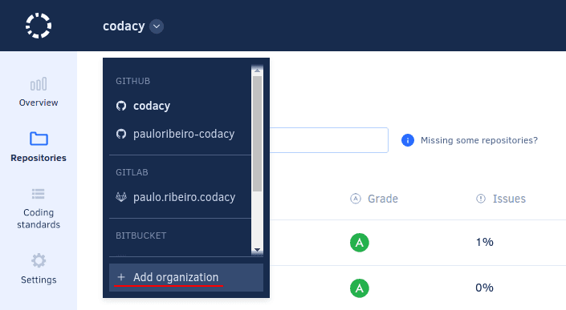

# What are organizations

Codacy organizations let you automatically import your Git provider organizations, repositories (including your personal repositories that don't belong to a Git provider organization), and team members into Codacy with a few clicks.

Changes to the organizations, repositories, and team members are synchronized with Codacy, avoiding the manual management of repositories and teams.

## Adding an organization

To add a new organization to Codacy, select **Add organization** on the navigation menu.

This opens the list of organizations on your Git providers. The organization with the same name as your Git provider username contains your personal repositories.

-   To add a new organization to Codacy, click the link **Add** for that organization.
-   To join an organization that's already on Codacy, click the link **Join** for that organization.
-   To add organizations from a Git provider not yet listed on this page, click **Add provider** and give the [necessary permissions](../getting-started/which-permissions-does-codacy-need-from-my-account.md) for Codacy to sync with the new Git provider and display your organizations.

!!! note
    If you can't see the organization you're looking for, follow the instructions in the card **Adding new organizations** or [these troubleshooting instructions](../faq/troubleshooting/why-cant-i-see-my-organization.md).

## Updates on the Git provider

<!-- TODO PLUTO-368 Review this section -->

In case you change your organization or repository on the Git provider, some changes are automatically reflected on Codacy. The following cases are supported, depending on your Git provider:

| Provider | Rename repository | Change repository visibility | Delete repository | Rename organization or group | Remove member from organization or group | Delete organization or group |
|---|---|---|---|---|---|---|
| GitHub Cloud | Yes | Yes | Yes | Yes | Yes | Yes |
| GitHub Enterprise | Yes | Yes | Yes | Yes | Yes | Yes |
| GitLab Cloud | No | No | No | No | No | No |
| GitLab Enterprise |  Yes | Yes | Yes | Yes | Yes | Yes |
| Bitbucket Cloud | Yes | Yes | No | No | No | No |
| Bitbucket Server | Yes | Yes | No | No | No | No |

Check out the [roles and permission mapping from the Git providers](roles-and-permissions-for-organizations.md).

## Deleting an organization

Deleting an organization on Codacy completely removes the configurations and all data related to the organization and its repositories from Codacy. This operation doesn't make any changes on your Git provider.

To delete an organization, open the **Profile** page and click the button **Delete organization**.

!!! note
    **If you're using Codacy Cloud** we'll ask for your feedback on why you're deleting your organization.

## See also

-   [How does Codacy support GitLab Cloud?](../faq/general/how-does-codacy-support-gitlab-cloud.md)
-   [How does Codacy support GitLab Enterprise?](../faq/general/how-does-codacy-support-gitlab-enterprise.md)
-   [How does Codacy support Bitbucket Cloud?](../faq/general/how-does-codacy-support-bitbucket-cloud.md)
-   [How does Codacy support Bitbucket Server?](../faq/general/how-does-codacy-support-bitbucket-server.md)
