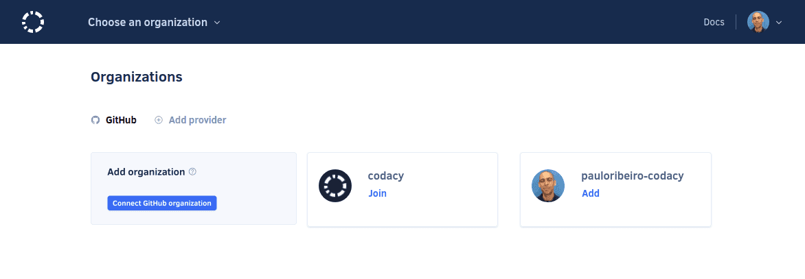
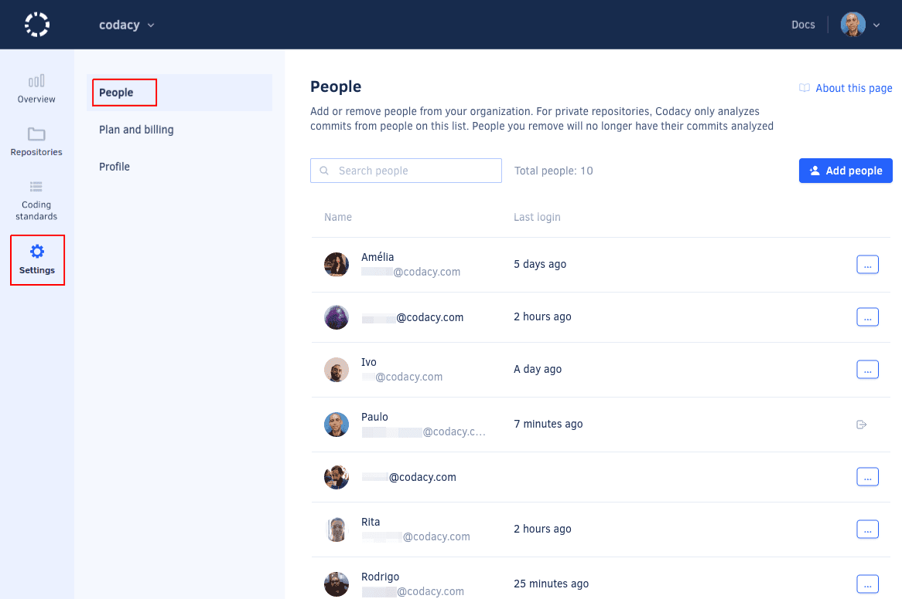

# What are synced organizations

With synced organizations, your Git provider organizations and members will be automatically imported into Codacy. Changes to membership will reflect on Codacy real time and you can add new repositories to Codacy in one click.

By setting up a synced organization, you are avoiding having to deal with manual team and repository management, duplicate repositories, stuck repositories created with insufficient permissions and blocked pull request status due to overriding.

## Adding an organization

Organizations that can be added to Codacy show up on the Organizations list.

If you can't see the organization you are looking for, [find out what could be the possible reasons](why-cant-i-see-my-organization.md).

## Managing people in an organization

You can see and manage who joined your organization on Codacy in the **People** page.

Members can remove themselves from organizations, while owners can remove themselves as well as other users, even other owners. Organizations must have at least one owner.

In the **Plan and Billing** page there are different ways to control who can join your organization:

-   **Allow new people to join**: team members with access on the Git provider will be able to join Codacy automatically and your billing will be updated accordingly.
-   **New people request to join**: team members need to request access in order to be able to join Codacy. You can override this setting for organization owners.

## Updates on the Git provider

In case you change your organization or repository on the Git provider, they'll be reflected on Codacy. The following cases are supported:

-   Changing the organization name
-   Changing a repository name
-   Changing a repository visibility

Check out the [roles and permission mapping from the Git providers](roles-and-permissions-for-synced-organizations.md).

## Deleting an organization

Delete an organization to remove that organization and all its repositories from Codacy.

To delete an organization, open the **Profile** page and click the button **Delete organization**. **If you are using Codacy Cloud**, Codacy will ask for your feedback on why you are deleting your organization.

