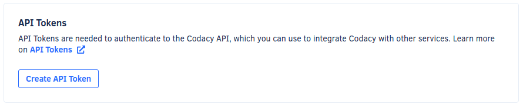

# API Tokens

API Tokens allow you authenticate when using the Codacy API. You must generate an API Token and include it in the headers of your API calls as described on the [Codacy API documentation](https://api.codacy.com/swagger#authentication).

To generate an API Token, go to your **Account Settings** and click on the tab **Access Management**. Codacy generates a new API token every time you click the button **Create API Token**.



To revoke access to the Codacy API, you must remove the corresponding API Token from the list. After this, all applications or services using that token to access the Codacy API will fail to authenticate and will receive the following error reply:

```text
{"error":"not found"}
```

To send coverage for your repository, you need the [Project API token](../repositories-configure/coverage.md).
