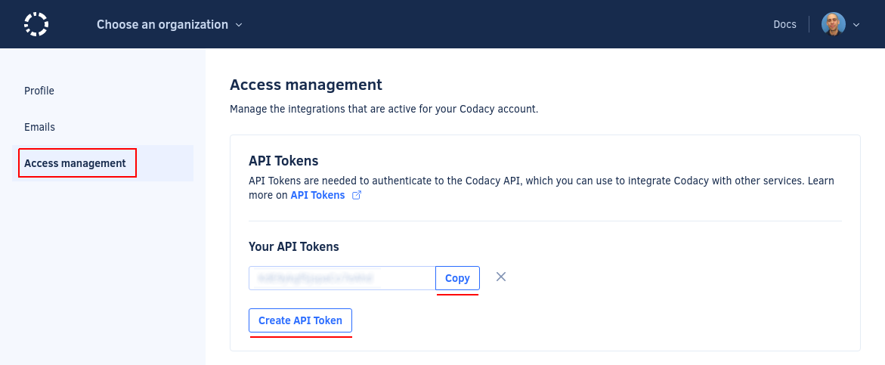
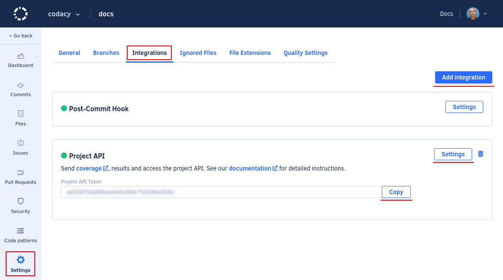

# Codacy API tokens

Codacy API tokens allow you to authenticate when using the Codacy API. You must generate a Codacy API token and include it in the headers of your API calls as described on the [Codacy API documentation](https://api.codacy.com/api/api-docs#authentication).

The Codacy API offers specific methods to manipulate repositories. To use these API methods, run local analysis, or send coverage results for your repository, you must use a project API token generated specifically for your repository. Each project API token is only valid for one repository.

To send coverage results for your repository or to limit the API access to a repository, use a [project API token](#).



## Account API tokens

To generate an account API token:

1.  Open your account, tab **Access management**.

1.  Click the button **Create API token**:

To revoke an account API token, click the cross next to the token. After this, all applications or services using that token to access the Codacy API will fail to authenticate and will receive the reply `{"error":"not found"}`.

!!! tip
    You can create multiple account API tokens. This can be useful to have a more flexible control by revoking only a specific token.

## Project API tokens

To generate a project API token:

1.  Open your repository **Settings**, tab **Integrations**.

1.  Click the button **Add integration** and add a **Project API** integration.

1.  Click the button **Settings** on the **Project API** integration and copy the project API token.

    

To revoke a project API token, click the trash can icon for the corresponding **Project API** integration. After this, all applications or services using that token to access the Codacy API will fail to authenticate and will receive the reply `{"error":"not found"}`.

!!! tip
    You can create multiple project API tokens. This can be useful to have a more flexible control by revoking only a specific token.

## See also

-   [Running local analysis](../related-tools/local-analysis/running-local-analysis.md)
-   [Client-side tools](local-analysis/client-side-tools.md)
-   [Adding coverage to your repository](../coverage-reporter/index.md)
-   To have access to all repositories, use a [Codacy API token](../related-tools/codacy-api-tokens.md)

