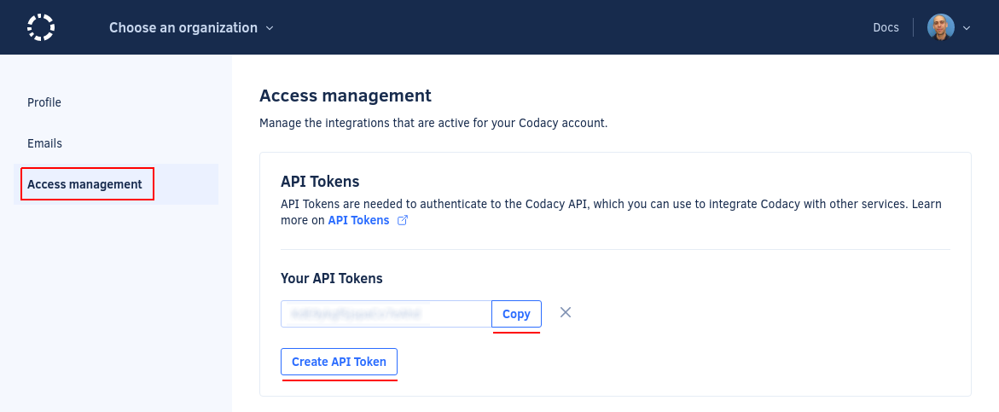
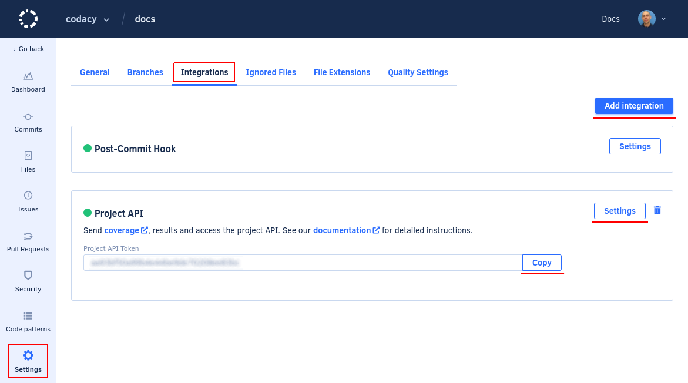

# API tokens

API tokens allow you to authenticate when using the Codacy API by including them in the headers of your API calls. See how to authenticate using the Codacy [API v2](https://api.codacy.com/swagger#authentication) and [API v3](https://api.codacy.com/api/api-docs#authentication).

You also need an API token when [uploading coverage data to Codacy](../../coverage-reporter/index.md) or [uploading the results of running local analysis](../local-analysis/running-local-analysis.md).

Codacy provides two types of API tokens:

-   **Account API tokens** are defined at the Codacy user account level. Each account API token authorizes access to the same organizations and repositories as the owner of the account.

-   **Project API tokens** are defined on individual repositories. Each project API token only authorizes access to the corresponding repository.

The sections below provide detailed instructions on how to generate and revoke API tokens.



## Account API tokens

To generate an account API token:

1.  Open your account, tab **Access management**.

1.  Click the button **Create API token**:

To revoke an account API token, click the cross next to the token. After this, all applications or services using that token to access the Codacy API will fail to authenticate and will receive the reply `{"error":"not found"}`.

!!! tip
    You can create multiple account API tokens. This can be useful to have a more flexible control by revoking only a specific token.

## Project API tokens

To generate a project API token:

1.  Open your repository **Settings**, tab **Integrations**.

1.  Click the button **Add integration** and add a **Project API** integration.

1.  Click the button **Settings** on the **Project API** integration and copy the project API token.

    

To revoke a project API token, click the trash can icon for the corresponding **Project API** integration. After this, all applications or services using that token to access the Codacy API will fail to authenticate and will receive the reply `{"error":"not found"}`.

!!! tip
    You can create multiple project API tokens. This can be useful to have a more flexible control by revoking only a specific token.

## See also

-   [Adding coverage to your repository](../../coverage-reporter/index.md)
-   [Running local analysis](../local-analysis/running-local-analysis.md)
-   [Client-side tools](../local-analysis/client-side-tools.md)

