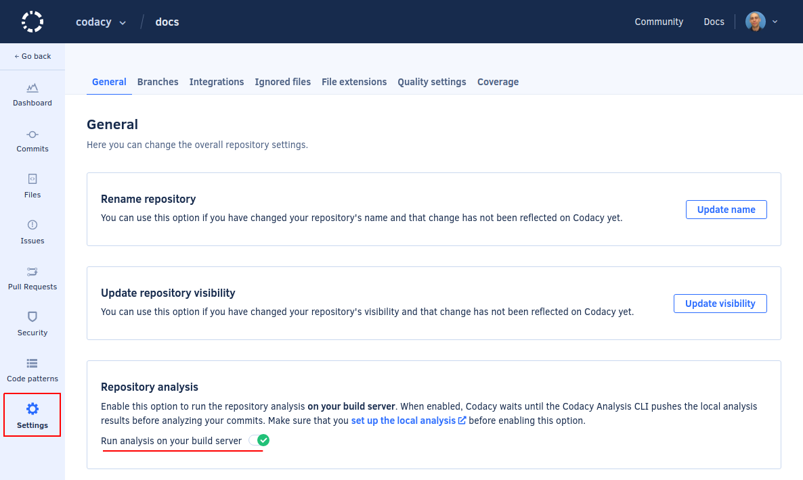

# Running aligncheck

To run aligncheck as a [client-side tool](client-side-tools.md):

1.  Enable **Run analysis through build server** in your repository **Settings**, tab **General**, **Repository analysis**.

    This setting enables Codacy to wait for the results of the local analysis before resuming the analysis of your commits.

    

1.  Obtain a [project API token](../codacy-api-tokens.md#project-api-tokens) for your repository.

    You need the project API Token to allow the Codacy Analysis CLI to authenticate to Codacy when reporting the analysis results.

1.  Set the following environment variable to specify your project API Token:

    ```bash
    export CODACY_PROJECT_TOKEN=<your project API Token>
    ```

    

1.  **If you are using Codacy Self-hosted** set the following environment variable to specify your Codacy instance URL:

    ```bash
    export CODACY_API_BASE_URL=<your Codacy instance URL>
    ```

1.  Download and run the [Codacy Analysis CLI](https://github.com/codacy/codacy-analysis-cli#install){: target="_blank"} on the root of the repository, specifying the tool aligncheck.

    ```bash
    codacy-analysis-cli analyze --tool aligncheck \
                                --allow-network \
                                --upload \
                                --verbose
    ```

The Codacy Analysis CLI runs aligncheck on your repository and uploads the results to Codacy so you can use them in your workflow.
