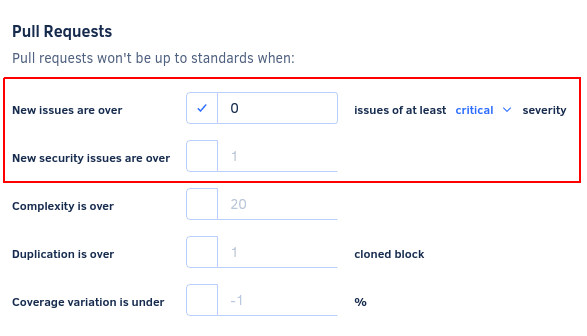

# Cloud August 2021

These release notes are for the Codacy Cloud updates during August 2021.

<!--

Jira issues without release notes:

Epics:
-   https://codacy.atlassian.net/browse/CY-4617
-   https://codacy.atlassian.net/browse/CY-4605

Bugs:

Jira issues with disabled release notes:

Epics:
-   https://codacy.atlassian.net/browse/CY-4844
-   https://codacy.atlassian.net/browse/CY-4676
-   https://codacy.atlassian.net/browse/CY-4654

Bugs:
-   https://codacy.atlassian.net/browse/CY-4865
-   https://codacy.atlassian.net/browse/CY-4852
-   https://codacy.atlassian.net/browse/CY-4847
-   https://codacy.atlassian.net/browse/CY-4846
-   https://codacy.atlassian.net/browse/CY-4839
-   https://codacy.atlassian.net/browse/CY-4764
-   https://codacy.atlassian.net/browse/CY-4759
-   https://codacy.atlassian.net/browse/CY-4756
-   https://codacy.atlassian.net/browse/CY-4745
-   https://codacy.atlassian.net/browse/CY-4737
-   https://codacy.atlassian.net/browse/CY-4622
-   https://codacy.atlassian.net/browse/CY-4461

-->

## Product enhancements

It's now possible to [configure the Codacy quality settings](https://docs.codacy.com/v4.2/repositories-configure/adjusting-quality-settings/) with the minimum severity level of new issues and a maximum number of new security issues, giving you more control over the pull requests that Codacy blocks from being merged. Besides this, the status reported by Codacy on pull requests now includes more information on why the quality checks failed. (CY-4216)

## Tool versions

Codacy Cloud now includes the tool versions below. The tools that were recently updated are highlighted in bold:

-   Ameba 0.13.1
-   Bandit 1.7.0
-   Brakeman 4.3.1
-   BundlerAudit 0.6.1
-   Checkov 2.0.283
-   Checkstyle 8.44
-   Clang-tidy 10.0.1
-   CodeNarc 1.6
-   Coffeelint 2.1.0
-   Cppcheck 2.2
-   Credo 1.4.0
-   CSSLint 1.0.5
-   Detekt 1.17.1
-   **ESLint 7.32.0 (updated from 7.30.0)**
-   Faux-Pas 1.7.2
-   Flawfinder 2.0.11
-   Gosec 2.3.0
-   Hadolint 1.18.2
-   JacksonLinter 2.10.2
-   JSHint 2.12.0
-   markdownlint 0.23.1
-   PHP Code Sniffer 3.6.0
-   PHP Mess Detector 2.8.1
-   **PMD 6.36.0 (updated from 6.33.0)**
-   PMD (Legacy) 5.8.1
-   Prospector 1.3.1
-   PSScriptAnalyzer 1.18.3
-   Pylint 1.9.5
-   Pylint (Python 3) 2.7.4
-   RemarkLint 7.0.1
-   Revive 1.0.2
-   **Rubocop 1.19.1 (updated from 1.18.3)**
-   Scalastyle 1.5.0
-   ShellCheck v0.7.1
-   Sonar C# 8.25
-   Sonar Visual Basic 8.15
-   SpotBugs 4.1.2
-   SQLint 0.1.9
-   Staticcheck 2020.1.6
-   Stylelint 13.13.1
-   SwiftLint 0.40.0
-   Tailor 0.12.0
-   TSLint 6.1.3
-   TSQLLint 1.11.1
