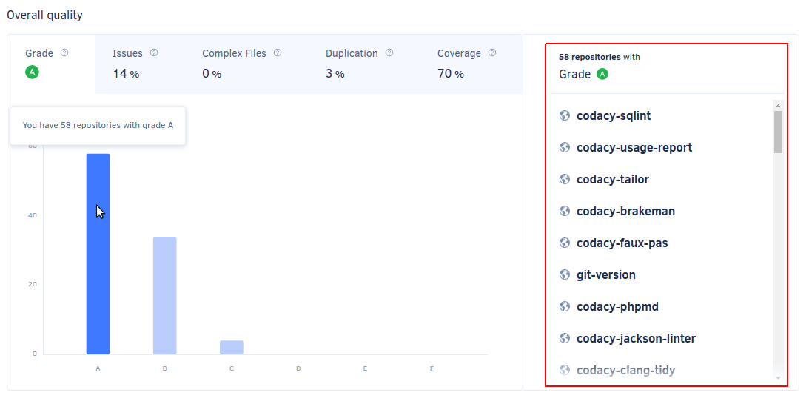

# Cloud February 2022

These release notes are for the Codacy Cloud updates during February 2022.

📢 [Visit the Codacy roadmap](https://roadmap.codacy.com) and let us know your feedback on both new and planned product updates!

<!--TODO Check these issues manually

Jira issues without release notes

Epics:
-   https://codacy.atlassian.net/browse/CY-5712
-   https://codacy.atlassian.net/browse/CY-5696
-   https://codacy.atlassian.net/browse/CY-5662
-   https://codacy.atlassian.net/browse/CY-5522
Bugs and Community Issues:
-   https://codacy.atlassian.net/browse/CY-5677
-   https://codacy.atlassian.net/browse/CY-5670
-   https://codacy.atlassian.net/browse/CY-5640
Others:
-   https://codacy.atlassian.net/browse/CY-5667
-   https://codacy.atlassian.net/browse/CY-5655
-   https://codacy.atlassian.net/browse/CY-5649
-   https://codacy.atlassian.net/browse/CY-5637
-   https://codacy.atlassian.net/browse/CY-5635
-   https://codacy.atlassian.net/browse/CY-5618
-   https://codacy.atlassian.net/browse/CY-5616
-   https://codacy.atlassian.net/browse/CY-5615
-   https://codacy.atlassian.net/browse/CY-2768
-   https://codacy.atlassian.net/browse/CY-1368
-   https://codacy.atlassian.net/browse/CY-1099

Jira issues with disabled release notes

Epics:
-   https://codacy.atlassian.net/browse/CY-5471
-   https://codacy.atlassian.net/browse/CY-5391
-   https://codacy.atlassian.net/browse/CY-5371
-   https://codacy.atlassian.net/browse/CY-4995
-   https://codacy.atlassian.net/browse/CY-4934
-   https://codacy.atlassian.net/browse/CY-3595
Bugs and Community Issues:
-   https://codacy.atlassian.net/browse/CY-5681
-   https://codacy.atlassian.net/browse/CY-5657
-   https://codacy.atlassian.net/browse/CY-5650
-   https://codacy.atlassian.net/browse/CY-5645
-   https://codacy.atlassian.net/browse/CY-5634
-   https://codacy.atlassian.net/browse/CY-5613
-   https://codacy.atlassian.net/browse/CY-5595
-   https://codacy.atlassian.net/browse/CY-5592
-   https://codacy.atlassian.net/browse/CY-5567
-   https://codacy.atlassian.net/browse/CY-5552
-   https://codacy.atlassian.net/browse/CY-5519
-   https://codacy.atlassian.net/browse/CY-5509
-   https://codacy.atlassian.net/browse/CY-5502
-   https://codacy.atlassian.net/browse/CY-5498
-   https://codacy.atlassian.net/browse/CY-5474
-   https://codacy.atlassian.net/browse/CY-5462
-   https://codacy.atlassian.net/browse/CY-5344
-   https://codacy.atlassian.net/browse/CY-5144
-->

## Product enhancements

-   It's now possible to click on the organization overview chart to drill down on the information and understand which repositories require attention to improve the organization's code quality. (CY-5580)

    

-   Now, Codacy calculates the new metric [diff coverage for pull requests](../../repositories/pull-requests.md#pull-request-quality-overview). (CY-5533)

    It's also possible to [set up a quality gate rule](../../repositories-configure/adjusting-quality-settings.md#gates) for diff coverage. (CY-5534)
    
    

    

## Bug fixes

-   Fixed an issue that caused the v2 API endpoint to trigger the analysis of a commit to not start the analysis as expected. (CY-5622)
-   Updated the [codacy-rubocop](https://github.com/codacy/codacy-rubocop) plugins listed below.

    -   [rubocop-shopify 2.4.0](https://rubygems.org/gems/rubocop-shopify/versions/2.4.0)
    -   [rubocop-sorbet 0.6.5](https://rubygems.org/gems/rubocop-sorbet/versions/0.6.5)
    -   [rubocop-rails 2.13.2](https://rubygems.org/gems/rubocop-rails/versions/2.13.2)
    -   [rubocop-performance 1.13.2](https://rubygems.org/gems/rubocop-performance/versions/1.13.2)
    -   [rubocop-graphql 0.12.3](https://rubygems.org/gems/rubocop-graphql/versions/0.12.3)
    -   [rubocop-ast 1.15.1](https://rubygems.org/gems/rubocop-ast/versions/1.15.1) (CY-5550)
-   Now, the **Coverage** column always appears on the Files page even when there's no coverage data, avoiding a jump in the view. (CY-5518)
-   You can now use the Codacy configuration file to [adjust how PMD CPD detects duplicated code](../../repositories-configure/codacy-configuration-file.md#pmd-cpd-duplication), giving you more flexibility to eliminate false positives. (CY-5184)

## Tool versions

Codacy Cloud now includes the tool versions below. The tools that were recently updated are highlighted in bold:

-   Ameba 0.13.1
-   Bandit 1.7.0
-   Brakeman 4.3.1
-   bundler-audit 0.6.1
-   Checkov 2.0.399
-   Checkstyle 8.44
-   Clang-Tidy 10.0.1
-   CodeNarc 2.2.0
-   CoffeeLint 2.1.0
-   Cppcheck 2.2
-   Credo 1.4.0
-   CSSLint 1.0.5
-   dartanalyzer 2.15.1
-   detekt 1.19.0
-   ESLint 7.32.0
-   Faux-Pas 1.7.2
-   Flawfinder 2.0.11
-   Gosec 2.8.1
-   Hadolint 1.18.2
-   Jackson Linter 2.10.2
-   JSHint 2.12.0
-   markdownlint 0.23.1
-   PHP Mess Detector 2.10.1
-   PHP_CodeSniffer 3.6.2
-   PMD 6.36.0
-   Prospector 1.3.1
-   PSScriptAnalyzer 1.18.3
-   Pylint 1.9.5
-   Pylint (Python 3) 2.7.4
-   remark-lint 7.0.1
-   Revive 1.0.2
-   **RuboCop 1.25.1 (updated from 1.25.0)**
-   Scalastyle 1.5.0
-   ShellCheck v0.7.2
-   Sonar C# 8.30
-   Sonar Visual Basic 8.15
-   spectral-rulesets 1.2.7
-   **SpotBugs 4.5.3 (updated from 4.1.2)**
-   **SQLint 0.2.1 (updated from 0.1.9)**
-   Staticcheck 2020.1.6
-   Stylelint 14.2.0
-   SwiftLint 0.43.1
-   Tailor 0.12.0
-   TSLint 6.1.3
-   TSQLLint 1.11.1
