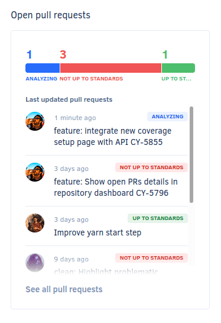

# Cloud March 2022

These release notes are for the Codacy Cloud updates during March 2022.

📢 [Visit the Codacy roadmap](https://roadmap.codacy.com) and let us know your feedback on both new and planned product updates!

## Product enhancements

-   GitLab project members with the Maintainer role can now perform the following operations on Codacy:

    -   Adding the project
    -   Configuring the project
    -   Changing the following analysis settings: ignoring issues and files, configuring code patterns, configuring file extensions, and managing branches

    [See the updated permissions](../../organizations/roles-and-permissions-for-synced-organizations.md#permissions-for-gitlab) for all GitLab roles. (CY-5876)

-   Included ESLint 8 as a new supported tool and deprecated ESLint 7.

    New repositories will use ESLint 8 by default, and **Codacy won't provide more updates for ESLint 7 and will remove ESLint 7 on April 4, 2023**. [See this post on the Codacy Community](https://community.codacy.com/t/introducing-eslint-version-8-on-our-platform/868) for more details on this update. (CY-5848)

-   The [Codacy Coverage Reporter Docker image](https://hub.docker.com/r/codacy/codacy-coverage-reporter/tags){: target="_blank"} is now published with a stable tag as well. For example, we publish `codacy/codacy-coverage-reporter:13.8.0` as well as `codacy/codacy-coverage-reporter:13`. (CY-5837)

-   Added the plugins [vue-template-compiler](https://www.npmjs.com/package/vue-template-compiler){: target="_blank"} and [eslint-plugin-vuejs-accessibility](https://www.npmjs.com/package/eslint-plugin-vuejs-accessibility){: target="_blank"} to [codacy-eslint](https://github.com/codacy/codacy-eslint){: target="_blank"}. (CY-5821)

-   RuboCop configuration files can now reference the [GraphQL extension](https://github.com/DmitryTsepelev/rubocop-graphql){: target="_blank"}. (CY-5814)

-   The [**Repositories list** page](https://docs.codacy.com/v7.0/organizations/managing-repositories/) now displays a warning icon to improve the visibility of warnings and errors affecting the repositories. (CY-5797)

    

-   The [**Open pull requests** area](https://docs.codacy.com/v7.0/repositories/repository-dashboard/#open-pull-requests) on the Repository Dashboard now displays more details about the open pull requests. (CY-5796)

    

-   The [**Access management** page](https://docs.codacy.com/v7.0/getting-started/which-permissions-does-codacy-need-from-my-account/#revoking-access-to-integrations) under your account settings now also allows adding new Git providers. (CY-5795)

-   The **Organization Overview** and **Repositories list** pages have improved loading times using a short-lived cache in the user's browser. (CY-5793)

-   Codacy Coverage Reporter now supports [automatic commit SHA hash detection](../../coverage-reporter/troubleshooting-common-issues.md#commit-detection) on AWS CodeBuild. (CY-5787)

-   Added new Codacy Analysis CLI options to allow uploading analysis results in batches of configurable size and to use only specific tool categories while performing the analysis. For more information [see the documentation](https://github.com/codacy/codacy-analysis-cli#commands-and-configuration) of the options `--tool` and `--upload-batch-size`. (CY-5727)

-   The [**Repositories list** page](https://docs.codacy.com/v7.0/organizations/managing-repositories/) now allows sorting the list of repositories using the available columns in organizations with less than 100 repositories. (CY-5695)

-   Moved the code coverage setup page under the repository **Settings**, tab **Coverage**. The new page includes a list of the most recent coverage reports uploaded to Codacy to [help you troubleshoot your coverage setup](../../coverage-reporter/index.md#uploading-coverage). (CY-5399)

## Bug fixes

-   Fixed an issue that prevented running [standalone tools](../../related-tools/local-analysis/client-side-tools.md) using the Codacy Analysis CLI GitHub Action. (CY-5812)
-   Fixed an issue that caused inconsistencies on the last updated date when listing GitHub repositories. Now, the last updated date is the [date of the last push to the repositories](../../organizations/organization-overview.md#last-updated-repositories). (CY-5784)
-   Fixed an issue on the API endpoint [getRepositoryPullRequest](https://api.codacy.com/api/api-docs#getrepositorypullrequest) where the grades for coverage weren't being taken into account when calculating if the pull request is up to standards. (CY-5716)
-   dartanalyzer now supports including the packages [lints](https://pub.dev/packages/lints){: target="_blank"} and [flutter_lints](https://pub.dev/packages/flutter_lints){: target="_blank"} in the `analysis_option.yaml` configuration file. (CY-5626)
-   The re-analyze button is now hidden on repositories that are running analysis through a build server. (CY-4205)

## Tool versions

Codacy Cloud now includes the tool versions below. The tools that were recently updated are highlighted in bold:

-   Ameba 0.13.1
-   Bandit 1.7.0
-   Brakeman 4.3.1
-   bundler-audit 0.6.1
-   Checkov 2.0.399
-   Checkstyle 8.44
-   Clang-Tidy 10.0.1
-   CodeNarc 2.2.0
-   CoffeeLint 2.1.0
-   Cppcheck 2.2
-   Credo 1.4.0
-   CSSLint 1.0.5
-   **[dartanalyzer 2.16.1](https://github.com/dart-lang/sdk/blob/main/CHANGELOG.md#2161---2022-02-09){: target="_blank"} (updated from 2.15.1)**
-   detekt 1.19.0
-   **[ESLint 8.12.0](https://github.com/eslint/eslint/releases/tag/v8.12.0){: target="_blank"} (new)**
-   **ESLint 7.32.0 (deprecated)**
-   Faux-Pas 1.7.2
-   **[Flawfinder 2.0.19](https://github.com/david-a-wheeler/flawfinder/blob/master/ChangeLog){: target="_blank"} (updated from 2.0.11)**
-   Gosec 2.8.1
-   Hadolint 1.18.2
-   Jackson Linter 2.10.2
-   JSHint 2.12.0
-   markdownlint 0.23.1
-   PHP Mess Detector 2.10.1
-   PHP_CodeSniffer 3.6.2
-   PMD 6.36.0
-   Prospector 1.3.1
-   PSScriptAnalyzer 1.18.3
-   Pylint 1.9.5
-   Pylint (Python 3) 2.7.4
-   remark-lint 7.0.1
-   Revive 1.0.2
-   **[RuboCop 1.26.1](https://github.com/rubocop/rubocop/releases/tag/v1.26.1){: target="_blank"} (updated from 1.25.1)**
-   Scalastyle 1.5.0
-   ShellCheck v0.7.2
-   Sonar C# 8.30
-   Sonar Visual Basic 8.15
-   spectral-rulesets 1.2.7
-   SpotBugs 4.5.3
-   SQLint 0.2.1
-   Staticcheck 2020.1.6
-   Stylelint 14.2.0
-   SwiftLint 0.43.1
-   Tailor 0.12.0
-   TSLint 6.1.3
-   TSQLLint 1.11.1
