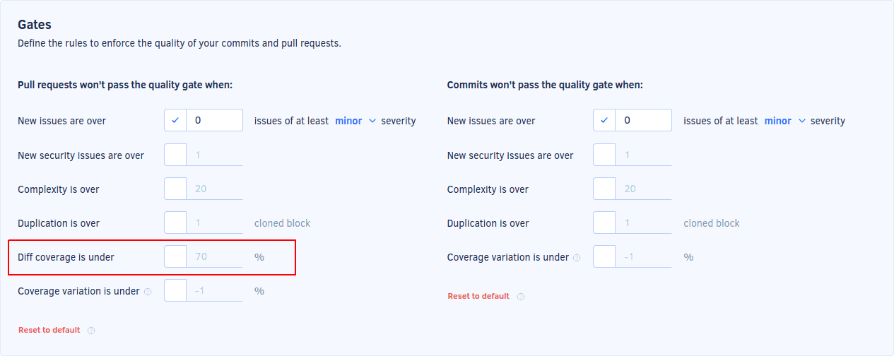

# Cloud March 2022

These release notes are for the Codacy Cloud updates during March 2022.

📢 [Visit the Codacy roadmap](https://roadmap.codacy.com) and let us know your feedback on both new and planned product updates!

<!--TODO Check these issues manually

Jira issues without release notes

Epics:
-   https://codacy.atlassian.net/browse/CY-5738
-   https://codacy.atlassian.net/browse/CY-5606
-   https://codacy.atlassian.net/browse/CY-5573
-   https://codacy.atlassian.net/browse/CY-5522
-   https://codacy.atlassian.net/browse/CY-5399
Bugs and Community Issues:
-   https://codacy.atlassian.net/browse/CY-5846
Others:
-   https://codacy.atlassian.net/browse/CY-5940
-   https://codacy.atlassian.net/browse/CY-5920
-   https://codacy.atlassian.net/browse/CY-5873
-   https://codacy.atlassian.net/browse/CY-5797
-   https://codacy.atlassian.net/browse/CY-5796
-   https://codacy.atlassian.net/browse/CY-5795
-   https://codacy.atlassian.net/browse/CY-5794
-   https://codacy.atlassian.net/browse/CY-5793
-   https://codacy.atlassian.net/browse/CY-5783
-   https://codacy.atlassian.net/browse/CY-5782
-   https://codacy.atlassian.net/browse/CY-5772
-   https://codacy.atlassian.net/browse/CY-5770
-   https://codacy.atlassian.net/browse/CY-5768
-   https://codacy.atlassian.net/browse/CY-5755
-   https://codacy.atlassian.net/browse/CY-5721
-   https://codacy.atlassian.net/browse/CY-5702
-   https://codacy.atlassian.net/browse/CY-5695
-   https://codacy.atlassian.net/browse/CY-5648

Jira issues with disabled release notes

Epics:
-   https://codacy.atlassian.net/browse/CY-5761
-   https://codacy.atlassian.net/browse/CY-5760
-   https://codacy.atlassian.net/browse/CY-5748
-   https://codacy.atlassian.net/browse/CY-5747
-   https://codacy.atlassian.net/browse/CY-5712
-   https://codacy.atlassian.net/browse/CY-5701
-   https://codacy.atlassian.net/browse/CY-5560
-   https://codacy.atlassian.net/browse/CY-5316
-   https://codacy.atlassian.net/browse/CY-4844
Bugs and Community Issues:
-   https://codacy.atlassian.net/browse/CY-5947
-   https://codacy.atlassian.net/browse/CY-5931
-   https://codacy.atlassian.net/browse/CY-5911
-   https://codacy.atlassian.net/browse/CY-5896
-   https://codacy.atlassian.net/browse/CY-5895
-   https://codacy.atlassian.net/browse/CY-5849
-   https://codacy.atlassian.net/browse/CY-5847
-   https://codacy.atlassian.net/browse/CY-5835
-   https://codacy.atlassian.net/browse/CY-5830
-   https://codacy.atlassian.net/browse/CY-5822
-   https://codacy.atlassian.net/browse/CY-5821
-   https://codacy.atlassian.net/browse/CY-5798
-   https://codacy.atlassian.net/browse/CY-5791
-   https://codacy.atlassian.net/browse/CY-5763
-   https://codacy.atlassian.net/browse/CY-5756
-   https://codacy.atlassian.net/browse/CY-5726
-   https://codacy.atlassian.net/browse/CY-5711
-   https://codacy.atlassian.net/browse/CY-5678
-   https://codacy.atlassian.net/browse/CY-5654
-   https://codacy.atlassian.net/browse/CY-5633
-   https://codacy.atlassian.net/browse/CY-5614
-   https://codacy.atlassian.net/browse/CY-5551
-->

## Product enhancements

-   GitLab project members with the Maintainer role can now perform the following operations on Codacy:

    -   Adding the project
    -   Configuring the project
    -   Changing the following analysis settings: ignoring issues and files, configuring code patterns, configuring file extensions, and managing branches
    
    [See the updated permissions](../../organizations/roles-and-permissions-for-synced-organizations.md) for all GitLab roles. (CY-5876)
-   It's also possible to [set up a quality gate rule](../../repositories-configure/adjusting-quality-settings.md#gates) for diff coverage.  (CY-5534)

## Bug fixes

-   Included ESLint 8 as a new supported tool and deprecated ESLint 7.

New repositories will use ESLint 7 by default, but **Codacy won't provide more updates for ESLint 7 and will remove ESLint 7 on April 4, 2023**. (CY-5848)
-   Now the `codacy/codacy-coverage-reporter` docker image is published with a stable tag as well. For example we publish `codacy/codacy-coverage-reporter:13.8.0` as well as `codacy/codacy-coverage-reporter:13` (CY-5837)
-   Prevented the tool from crashing by adding graphql as a gem dependency so it can be referenced by user configuration files (CY-5814)
-   Allow Standalone tools to run in the CLI-action (CY-5812)
-   Support Reporting Coverage in AWS CodeBuild CI  (CY-5787)
-   Fixed an issue that caused inconsistencies on the last updated date when listing GitHub repositories. Now, the last updated date is the [date of the last push to the repositories](../../organizations/organization-overview.md#last-updated-repositories). (CY-5784)
-   Added capabilities for results to be sent to Codacy in batches. The size of these batches can be set through a new parameter.
Added capabilities to run only issues analysis using the codacy-analysis-cli (CY-5727)
-   Fixed an issue with the API endpoint to `getRepositoryPullRequest` where the grades for coverage were not being taken into account when calculating if the Pull Request is up to standards. (CY-5716)
-   dartanalyzer now supports including the packages [lints](https://pub.dev/packages/lints){: target="_blank"} and [flutter_lints](https://pub.dev/packages/flutter_lints){: target="_blank"} in the `analysis_option.yaml` configuration file. (CY-5626)
-   The re-analyze button is now hidden on repositories that are running analysis through a build server. (CY-4205)

## Tool versions

Codacy Cloud now includes the tool versions below. The tools that were recently updated are highlighted in bold:

-   Ameba 0.13.1
-   Bandit 1.7.0
-   Brakeman 4.3.1
-   bundler-audit 0.6.1
-   Checkov 2.0.399
-   Checkstyle 8.44
-   Clang-Tidy 10.0.1
-   CodeNarc 2.2.0
-   CoffeeLint 2.1.0
-   Cppcheck 2.2
-   Credo 1.4.0
-   CSSLint 1.0.5
-   **dartanalyzer 2.16.1 (updated from 2.15.1)**
-   detekt 1.19.0
-   **ESLint 8.12.0 (new)**
-   **ESLint 7.32.0 (deprecated)**
-   Faux-Pas 1.7.2
-   **Flawfinder 2.0.19 (updated from 2.0.11)**
-   Gosec 2.8.1
-   Hadolint 1.18.2
-   Jackson Linter 2.10.2
-   JSHint 2.12.0
-   markdownlint 0.23.1
-   PHP Mess Detector 2.10.1
-   PHP_CodeSniffer 3.6.2
-   PMD 6.36.0
-   Prospector 1.3.1
-   PSScriptAnalyzer 1.18.3
-   Pylint 1.9.5
-   Pylint (Python 3) 2.7.4
-   remark-lint 7.0.1
-   Revive 1.0.2
-   **RuboCop 1.26.1 (updated from 1.25.1)**
-   Scalastyle 1.5.0
-   ShellCheck v0.7.2
-   Sonar C# 8.30
-   Sonar Visual Basic 8.15
-   spectral-rulesets 1.2.7
-   SpotBugs 4.5.3
-   SQLint 0.2.1
-   Staticcheck 2020.1.6
-   Stylelint 14.2.0
-   SwiftLint 0.43.1
-   Tailor 0.12.0
-   TSLint 6.1.3
-   TSQLLint 1.11.1
