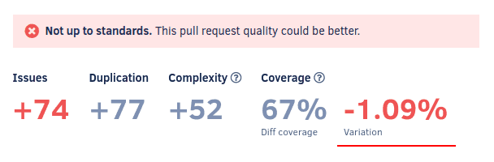

# Cloud August 2022

These release notes are for the Codacy Cloud updates during August 2022.

📢 [Visit the Codacy roadmap](https://roadmap.codacy.com) and let us know your feedback on both new and planned product updates!

## Product enhancements

-   The [GitHub integration](../../repositories-configure/integrations/github-integration.md) now uses a GitHub Apps token instead of a personal one so that the following features continue working even if the person who created the integration leaves the organization on GitHub:

    -   Analyzing new commits and pull requests
    -   Updating the status check of pull requests
    -   Suggesting changes
    -   Creating comments and issues on GitHub for issues detected by Codacy

    Additionally, all activity related to the GitHub integration features now appear as having been performed by Codacy instead of the person who created the integration. (PLUTO-36, PLUTO-77)

    

-   Added the new API endpoint [searchOrganizationRepositoriesWithAnalysis](https://api.codacy.com/api/api-docs#searchorganizationrepositorieswithanalysis) to allow searching for repositories in more advanced use cases. For now, it's possible to search for repositories filtered by a list of names. (PLUTO-45)

-   Codacy now displays the coverage variation metric with a precision of two decimal places on the [Pull request](../../repositories/pull-requests.md), [Commit](../../repositories/commits.md), and [Files](../../repositories/files.md) page.

    The increased precision of the metric reflects the code coverage changes better by reducing issues with rounding errors. (IO-92, IO-93)

    

-   Improved the Codacy Analysis CLI output to provide better feedback when tools fail to run. (IO-47)

-   Improved the error handling for the [Stylelint exit codes](https://stylelint.io/user-guide/usage/cli/#exit-codes). (IO-47)

-   The [Organization Overview](../../organizations/organization-overview.md) now allows filtering repositories to help you see and focus on the information for the repositories that matter most to your team. (CY-5573)

    

## Bug fixes

-   Codacy now supports user accounts with email addresses containing the special characters specified in [RFC 5322](https://www.rfc-editor.org/rfc/rfc5322#section-3.4.1). (PLUTO-73)
-   Fixed an issue that prevented changing code pattern configurations in a coding standard if Codacy added the code patterns only after the coding standard had been created. (PLUTO-37)
-   Fixed an issue in the Codacy Analysis CLI and the cloc metrics tool that made the tools fail when running for an empty set of files. (IO-47)
-   Fixed an issue that caused PMD to fail when called in some modes. (IO-47)

## Tool versions

Codacy Cloud now includes the tool versions below. The tools that were recently updated are highlighted in bold:

-   Ameba 0.13.1
-   Bandit 1.7.0
-   Brakeman 4.3.1
-   bundler-audit 0.6.1
-   Checkov 2.1.81
-   Checkstyle 10.3.1
-   Clang-Tidy 10.0.1
-   CodeNarc 2.2.0
-   CoffeeLint 2.1.0
-   Cppcheck 2.2
-   Credo 1.4.0
-   CSSLint 1.0.5
-   dartanalyzer 2.17.0
-   detekt 1.19.0
-   ESLint 8.18.0
-   ESLint (deprecated) 7.32.0
-   Faux-Pas 1.7.2
-   Flawfinder 2.0.19
-   Gosec 2.8.1
-   Hadolint 1.18.2
-   Jackson Linter 2.10.2
-   JSHint 2.12.0
-   markdownlint 0.23.1
-   PHP Mess Detector 2.10.1
-   PHP_CodeSniffer 3.6.2
-   **[PMD 6.48.0](https://pmd.sourceforge.io/pmd-6.48.0/pmd_release_notes.html) (updated from 6.36.0)**
-   Prospector 1.7.7
-   PSScriptAnalyzer 1.18.3
-   Pylint 1.9.5
-   Pylint (Python 3) 2.14.5
-   remark-lint 7.0.1
-   Revive 1.2.1
-   **[RuboCop 1.32.0](https://github.com/rubocop/rubocop/releases/tag/v1.32.0) (updated from 1.28.2)**
-   Scalastyle 1.5.0
-   ShellCheck 0.8.0
-   SonarC# 8.39
-   SonarVB 8.15
-   Spectral 1.2.7
-   SpotBugs 4.5.3
-   SQLint 0.2.1
-   **[Staticcheck 2022.1.3](https://staticcheck.io/changes/2022.1/#2022.1.3) (updated from 2020.1.6)**
-   Stylelint 14.2.0
-   SwiftLint 0.43.1
-   Tailor 0.12.0
-   TSLint 6.1.3
-   TSQLLint 1.11.1
