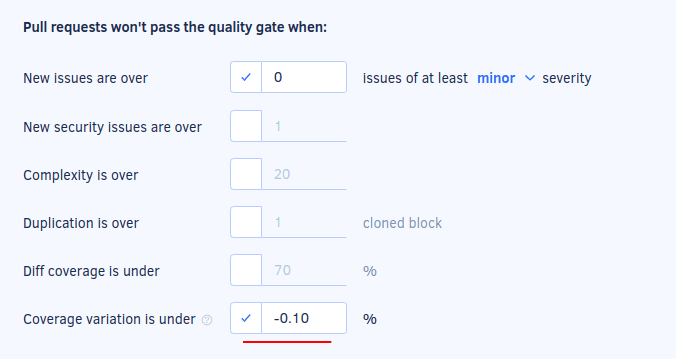
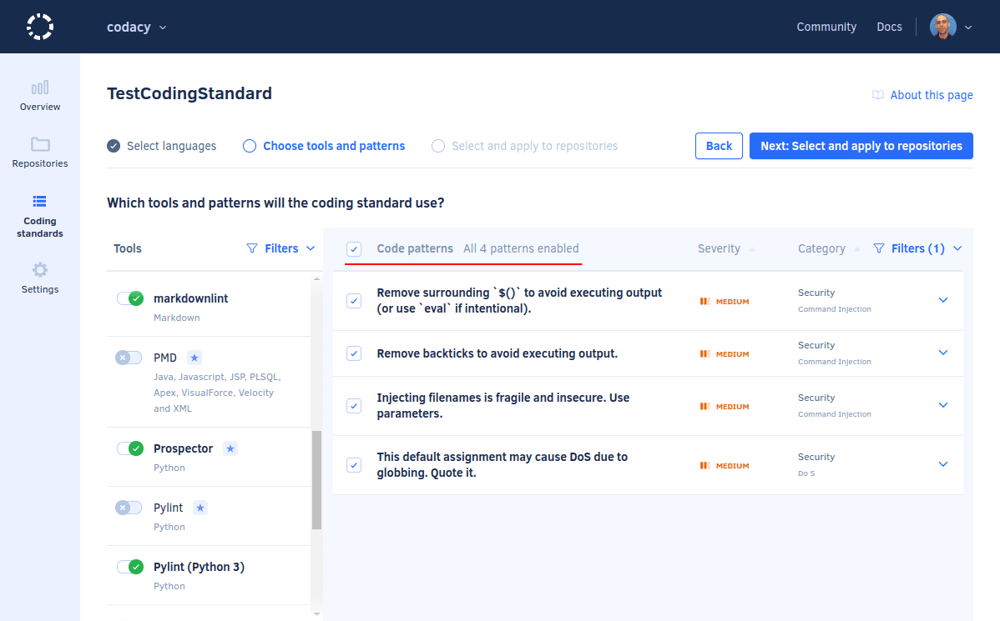

# Cloud September 2022

These release notes are for the Codacy Cloud updates during September 2022.

📢 [Visit the Codacy roadmap](https://roadmap.codacy.com) and let us know your feedback on both new and planned product updates!

<!--TODO Check these issues manually

Jira issues without release notes

Others:
-   https://codacy.atlassian.net/browse/CY-6508
-   https://codacy.atlassian.net/browse/CY-6467
-   https://codacy.atlassian.net/browse/CY-6455
-   https://codacy.atlassian.net/browse/CY-6421
-   https://codacy.atlassian.net/browse/CY-6411
-   https://codacy.atlassian.net/browse/PLUTO-72

Jira issues with disabled release notes

Epics:
-   https://codacy.atlassian.net/browse/IO-54
Bugs and Community Issues:
-   https://codacy.atlassian.net/browse/IO-129
-   https://codacy.atlassian.net/browse/PLUTO-103
-   https://codacy.atlassian.net/browse/CY-6496
-   https://codacy.atlassian.net/browse/PLUTO-90
-->

## Product enhancements

-   Codacy now displays the coverage variation metric with a precision of two decimal places on the [Repository Dashboard](../../repositories/repository-dashboard.md) and [Organization Overview](../../organizations/organization-overview.md), and you can [define quality gates](../../repositories-configure/adjusting-quality-settings.md#gates) with a coverage variation threshold using the same precision.

    The increased precision of the metric reflects the code coverage changes better by reducing the false changes due to rounding errors. (IO-54, IO-56)

    

-   While [configuring a coding standard](../../organizations/using-a-coding-standard.md), there's now a checkbox on the header of the code pattern list that allows toggling all code patterns that are currently visible on the list. This allows you to conveniently toggle code patterns in bulk, for example, to enable all security code patterns. (CY-6336)

    

## Bug fixes

## Tool versions

Codacy Cloud now includes the tool versions below. The tools that were recently updated are highlighted in bold:

-   Ameba 0.13.1
-   Bandit 1.7.0
-   Brakeman 4.3.1
-   bundler-audit 0.6.1
-   **[Checkov 2.1.188](https://github.com/bridgecrewio/checkov/releases/tag/2.1.188) (updated from 2.1.81)**
-   Checkstyle 10.3.1
-   Clang-Tidy 10.0.1
-   CodeNarc 2.2.0
-   CoffeeLint 2.1.0
-   Cppcheck 2.2
-   Credo 1.4.0
-   CSSLint 1.0.5
-   dartanalyzer 2.17.0
-   detekt 1.19.0
-   **[ESLint 8.23.1](https://github.com/eslint/eslint/releases/tag/v8.23.1) (updated from 8.18.0)**
-   ESLint (deprecated) 7.32.0
-   Faux-Pas 1.7.2
-   Flawfinder 2.0.19
-   Gosec 2.8.1
-   Hadolint 1.18.2
-   Jackson Linter 2.10.2
-   JSHint 2.12.0
-   markdownlint 0.23.1
-   PHP Mess Detector 2.10.1
-   PHP_CodeSniffer 3.6.2
-   PMD 6.48.0
-   Prospector 1.7.7
-   PSScriptAnalyzer 1.18.3
-   Pylint 1.9.5
-   Pylint (Python 3) 2.14.5
-   remark-lint 7.0.1
-   **[Revive 1.2.3](https://github.com/mgechev/revive/releases/tag/v1.2.3) (updated from 1.2.1)**
-   RuboCop 1.32.0
-   Scalastyle 1.5.0
-   ShellCheck 0.8.0
-   Sonar C# 8.39
-   Sonar Visual Basic 8.15
-   spectral-rulesets 1.2.7
-   SpotBugs 4.5.3
-   SQLint 0.2.1
-   Staticcheck 2022.1.3
-   Stylelint 14.2.0
-   SwiftLint 0.43.1
-   Tailor 0.12.0
-   TSLint 6.1.3
-   TSQLLint 1.11.1
