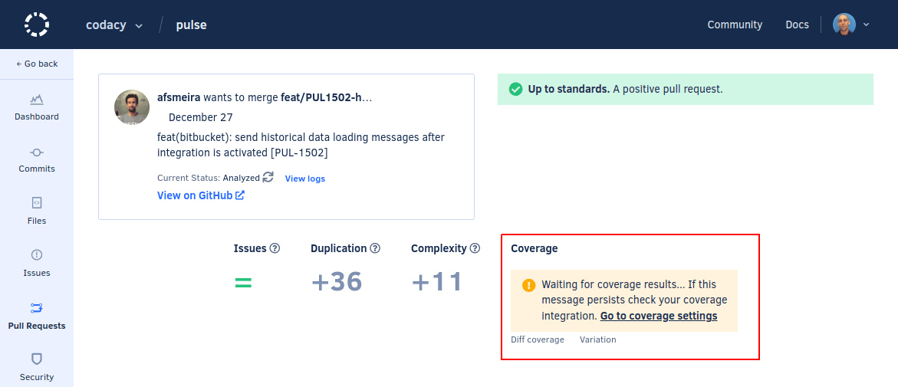

# Cloud December 2022

These release notes are for the Codacy Cloud updates during December 2022.

📢 [Visit the Codacy roadmap](https://roadmap.codacy.com) and let us know your feedback on both new and planned product updates!

## Product enhancements

-   The pull request detail page now displays a message when Codacy can't calculate the pull request metrics. The message includes a link to the **Coverage** tab in your repository settings, where you can [test and validate your coverage setup](../../coverage-reporter/index.md#validating-coverage). (IO-152)

    

## Bug fixes

-   Fixed an issue that caused Codacy to display the coverage value on the wrong file in specific edge cases. (COV-25)
-   All [coding standards API endpoints](https://api.codacy.com/api/api-docs#codacy-api-coding-standards) now return the **`403 Forbidden`** status code when authorization is required instead of **`401 Forbidden`**, since user permissions on Codacy are [synced with the permissions on the Git provider](../../organizations/roles-and-permissions-for-organizations.md) and re-authenticating the user doesn't change the access to the endpoints. (IO-333)

-   Fixed an issue affecting GitLab repositories configured to use merge request pipelines, where Codacy would create a separate branch pipeline. (PLUTO-184)
-   Fixed an issue that caused Checkov to output warnings when the tool had no files to analyze. (TS-11)

## Tool versions

Codacy Cloud now includes the tool versions below. The tools that were recently updated are highlighted in bold:

-   Ameba 0.13.1
-   Bandit 1.7.0
-   Brakeman 4.3.1
-   bundler-audit 0.6.1
-   Checkov 2.1.188
-   Checkstyle 10.3.1
-   Clang-Tidy 10.0.1
-   CodeNarc 2.2.0
-   CoffeeLint 2.1.0
-   Cppcheck 2.2
-   Credo 1.4.0
-   CSSLint 1.0.5
-   dartanalyzer 2.17.0
-   detekt 1.19.0
-   ESLint 8.23.1
-   ESLint (deprecated) 7.32.0
-   Faux-Pas 1.7.2
-   Flawfinder 2.0.19
-   Gosec 2.8.1
-   Hadolint 1.18.2
-   Jackson Linter 2.10.2
-   JSHint 2.13.5
-   markdownlint 0.26.2
-   PHP Mess Detector 2.10.1
-   PHP_CodeSniffer 3.6.2
-   PMD 6.51.0
-   Prospector 1.7.7
-   PSScriptAnalyzer 1.18.3
-   Pylint 1.9.5
-   Pylint (Python 3) 2.14.5
-   remark-lint 7.0.1
-   Revive 1.2.3
-   RuboCop 1.39.0
-   Scalastyle 1.5.0
-   **[ShellCheck 0.9.0](https://github.com/koalaman/shellcheck/blob/master/CHANGELOG.md#v090---2022-12-12) (updated from 0.8.0)**
-   Sonar C# 8.39
-   Sonar Visual Basic 8.15
-   spectral-rulesets 1.2.7
-   SpotBugs 4.5.3
-   SQLint 0.2.1
-   Staticcheck 2022.1.3
-   Stylelint 14.2.0
-   SwiftLint 0.43.1
-   Tailor 0.12.0
-   TSLint 6.1.3
-   TSQLLint 1.11.1
-   Unity Roslyn Analyzers 1.14.0
