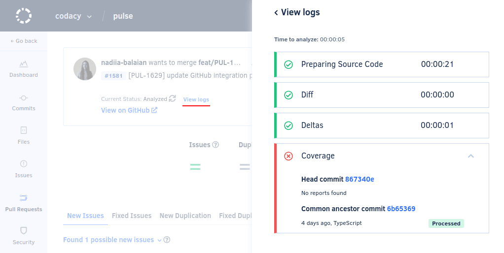
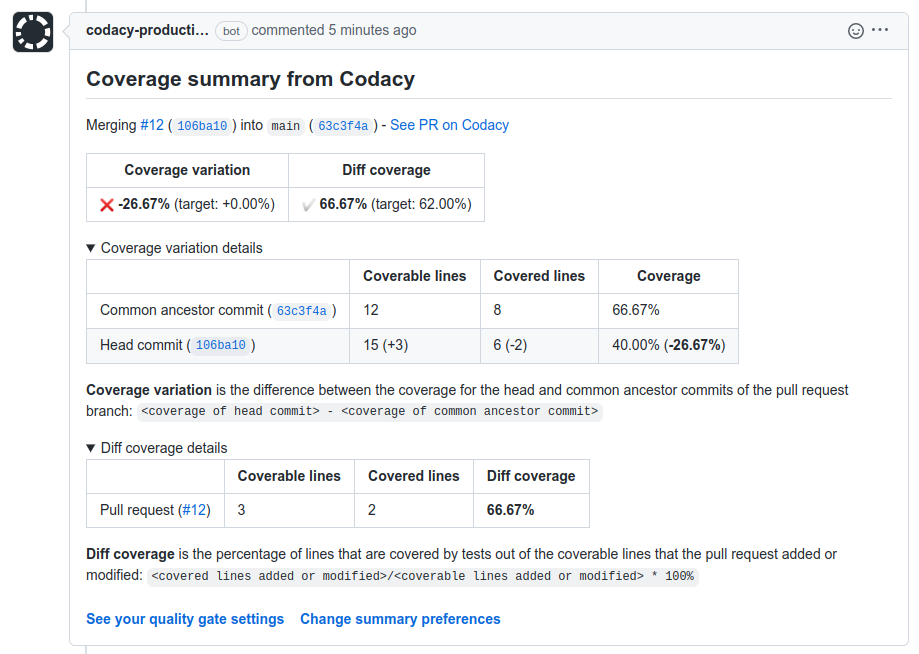

# Cloud January 2023

These release notes are for the Codacy Cloud updates during January 2023.

📢 [Visit the Codacy roadmap](https://roadmap.codacy.com) and let us know your feedback on both new and planned product updates!

## Product enhancements

-   The Codacy Coverage Reporter now supports [automatic commit SHA-1 detection](../../coverage-reporter/troubleshooting-coverage-cli-issues.md#commit-detection) on Argo CD. (TS-140)
-   Extended the visibility of the [coding standards page](../../organizations/using-a-coding-standard.md) to all users, regardless of their permission level. (IO-359)
-   The pull request detail page now displays the [commits that are missing coverage data](../../coverage-reporter/index.md#validating-coverage) for Codacy to calculate the coverage metrics. This information is also visible in the analysis logs. (IO-152)

    

    <!--NOTE This Jira key appears on two release note pages because the feature had an update after being released (see https://codacy.atlassian.net/browse/COV-137)-->

-   Codacy now supports [reporting a summary of the coverage metrics](../../repositories-configure/integrations/github-integration.md#enabling) directly on your pull requests. For now, this feature is only supported on GitHub Cloud. (COV-2, COV-3)

    

## Bug fixes

-   Codacy no longer counts ignored files towards the [maximum number of files for calculating complexity](../../faq/code-analysis/does-codacy-place-limits-on-the-code-analysis.md). (TS-93)
-   Fixed an issue that caused all ESLint 8 code patterns to be turned off by default when adding a new repository. (TS-50)
-   Fixed the repository page not opening for Bitbucket repositories with many branch restrictions and repository:admin users. (PLUTO-290)
-   The Files page now correctly loads and displays more files when scrolling. (PLUTO-225)
-   Improved the reporting of analysis and coverage status to Git providers when new commits are pushed during an ongoing analysis. (IO-341)

## Tool versions

Codacy Cloud now includes the tool versions below. The tools that were recently updated are highlighted in bold:

-   Ameba 0.13.1
-   Bandit 1.7.0
-   Brakeman 4.3.1
-   bundler-audit 0.6.1
-   Checkov 2.1.188
-   Checkstyle 10.3.1
-   Clang-Tidy 10.0.1
-   CodeNarc 2.2.0
-   CoffeeLint 2.1.0
-   Cppcheck 2.2
-   Credo 1.4.0
-   CSSLint 1.0.5
-   dartanalyzer 2.17.0
-   detekt 1.19.0
-   ESLint 8.23.1
-   ESLint (deprecated) 7.32.0
-   Faux-Pas 1.7.2
-   Flawfinder 2.0.19
-   Gosec 2.8.1
-   Hadolint 1.18.2
-   Jackson Linter 2.10.2
-   JSHint 2.13.5
-   markdownlint 0.26.2
-   PHP Mess Detector 2.10.1
-   PHP_CodeSniffer 3.6.2
-   PMD 6.51.0
-   Prospector 1.7.7
-   PSScriptAnalyzer 1.18.3
-   Pylint 1.9.5
-   **[Pylint (Python 3) 2.15.10](https://github.com/PyCQA/pylint/releases/tag/v2.15.10) (updated from 2.14.5)**
-   remark-lint 7.0.1
-   Revive 1.2.3
-   RuboCop 1.39.0
-   Scalastyle 1.5.0
-   ShellCheck v0.9.0
-   SonarC# 8.39
-   SonarVB 8.15
-   spectral-rulesets 1.2.7
-   **SpotBugs 4.7.3 (updated from 4.5.3)**
-   SQLint 0.2.1
-   Staticcheck 2022.1.3
-   Stylelint 14.2.0
-   **SwiftLint 0.50.3 (updated from 0.43.1)**
-   Tailor 0.12.0
-   TSLint 6.1.3
-   TSQLLint 1.11.1
-   Unity Roslyn Analyzers 1.14.0
