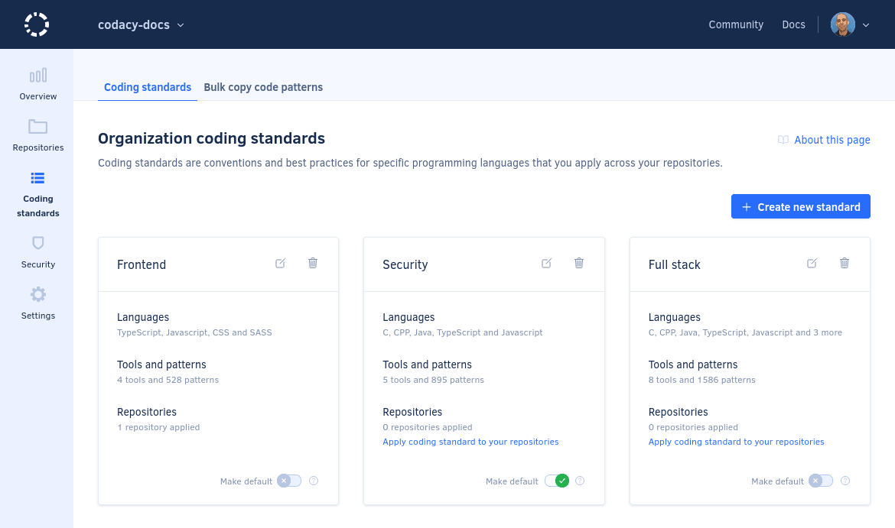

# Cloud March 2023

These release notes are for the Codacy Cloud updates during March 2023.

📢 [Visit the Codacy roadmap](https://roadmap.codacy.com) and let us know your feedback on both new and planned product updates!

## Product enhancements

-   Added support for the following plugins:
    -   [@tailwindcss/line-clamp](https://www.npmjs.com/package/@tailwindcss/line-clamp) for ESLint (TS-288)
    -   [pylint-beam](https://github.com/kvudata/pylint-beam) for Pylint (Python 3) (TS-274)
    -   [PHPCompatibilityWP](https://github.com/PHPCompatibility/PHPCompatibilityWP) for PHP_CodeSniffer (TS-56)
-   Some Enterprise plans now allow downloading a CSV list of all organization members from the **People** page. This feature is also available on all plans using the API endpoint [listPeopleFromOrganizationCsv](https://api.codacy.com/api/api-docs#listpeoplefromorganizationcsv). (PLUTO-388)
-   Codacy now supports up to 10 coding standards per organization, allowing you to [optimize and apply quality settings to multiple repositories quickly](../../organizations/using-a-coding-standard.md). For more details, [see the announcement on our blog](https://blog.codacy.com/organization-coding-standards-just-got-better/). (IO-358)

    

## Bug fixes

-   Updated the Codacy Analysis CLI GitHub Action so it's no longer rate-limited by the GitHub API. (TS-109)
-   Fix permission issue when a user has minimal access on GitLab. (PLUTO-468)<!--TODO Clarify -->
-   Fixed an issue while synchronizing the name of Codacy organizations with the corresponding GitLab groups. (PLUTO-450)
-   Fixed an issue that prevented some API endpoints from listing repository languages. (IO-512)
-   Fixed an issue listing issues found by some tools under the **New Issues** tab for pull requests. (IO-461)
-   Fixed an inconsistent issue count between the Commit list and the Repository Dashboard pages. (IO-422)
-   Now, the [Codacy API v3 docs](https://api.codacy.com/api/api-docs) correctly identify public endpoints as not requiring authentication. (DOCS-540)
-   Fixed an issue that caused the repository-level navigation sidebar to hide all icons from anonymous users visiting public repositories. (COV-186)

## Tool versions

Codacy Cloud now includes the tool versions below. The tools that were recently updated are highlighted in bold:

-   Ameba 0.13.1
-   Bandit 1.7.0
-   Brakeman 4.3.1
-   bundler-audit 0.6.1
-   Checkov 2.1.188
-   Checkstyle 10.3.1
-   Clang-Tidy 10.0.1
-   CodeNarc 3.2.0
-   CoffeeLint 2.1.0
-   Cppcheck 2.10
-   Credo 1.4.0
-   CSSLint 1.0.5
-   dartanalyzer 2.17.0
-   detekt 1.19.0
-   ESLint 8.34.0
-   ESLint (deprecated) 7.32.0
-   Faux-Pas 1.7.2
-   Flawfinder 2.0.19
-   Gosec 2.8.1
-   Hadolint 1.18.2
-   Jackson Linter 2.10.2
-   JSHint 2.13.5
-   markdownlint 0.26.2
-   PHP Mess Detector 2.13.0
-   **[PHP_CodeSniffer 3.7.2](https://github.com/squizlabs/PHP_CodeSniffer/releases/tag/3.7.2) (updated from 3.6.2)**
-   **[PMD 6.55.0](https://pmd.sourceforge.io/pmd-6.55.0/pmd_release_notes.html) (updated from 6.51.0)**
-   Prospector 1.7.7
-   PSScriptAnalyzer 1.18.3
-   Pylint 1.9.5
-   **[Pylint (Python 3) 2.17.0](https://github.com/PyCQA/pylint/releases/tag/v2.17.0) (updated from 2.15.10)**
-   remark-lint 7.0.1
-   Revive 1.2.3
-   RuboCop 1.39.0
-   Scalastyle 1.5.0
-   ShellCheck v0.9.0
-   SonarC# 8.40
-   SonarVB 8.15
-   spectral-rulesets 1.2.7
-   SpotBugs 4.7.3
-   SQLint 0.2.1
-   Staticcheck 2022.1.3
-   Stylelint 14.16.1
-   SwiftLint 0.50.3
-   Tailor 0.12.0
-   TSLint 6.1.3
-   TSQLLint 1.11.1
-   Unity Roslyn Analyzers 1.14.0
