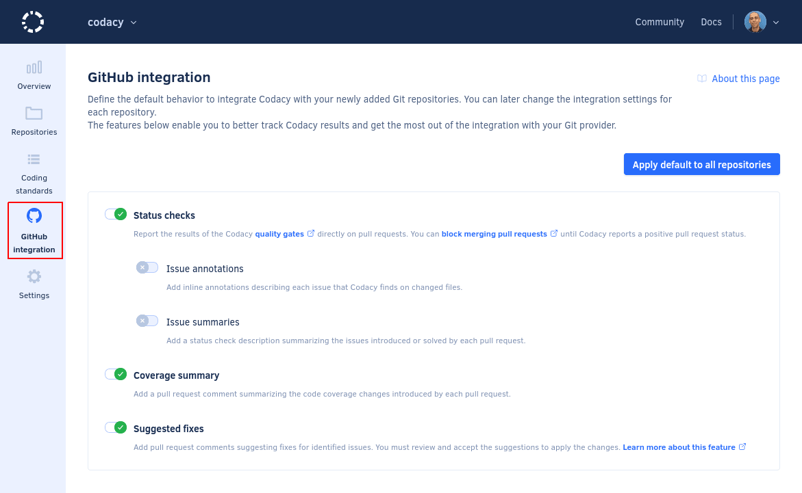

# Cloud May 2023

These release notes are for the Codacy Cloud updates during May 2023.

📢 [Visit the Codacy roadmap](https://roadmap.codacy.com) and let us know your feedback on both new and planned product updates!

## Product enhancements

-   Added support for the following ESLint plugins:
    -   [eslint-plugin-rxjs](https://www.npmjs.com/package/eslint-plugin-rxjs) (TS-346)
    -   [eslint-plugin-markdown](https://www.npmjs.com/package/eslint-plugin-markdown) (TS-121)
    -   [eslint-plugin-yml](https://www.npmjs.com/package/eslint-plugin-yml) (TS-121)

-   The [quality gates](../../repositories-configure/adjusting-quality-gates.md) defined for your repository now apply to both pull requests and commits. (PLUTO-540)

-   To enhance your experience and bring clarity to your settings, we've split the **Quality settings** of your repository into two tabs, [**Gates**](../../repositories-configure/adjusting-quality-gates.md) and [**Goals**](../../repositories-configure/adjusting-quality-goals.md). (PLUTO-520)

-   To ensure consistency across repositories, organization admins can now configure the [default settings that Codacy uses to integrate with the Git provider](../../organizations/configuring-default-git-provider-integration-settings.md) when adding a new repository to Codacy. These default settings can also be applied to all repositories. (PLUTO-470, PLUTO-546)

    

-   The Codacy Coverage Reporter now supports glob patterns to specify the coverage report to upload. (TS-193)

## Bug fixes

-   Fixed the error `unexpected end of file` when running the Codacy Analysis CLI GitHub Action. (TS-358)
-   Fixed an issue that prevented Codacy from providing more detailed information about the issues found directly on the Git provider status check messages. (IO-525)
-   Fixed inconsistencies on go parser of coverage reporter when statement lines intersected with other same statement lines (COV-207)

## Tool versions

Codacy Cloud now includes the tool versions below. The tools that were recently updated are highlighted in bold:

-   Ameba 0.13.1
-   Bandit 1.7.0
-   Brakeman 4.3.1
-   bundler-audit 0.6.1
-   Checkov 2.3.187
-   Checkstyle 10.3.1
-   Clang-Tidy 10.0.1
-   CodeNarc 3.2.0
-   CoffeeLint 2.1.0
-   **[Cppcheck 2.10.3](https://github.com/danmar/cppcheck/releases/tag/2.10) (updated from 2.10)**
-   Credo 1.4.0
-   CSSLint 1.0.5
-   dartanalyzer 2.17.0
-   detekt 1.22.0
-   **[ESLint 8.40.0](https://github.com/eslint/eslint/releases/tag/v8.40.0) (updated from 8.38.0)**
-   ESLint (deprecated) 7.32.0
-   Faux-Pas 1.7.2
-   Flawfinder 2.0.19
-   Gosec 2.15.0
-   Hadolint 1.18.2
-   Jackson Linter 2.14.2
-   JSHint 2.13.5
-   markdownlint 0.26.2
-   PHP Mess Detector 2.13.0
-   PHP_CodeSniffer 3.7.2
-   PMD 6.55.0
-   **[Prospector 1.10.2](https://github.com/PyCQA/prospector/releases/tag/v1.10.2) (updated from 1.9.0)**
-   PSScriptAnalyzer 1.18.3
-   Pylint 2.17.3
-   Pylint (deprecated) 1.9.5
-   remark-lint 7.0.1
-   **[Revive 1.3.2](https://github.com/mgechev/revive/releases/tag/v1.3.2) (updated from 1.2.3)**
-   RuboCop 1.39.0
-   Scalastyle 1.5.0
-   ShellCheck v0.9.0
-   SonarC# 8.40
-   SonarVB 8.15
-   **Spectral 1.16.0 (updated from 1.2.7)**
-   SpotBugs 4.7.3
-   SQLint 0.2.1
-   Staticcheck 2022.1.3
-   **[Stylelint 15.6.2](https://github.com/stylelint/stylelint/releases/tag/15.6.2) (updated from 15.5.0)**
-   SwiftLint 0.50.3
-   Tailor 0.12.0
-   TSLint 6.1.3
-   TSQLLint 1.11.1
-   Unity Roslyn Analyzers 1.14.0
