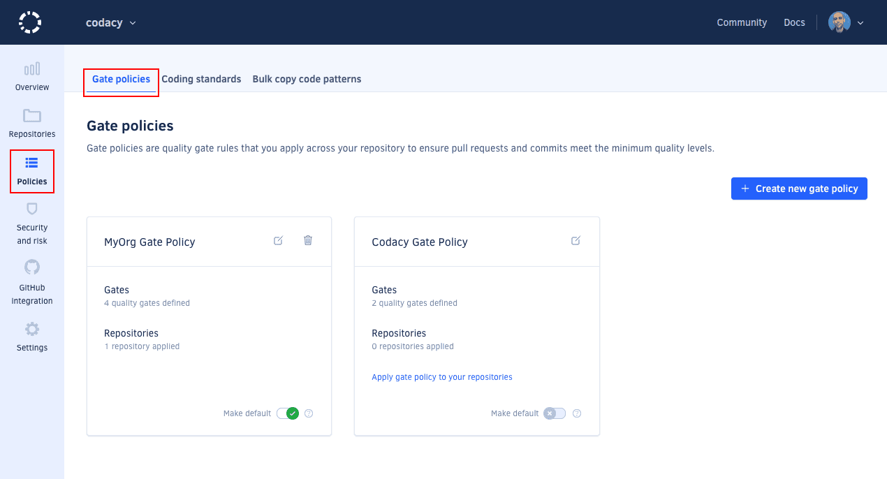

# Cloud July 2023

These release notes are for the Codacy Cloud updates during July 2023.

📢 [Visit the Codacy roadmap](https://roadmap.codacy.com) and let us know your feedback on both new and planned product updates!

## Product enhancements

-   Added support for AI-generated context-aware comments and fix suggestions directly in your Git provider. For more details, [see the announcement on our blog](https://blog.codacy.com/codacy-quality-ai-actionable-fixes/). (CY-6855, HRZ-286)

    

-   You can now use [Security and risk management](../../organizations/managing-security-and-risk.md) to detect security vulnerabilities across your Codacy repositories and Jira issues and assign the Security Manager role to any organization member. For more details, [see the announcement on our blog](https://blog.codacy.com/centralized-view-of-security-issues/). (HRZ-6, PUL-1924, HRZ-180)

    

-   To ensure that Codacy uses the same quality gates across your repositories, organization admins can now apply [gate policies](../../organizations/using-gate-policies.md) to multiple repositories. **Gate policies** are available under the new organization page **Policies**, where you can now also find your **Coding standards**. (PLUTO-484)

    

-   For increased privacy, Codacy no longer requests access to read or write Git SSH keys from your GitHub account. (PLUTO-624)

-   When developers commit from GitHub, now Codacy automatically associates all email addresses linked to their GitHub user with a single Codacy committer. This reduces the number of duplicate seats in an organization when developers don’t log in to Codacy. (PLUTO-653)

## Bug fixes

-   Fixed a bug causing the TSQLLint tool to fail analyzing the correct files and displaying in the UI and API. (TS-470)
-   Fixed an issue that caused Codacy issue permalinks to change between commits. (PUL-2202)
-   Fixed an issue that prevented Codacy from retrieving coverage information for individual files. (ALA-514)

## Tool versions

Codacy Cloud now includes the tool versions below. The tools that were recently updated are highlighted in bold:

-   Ameba 1.4.3
-   Bandit 1.7.0
-   Brakeman 4.3.1
-   **[bundler-audit 0.9.1](https://github.com/rubysec/bundler-audit/releases/tag/v0.9.1) (updated from 0.6.1)**
-   Checkov 2.3.187
-   Checkstyle 10.3.1
-   Clang-Tidy 10.0.1
-   CodeNarc 3.2.0
-   CoffeeLint 2.1.0
-   Cppcheck 2.10.3
-   Credo 1.4.0
-   CSSLint 1.0.5
-   dartanalyzer 2.17.0
-   detekt 1.22.0
-   **[ESLint 8.45.0](https://github.com/eslint/eslint/releases/tag/v8.45.0) (updated from 8.43.0)**
-   ESLint (deprecated) 7.32.0
-   Faux-Pas 1.7.2
-   Flawfinder 2.0.19
-   Gosec 2.15.0
-   Hadolint 1.18.2
-   Jackson Linter 2.14.2
-   JSHint 2.13.5
-   markdownlint 0.26.2
-   PHP Mess Detector 2.13.0
-   PHP_CodeSniffer 3.7.2
-   PMD 6.55.0
-   Prospector 1.10.2
-   PSScriptAnalyzer 1.18.3
-   **[Pylint 2.17.4](https://github.com/pylint-dev/pylint/releases/tag/v2.17.4) (updated from 2.17.3)**
-   Pylint (deprecated) 1.9.5
-   remark-lint 7.0.1
-   Revive 1.3.2
-   RuboCop 1.52.1
-   Scalastyle 1.5.0
-   ShellCheck v0.9.0
-   SonarC# 8.40
-   SonarVB 8.15
-   Spectral 1.16.0
-   SpotBugs 4.7.3
-   SQLint 0.2.1
-   Staticcheck 2022.1.3
-   **[Stylelint 15.10.1](https://github.com/stylelint/stylelint/releases/tag/15.10.1) (updated from 15.9.0)**
-   SwiftLint 0.50.3
-   Tailor 0.12.0
-   TSLint 6.1.3
-   TSQLLint 1.11.1
-   Unity Roslyn Analyzers 1.14.0
