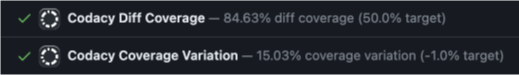
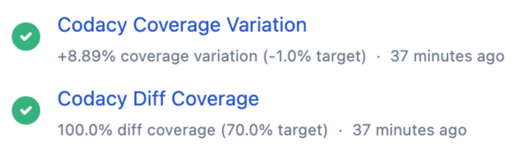
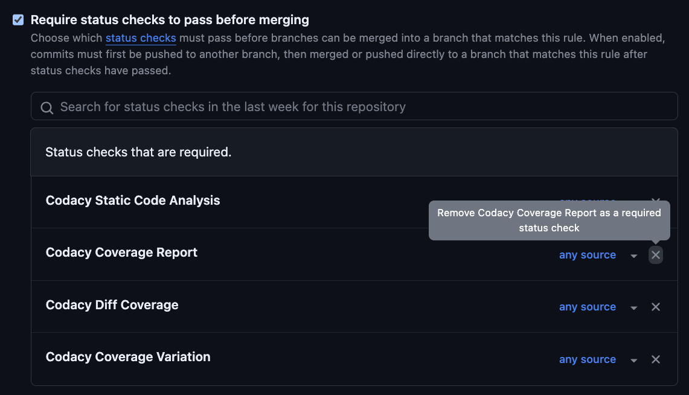

# Rollout of new Coverage engine November 23, 2023

As part of an ongoing effort to improve the speed and value of the insights provided by Codacy, we've been working on a new Coverage engine and started its deployment on November 23rd, 2023. The rollout to use the new engine across Codacy will be phased across several months and will gradually impact the coverage data you see on the Git provider, UI, and API.

!!! info
    GitHub only: The new Coverage engine requires updated app permissions. If you haven't done so yet, please [review and accept the updated Codacy app permissions](https://docs.github.com/en/enterprise-cloud@latest/apps/using-github-apps/reviewing-and-modifying-installed-github-apps#reviewing-permissions).

Please refer to the table below for the updated status of the transition process. The table will be updated as changes are introduced.

| Feature                                          | Status      | Notes                                                                                                                                                         |
|--------------------------------------------------|-------------|---------------------------------------------------------------------------------------------------------------------------------------------------------------|
| [Git provider status checks](#status-checks)     | Live (beta) | The new Coverage engine now sends coverage data to your Git provider. This data is marked \[beta\] and is shown alongside the data from the current engine.   |
| [GitHub coverage summaries](#coverage-summaries) | Live        | The new Coverage engine now sends coverage summaries to GitHub. If you haven't done so yet, please review and update your app permissions as mentioned above. |
| Codacy app UI                                    | Planned     | -                                                                                                                                                             |
| Codacy API                                       | Planned     | -                                                                                                                                                             |

Because of this transition, both old and new data will coexist during this period, potentially leading to [differences in reported metrics](#differences-in-coverage-metrics-between-the-old-and-new-coverage-engines).

## Git provider status checks from the new Coverage engine {: id="status-checks"}

!!! info "This section applies to the repositories for which you set Codacy to send pull request coverage status data to your Git provider (see how on [GitHub](../../repositories-configure/integrations/github-integration.md#status-checks), [GitLab](../../repositories-configure/integrations/gitlab-integration.md#pull-request-status), and [Bitbucket](../../repositories-configure/integrations/bitbucket-integration.md#pull-request-status))."

On November 23rd 2023 we set the new Coverage engine to send coverage data to your Git provider. As a consequence of this update, you can now see two additional checks on your pull requests, marked **\[beta\]**, alongside the preexisting **Codacy Coverage Report** check.

!!! important
    GitHub only: If you are using the Codacy Coverage Report status check to block merging pull requests, please [update your GitHub setup](#if-you-are-using-the-old-coverage-status-check-to-block-merging-pull-requests-on-github) and avoid disruptions in the future.

This is what the new checks look like on each provider:

-   On GitHub:

    

-   On GitLab:

    

-   On Bitbucket:

    

### Deprecation and removal of the old Coverage engine status checks

Currently, Codacy sends coverage data to your Git provider from both the old and new Coverage engines. We will deprecate and later remove the old status checks on the following dates:

<table>
  <thead>
    <th>Date</th>
    <th>Event</th>
    <th>What to expect</th>
  </thead>
  <tbody>
    <tr>
      <td>February 14th, 2024</td>
      <td>Deprecation of the old Coverage status check</td>
      <td>
        
From this day on, the new checks will be the official status checks for Codacy Coverage and will no longer be marked <strong>beta</strong>. The old check will be marked <strong>deprecated</strong> but will keep working.

        
If on this date you are still using the old check to block merging pull requests on GitHub, please <a href="#if-you-are-using-the-old-coverage-status-check-to-block-merging-pull-requests-on-github">update your Git provider settings</a>.

      </td>
    </tr>
    <tr>
      <td>April 18th, 2024</td>
      <td>Brownout of the old Coverage status check</td>
      <td>
        
Codacy will not send the old status check on this day.

        
This will help you confirm that your setup has been updated correctly and lower the risk of disruptions when the old status check is removed. If on this day you can merge your pull requests using the new checks and don't encounter other issues, it means that your setup has been updated correctly. Otherwise, if on this date you are still using the old check to block merging pull requests on GitHub, please <a href="#if-you-are-using-the-old-coverage-status-check-to-block-merging-pull-requests-on-github">update your Git provider settings</a>.

      </td>
    </tr>
    <tr>
      <td>June 5th, 2024</td>
      <td>Removal of the old Coverage status check</td>
      <td>
        
Codacy will stop sending the old status check.

        
If on this date you are still using the old check to block merging pull requests on GitHub, you will no longer be able to merge them. To fix this, <a href="#if-you-are-using-the-old-coverage-status-check-to-block-merging-pull-requests-on-github">follow the instructions below</a>.

      </td>
    </tr>
  </tbody>
</table>

### If you are using the old Coverage status check to block merging pull requests on GitHub

If you are using the old status check to block merging pull requests on GitHub, remove the old Codacy Coverage Report as a required check of your pull requests' target branch:

1.  [Edit the branch protection rule](https://docs.github.com/en/repositories/configuring-branches-and-merges-in-your-repository/managing-protected-branches/managing-a-branch-protection-rule#editing-a-branch-protection-rule) of your pull requests' target branch.
1.  Remove the old **Codacy Coverage Report** under the section **Require status checks to pass before merging** and save your changes:

## GitHub coverage summaries from the new Coverage engine {: id="coverage-summaries"}

!!! info "This section applies to the repositories for which you set Codacy to post [coverage summaries](../../repositories-configure/integrations/github-integration.md#coverage-summaries) to your GitHub pull requests"

On December 7th 2023 we set the new Coverage engine to post coverage summaries to GitHub, replacing the old Coverage engine. If you haven't done so yet, please [review and accept the updated Codacy app permissions](https://docs.github.com/en/enterprise-cloud@latest/apps/using-github-apps/reviewing-and-modifying-installed-github-apps#reviewing-permissions).

## Differences in coverage metrics between the old and new Coverage engines

You may notice some differences in the coverage metrics reported by the old and new Coverage engines and may need to update your [coverage gate rules](../../repositories-configure/adjusting-quality-gates.md) accordingly. This may happen because the new Coverage engine calculates coverage metrics considering all the files included in the coverage report, while the old Coverage engine ignores some files:

-   The old Coverage engine ignores any files on a coverage report that aren't present on the repository on that given commit.
-   The old Coverage engine may ignore additional files since it shares [ignore rules](../../repositories-configure/ignoring-files.md) with the Codacy analysis engine.
