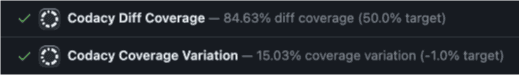
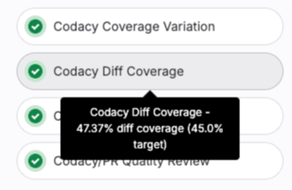
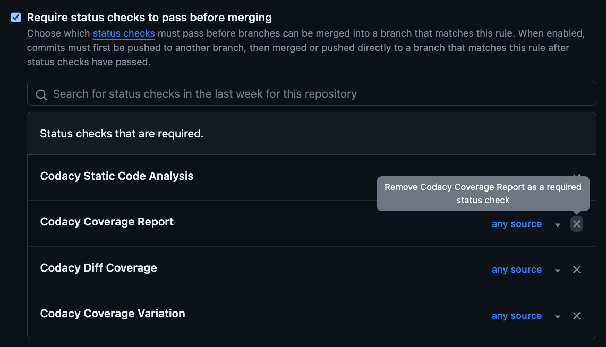

# New Coverage engine status checks November 23rd, 2023

!!! info "This release note applies if you have set Codacy to send pull request status data to your Git provider (see how on [GitHub](../../repositories-configure/integrations/github-integration.md#status-checks), [GitLab](../../repositories-configure/integrations/gitlab-integration.md#pull-request-status), and [Bitbucket](../../repositories-configure/integrations/bitbucket-integration.md#pull-request-status))."<!--NOTE Temporary comment for review purpose, to remove-->

On November 23rd 2023 we activated the new, faster Coverage engine and set it to send coverage data to your Git provider. This is part of an ongoing effort to improve the speed and value of the insights provided by Codacy.

As a consequence of this update, you can now see two additional checks on your pull requests, marked **beta**, alongside the preexisting Codacy Coverage check. If you are using the Codacy Coverage status check to block merging pull requests on GitHub, please [update your setup](#if-you-are-using-the-old-coverage-status-check-to-block-merging-pull-requests-on-github) and avoid disruptions in the future.<!--NOTE Temporary comment for review purpose, to remove-->

This is what the new checks look like on each provider:

-   On GitHub:

    <!--NOTE Temporary comment for review purpose, to remove-->

-   On GitLab:

    

-   On Bitbucket:

    

## Deprecation and removal of the old Coverage engine status checks

Currently, Codacy sends coverage data to your Git provider from both the old and new Coverage engines. We will deprecate and eventually remove the old status checks on the following dates:<!--NOTE Temporary comment for review purpose, to remove-->

<table>
  <thead>
    <th>Date</th>
    <th>Event</th>
    <th>What to expect</th>
  </thead>
  <tbody>
    <tr>
      <td>February 14th, 2024</td>
      <td>Deprecation of the old Coverage status check</td>
      <td>
        
From this day on, the new checks will no longer be marked <strong>beta</strong> and will be the official status checks for Codacy Coverage. The old check will be marked <strong>deprecated</strong> but will keep working.
<!--NOTE Temporary comment for review purpose, to remove-->
        
If on this date you are still using the old check to block merging pull requests on GitHub, please <a href="#if-you-are-using-the-old-coverage-status-check-to-block-merging-pull-requests-on-github">update your Git provider settings</a>.

      </td>
    </tr>
    <tr>
      <td>April 18th, 2024</td>
      <td>Brownout of the old Coverage status check</td>
      <td>
        
Codacy will not send the old status check on this day.
<!--NOTE Temporary comment for review purpose, to remove-->
        
This will help you confirm that your setup has been updated correctly and lower the risk of disruptions when the old status check is removed.

      </td>
    </tr>
    <tr>
      <td>June 5th, 2024</td>
      <td>Removal of the old Coverage status check</td>
      <td>
        
Codacy will stop sending the old status check.

        
If on this date you are still using the old check to block merging pull requests on GitHub, you will no longer be able to merge them. To fix this, <a href="#if-you-are-using-the-old-coverage-status-check-to-block-merging-pull-requests-on-github">follow the instructions below</a>.

      </td>
    </tr>
  </tbody>
</table>

## If you are using the old Coverage status check to block merging pull requests on GitHub

If you are using the old status check to block merging pull requests on GitHub, [remove the old Codacy Coverage report as a required check by editing the branch protection rules](https://docs.github.com/en/repositories/configuring-branches-and-merges-in-your-repository/managing-protected-branches/managing-a-branch-protection-rule#editing-a-branch-protection-rule) of your pull requests' target branch under the section **Require status checks to pass before merging**:

## Differences in coverage metrics between the old and new Coverage enginesx

You may notice some differences in the coverage metrics reported by the old and new Coverage engines. This may happen because the new Coverage engine calculates coverage metrics considering all the files included in the coverage report, while the old Coverage engine ignores some files:<!--NOTE Temporary comment for review purpose, to remove-->

-   The old Coverage engine ignores any files on a coverage report that aren't present on the repository on that given commit.
-   The old Coverage engine may ignore additional files since it shares [ignore rules](../../repositories-configure/ignoring-files.md) with the Codacy analysis engine.
