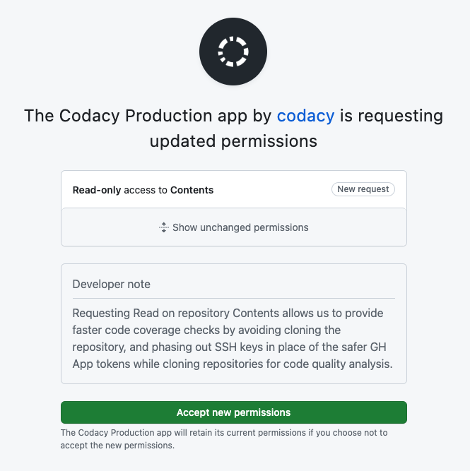

# Deprecation of SSH keys for GitHub repositories January DD, 2024<!--TODO PLUTO-802 Update release date-->

!!! info "This release note applies only to GitHub"

For increased security, Codacy deprecated the usage of **repository SSH keys** for Git operations on GitHub in favor of **installation access tokens**.

This change translates into important security improvements:

-   It reduces the liability of the Codacy GitHub App, as it no longer requires [read and write repository permissions for Administration](https://docs.github.com/en/rest/authentication/permissions-required-for-github-apps?apiVersion=2022-11-28#repository-permissions-for-administration).
-   Contrary to long-living SSH keys, [installation access tokens](https://docs.github.com/en/apps/creating-github-apps/authenticating-with-a-github-app/generating-an-installation-access-token-for-a-github-app#about-installation-access-tokens) expire after one hour and Codacy loses access when the GitHub App is uninstalled.

To minimize any impact, Codacy deprecated the usage of repository SSH keys for now but will keep using them as a fallback mechanism at this first stage. At a later stage, Codacy will delete the repository SSH keys stored in our systems. [See the rollout timeline](#timeline) for more details.

## Changes on the Codacy GitHub App required permissions {: id="changes-permissions"}

To use installation access tokens, the Codacy GitHub App now requires [repository read permissions for Contents](https://docs.github.com/en/rest/authentication/permissions-required-for-github-apps?apiVersion=2022-11-28#repository-permissions-for-contents).

On the other hand, the Codacy GitHub App no longer requires [read and write repository permissions for Administration](https://docs.github.com/en/rest/authentication/permissions-required-for-github-apps?apiVersion=2022-11-28#repository-permissions-for-administration). This permission will be removed from the Codacy GitHub App according to the [rollout timeline](#timeline).

## What do you need to do if you have a GitHub organization? {: id="to-do"}

Make sure an organization owner [approves the updated permissions for the Codacy GitHub App](https://docs.github.com/en/apps/using-github-apps/reviewing-and-modifying-installed-github-apps) on your GitHub organization, if not done yet.

Codacy has been requesting this permission since September 2023. Organization owners should had received a GitHub notification to review a request for this additional permission:

If you have any questions or need help, please contact <mailto:support@codacy.com>.

## Removal of repository permissions for Administration and SSH keys {: id="timeline"}

To ensure the conditions to use installation access tokens on GitHub organizations are met before the removal of repository permissions for Administration and SSH keys, Codacy will execute a phased rollout according to the timeline below:

<table>
  <thead>
    <th>Date</th>
    <th>Event</th>
    <th>What to expect</th>
  </thead>
  <tbody>
    <tr>
      <td>January DD, 2024</td><!--TODO PLUTO-802 Update release date-->
      <td>Codacy started using installation access tokens to clone and integrate with your repositories, and deprecated the usage of repositories SSH keys</td>
      <td>
        
From this day on, repositories SSH keys are used exclusively as a fallback mechanism when the Contents permission is missing.

        
If not done yet, make sure an organization owner <a href="#to-do">approves Codacy GitHub App updated permissions</a> on your GitHub organization.

      </td>
    </tr>
    <tr>
      <td>February 12, 2024</td>
      <td>Brownout of repository permissions for Administration</td>
      <td>
        
On this day, Codacy won't use any fallback mechanism if the Contents permission is missing.

        
This will help you confirm that the updated permissions for the Codacy GitHub App were already approved for your organization. If on this date your Codacy quality analysis fails or you have problems adding new repositories to Codacy, make sure an organization owner <a href="#to-do">approves the updated permissions for the Codacy GitHub App</a> on your GitHub organization.

      </td>
    </tr>
    <tr>
      <td>February 19, 2024</td>
      <td>Codacy will remove repository permissions for Administration and drop the usage of repository SSH keys</td>
      <td>
        
Codacy will start using exclusively installation access tokens to clone and integrate with your repositories, with no fallback mechanisms. Also, repository permissions for Administration will be removed from the Codacy GitHub App.

        
If on this date the Codacy GitHub App updated permissions haven't been approved on your GitHub organization yet, your Codacy quality analysis will fail and you'll not be able to add new repositories to Codacy until an organization owner <a href="#to-do">approves the updated permissions.</a>

      </td>
    </tr>
    <tr>
      <td>To define</td>
      <td>Codacy will no longer store repository SSH keys</td>
      <td>
        
On this day, Codacy will delete all the repository SSH keys stored in our systems.

      </td>
    </tr>
  </tbody>
</table>

## See also

-   [Which permissions are required by Codacy GitHub App?](../../getting-started/which-permissions-does-codacy-need-from-my-account.md#github-cloud)
