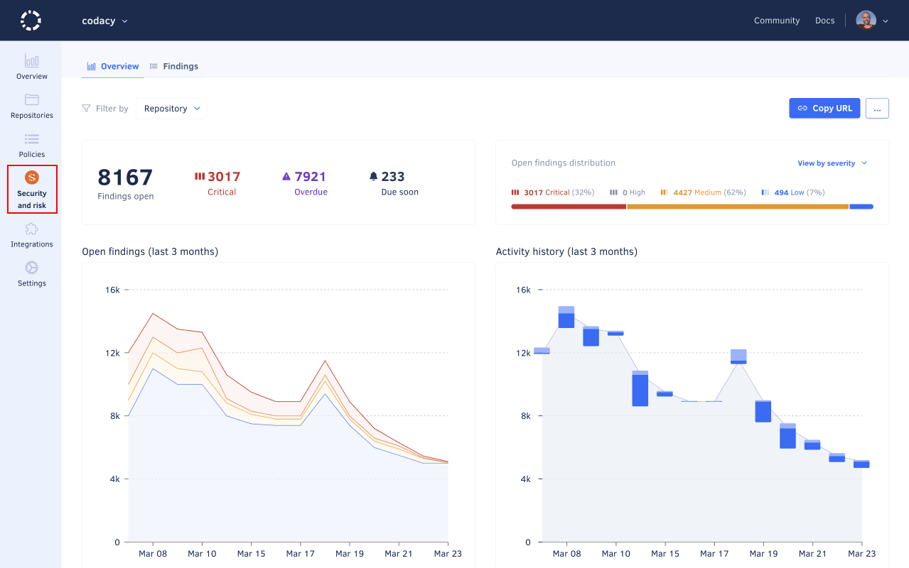
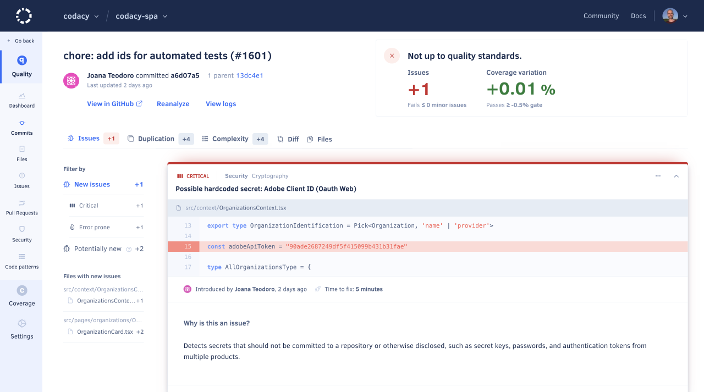

# Cloud April 2024

These release notes are for the Codacy Cloud updates during April 2024.

📢 [Visit the Codacy roadmap](https://roadmap.codacy.com) and let us know your feedback on both new and planned product updates!

<!--TODO Check these issues manually

-->

## Product enhancements

-   We revamped the [Security and risk management](../../organizations/managing-security-and-risk.md) area. (TAROT-2546)

    

-   You can now manually trigger a coverage pull request analysis using the [reanalyzeCoverage](https://api.codacy.com/api/api-docs#reanalyzecoverage) API endpoint. This can help you unblock pull requests that expect to receive a coverage report but only change uncovered files. (ALA-1003)
-   We revamped the **Commit** and **Pull Request** detail pages. (ALA-639)

    

-   Repository admins can now [bypass Codacy status check](../../faq/code-analysis/can-i-bypass-codacy-status-check.md) to unblock the merge of a pull request on very specific and exceptional situations. (IO-1036)

## Bug fixes

-   The [Codacy configuration file](../../repositories-configure/codacy-configuration-file.md) no longer overrides the [default ignored files](../../repositories-configure/ignoring-files.md#default-ignored-files). Also, Codacy no longer ignores by default files matching the regular expression `.*docs?/.*`. (IO-1031)
-   Codacy no longer updates the [default branch](../../repositories-configure/managing-branches.md) automatically when you change the default branch on your Git provider. (TCE-838)

## Feature removal

Due to their limited adoption, while revamping the **Commit** and **Pull Request** detail pages we removed the following options for the issues listed on the **Issues** tab:

-   GitHub: Create pull request comments and GitHub issues.
-   Bitbucket: Create pull requests comments and Bitbucket issues. (ALA-639)

## Tool versions

Codacy Cloud now includes the tool versions below. The tools that were recently updated are highlighted in bold:

-   Ameba 1.5.0
-   Bandit 1.7.5
-   Brakeman 4.3.1
-   bundler-audit (deprecated) 0.9.1
-   Checkov 3.2.37
-   Checkstyle 10.13.0
-   Clang-Tidy 10.0.1
-   CodeNarc 3.3.0
-   CoffeeLint 5.2.11
-   Cppcheck 2.13.0
-   Credo 1.7.2
-   CSSLint (deprecated) 1.0.5
-   dartanalyzer 3.3.3
-   detekt 1.23.5
-   ESLint 8.57.0
-   ESLint (deprecated) 7.32.0
-   Faux-Pas 1.7.2
-   Flawfinder 2.0.19
-   Gosec 2.15.0
-   Hadolint 1.18.2
-   Jackson Linter 2.15.2
-   JSHint (deprecated) 2.13.6
-   markdownlint 0.33.0
-   PHP Mess Detector 2.14.1
-   PHP_CodeSniffer 3.7.2
-   PMD 6.55.0
-   Prospector 1.10.3
-   PSScriptAnalyzer 1.21.0
-   Pylint 3.1.0
-   Pylint (deprecated) 1.9.5
-   remark-lint 9.1.2
-   Revive 1.3.7
-   **[RuboCop 1.63.1](https://github.com/rubocop/rubocop/releases/tag/v1.63.1) (updated from 1.60.2)**
-   Scalastyle 1.5.1
-   **[Semgrep 1.68.0](https://github.com/semgrep/semgrep/releases/tag/v1.68.0) (updated from 1.66.0)**
-   ShellCheck v0.9.0
-   **[SonarC# 9.23](https://github.com/SonarSource/sonar-dotnet/tags) (updated from 9.19)**
-   SonarVB 8.15
-   Spectral 1.18.1
-   SpotBugs 4.8.3
-   SQLint 0.2.1
-   Staticcheck 2023.1.6
-   Stylelint 15.10.3
-   SwiftLint 0.54.0
-   Tailor 0.12.0
-   **[Trivy 0.49.1](https://github.com/aquasecurity/trivy/releases/tag/v0.49.1) (updated from 0.47.0)**
-   TSLint (deprecated) 6.1.3
-   TSQLLint 1.11.1
-   Unity Roslyn Analyzers 1.19.0
