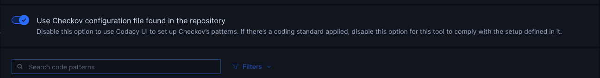

# Adding PHP CS Fixer as new supported tool – July 2026

## PHP CS Fixer

We're excited to announce support for [PHP-CS-Fixer](https://github.com/PHP-CS-Fixer/PHP-CS-Fixer), a popular tool that fixes your PHP code to follow standard coding style rules. With this addition, Codacy can now automatically analyze your PHP projects for style violations and report them directly in your dashboard.

**How it works:**

- PHP-CS-Fixer runs as a fully integrated Codacy engine, so there's nothing to install or configure locally.
- Simply enable the tool in your repository settings and Codacy will run it automatically as part of your regular analysis.
- You can configure rules directly through the Codacy UI, or use your repository's own `.php-cs-fixer.dist.php` (or `.php-cs-fixer.php`) file — if specific patterns are selected in Codacy, those take precedence over the repository's config file.

**To get started:**

1. Go to your repository settings in Codacy.
2. Enable PHP CS Fixer under the list of supported tools.
3. Select the patterns you'd like to enforce, or rely on your repository's existing configuration file.

Refer to our [documentation](https://github.com/codacy/codacy-php-cs-fixer) for detailed setup instructions.

## Now Checkov supports configuration files

Previously, Checkov analysis on Codacy could only be configured through the Codacy UI. Now, Codacy also supports Checkov configuration files — simply add a `.checkov.yaml` or `.checkov.yml` file to your repository and Codacy will automatically pick it up during analysis — but don't forget, you need to enable the configuration file in the Repository > Code Patterns > Checkov > "Use Checkov configuration file found in the repository"

If you have any questions or need help, please contact <mailto:support@codacy.com>.