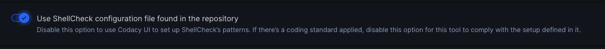

# Support for Shellcheck configuration file - July, 2026

We’ve upgraded how Shellcheck works on Codacy! While you previously had to configure Shellcheck analysis directly through the Codacy UI, you can now manage your settings using a configuration file.

Codacy will automatically apply your rules during analysis once you set it up.
Here is how to get started:

-  Add a .shellcheckrc file to your repository.
-  Navigate to Repository > Code Patterns > Shellcheck.
-  Enable "Use Shellcheck configuration file found in the repository".

If you have any questions or need help, please contact <mailto:support@codacy.com>.