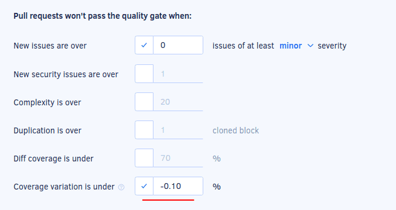

# Self-hosted v10.0.0

These release notes are for [Codacy Self-hosted v10.0.0](https://github.com/codacy/chart/releases/tag/10.0.0){: target="_blank"}, released on November 24, 2022.<!-- TODO Update release date -->

📢 [Visit the Codacy roadmap](https://roadmap.codacy.com) and let us know your feedback on both new and planned product updates!

<!--TODO Check these issues manually

Jira issues without release notes

Epics:
-   https://codacy.atlassian.net/browse/IO-151
-   https://codacy.atlassian.net/browse/PLUTO-83
Bugs and Community Issues:
-   https://codacy.atlassian.net/browse/DOCS-461
Others:
-   https://codacy.atlassian.net/browse/PLUTO-128
-   https://codacy.atlassian.net/browse/IO-164
-   https://codacy.atlassian.net/browse/IO-163
-   https://codacy.atlassian.net/browse/IO-154
-   https://codacy.atlassian.net/browse/IO-148
-   https://codacy.atlassian.net/browse/PLUTO-105
-   https://codacy.atlassian.net/browse/CY-6533
-   https://codacy.atlassian.net/browse/IO-115
-   https://codacy.atlassian.net/browse/IO-107
-   https://codacy.atlassian.net/browse/IO-4

Jira issues with disabled release notes

Epics:
-   https://codacy.atlassian.net/browse/PLUTO-106
-   https://codacy.atlassian.net/browse/CY-5953
-   https://codacy.atlassian.net/browse/CY-4844
Bugs and Community Issues:
-   https://codacy.atlassian.net/browse/CY-6584
-   https://codacy.atlassian.net/browse/CY-6574
-   https://codacy.atlassian.net/browse/CY-6547
-   https://codacy.atlassian.net/browse/IO-129
-   https://codacy.atlassian.net/browse/CY-6496
-   https://codacy.atlassian.net/browse/CY-6429
-->

## Upgrading Codacy Self-hosted

Follow the steps below to upgrade to Codacy Self-hosted v10.0.0:

1.  Check the [release notes for all Codacy Self-hosted versions](../index.md#self-hosted) **between your current version and the most recent version** for breaking changes and follow the instructions provided carefully.

1.  Follow the instructions to [upgrade your Codacy Self-hosted instance](https://docs.codacy.com/v10.0/chart/maintenance/upgrade/).

1.  Update your Codacy command-line tools to the versions with the Git tag `self-hosted-10.0.0`:

    -   [Codacy Analysis CLI](https://github.com/codacy/codacy-analysis-cli/releases/tag/self-hosted-10.0.0)
    -   [Codacy Coverage Reporter](https://github.com/codacy/codacy-coverage-reporter/releases/tag/self-hosted-10.0.0)

## Product enhancements

-   You can now configure your Codacy GitHub App to use [expiring user access tokens](https://docs.github.com/en/developers/apps/building-github-apps/refreshing-user-to-server-access-tokens). (PLUTO-133)
-   The Status column of the [coverage reports list](https://docs.codacy.com/v10.0/coverage-reporter/#validating-coverage) now includes direct links to troubleshooting instructions when there are coverage errors. (IO-155)
-   Improved the performance and error handling of retrieving many open pull requests from the Git providers while populating the [**Pull requests** page](https://docs.codacy.com/v10.0/repositories/pull-requests/). (IO-133)
-   Codacy now displays the coverage variation metric with a precision of two decimal places on the [Repository Dashboard](../../repositories/repository-dashboard.md) and [Organization Overview](../../organizations/organization-overview.md), and you can [define quality gates](../../repositories-configure/adjusting-quality-settings.md#gates) with a coverage variation threshold using the same precision.

    The increased precision of the metric reflects the code coverage changes better by reducing issues with rounding errors.

     (IO-56)
-   While [configuring a coding standard](../../organizations/using-a-coding-standard.md), you can now toggle all code patterns that are currently visible on the list using the new checkbox on the header. This allows you to conveniently toggle code patterns in bulk, for example, to enable all security code patterns.  (CY-6336)
-   While [configuring a coding standard](../../organizations/using-a-coding-standard.md), you can now click the link **Enable/Disable all &lt;N&gt; patterns** to toggle all patterns matching the current filters, including the code patterns that weren't loaded on the list yet. (CY-6255)
-   Codacy now displays the coverage variation metric with a precision of two decimal places on the [Pull request](https://docs.codacy.com/v10.0/repositories/pull-requests/), [Commit](https://docs.codacy.com/v10.0/repositories/commits/), and [Files](https://docs.codacy.com/v10.0/repositories/files/) page, and you can [define quality gates](https://docs.codacy.com/v10.0/repositories-configure/adjusting-quality-settings/#gates) with a coverage variation threshold using the same precision.

    The increased precision of the metric reflects the code coverage changes better by reducing issues with rounding errors.  (IO-92)
-   Codacy now supports the [client-side tool Unity Roslyn Analyzers](https://docs.codacy.com/v10.0/related-tools/local-analysis/client-side-tools/) for reporting error-prone and performance issues on C# projects that use the Unity framework. (IO-96)

## Bug fixes

-   Fix an issue where changing a parameter on a repository following a standard would not display a confirmation warning.  (PLUTO-149)
-   Added support for the ESLint plugin [prettier-plugin-tailwindcss](https://www.npmjs.com/package/prettier-plugin-tailwindcss). (CY-6570)
-   Added support for the ESLint plugin [eslint-plugin-typescript-sort-keys](https://www.npmjs.com/package/eslint-plugin-typescript-sort-keys). (CY-6561)
-   Codacy-remark-lint uses now the plugin remark-gfm (CY-6513)

## Tool versions

This version of Codacy Self-hosted includes the tool versions below. The tools that were updated on this version are highlighted in bold:

-   Ameba 0.13.1
-   Bandit 1.7.0
-   Brakeman 4.3.1
-   bundler-audit 0.6.1
-   Checkov 2.1.188
-   Checkstyle 10.3.1
-   Clang-Tidy 10.0.1
-   CodeNarc 2.2.0
-   CoffeeLint 2.1.0
-   Cppcheck 2.2
-   Credo 1.4.0
-   CSSLint 1.0.5
-   dartanalyzer 2.17.0
-   detekt 1.19.0
-   ESLint 8.23.1
-   ESLint (deprecated) 7.32.0
-   Faux-Pas 1.7.2
-   Flawfinder 2.0.19
-   Gosec 2.8.1
-   Hadolint 1.18.2
-   Jackson Linter 2.10.2
-   **[JSHint 2.13.5](https://github.com/jshint/jshint/releases/tag/2.13.5) (updated from 2.12.0)**
-   markdownlint 0.23.1
-   PHP Mess Detector 2.10.1
-   PHP_CodeSniffer 3.6.2
-   PMD 6.48.0
-   Prospector 1.7.7
-   PSScriptAnalyzer 1.18.3
-   Pylint 1.9.5
-   Pylint (Python 3) 2.14.5
-   remark-lint 7.0.1
-   Revive 1.2.3
-   **[RuboCop 1.39.0](https://github.com/rubocop/rubocop/releases/tag/v1.39.0) (updated from 1.32.0)**
-   Scalastyle 1.5.0
-   ShellCheck 0.8.0
-   Sonar C# 8.39
-   Sonar Visual Basic 8.15
-   spectral-rulesets 1.2.7
-   SpotBugs 4.5.3
-   SQLint 0.2.1
-   Staticcheck 2022.1.3
-   Stylelint 14.2.0
-   SwiftLint 0.43.1
-   Tailor 0.12.0
-   TSLint 6.1.3
-   TSQLLint 1.11.1
-   **[Unity Roslyn Analyzers 1.14.0](https://github.com/microsoft/Microsoft.Unity.Analyzers/releases/tag/1.14.0) (new)**
