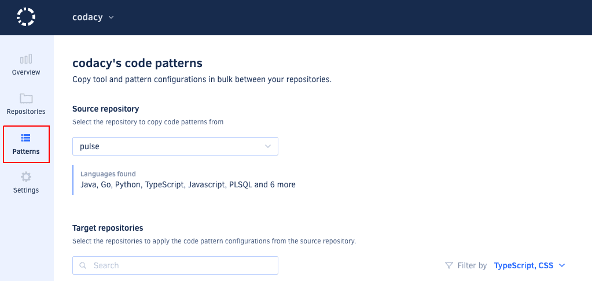

# Self-hosted v4.2.0

These release notes are for [Codacy Self-hosted v4.2.0](https://github.com/codacy/chart/releases/tag/4.2.0){: target="_blank"}, released on August 31, 2021.

To upgrade Codacy, follow [these instructions](../../chart/maintenance/upgrade.md).

## Product enhancements

-   It's now possible to [configure the Codacy quality settings](https://docs.codacy.com/v4.2/repositories-configure/adjusting-quality-settings/) with the minimum severity level of new issues and a maximum number of new security issues, giving you more control over the pull requests that Codacy blocks from being merged. Besides this, the status reported by Codacy on pull requests now includes more information on why the quality checks failed. (CY-4216)

    

-   You can now [copy tool and pattern configurations in bulk](https://docs.codacy.com/v4.2/organizations/copying-code-patterns-between-repositories/) between your repositories to help you bootstrap and standardize the coding standards in your organization. (CY-4196)

    

## Bug fixes

-   Fixed an issue that prevented administrators from removing users from Bitbucket Server organizations on Codacy. Besides this, Codacy Self-hosted administrators can now remove users from Codacy even if they're the last administrator in an organization. (CY-4724)
-   Fixed an issue that could allow an attacker to enable/disable analysis of branches on repositories that they didn't have permissions to access. CVSS v3.1 score: 2.9 (Low) (CY-4618)
-   Fixed an issue that caused the API endpoint `listOrganizationRepositories` to fail if it received both a cursor and an empty search string. (CY-4359)

## Tool versions

This version of Codacy Self-hosted includes the tool versions below. The tools that were updated on this version are highlighted in bold:

-   Ameba 0.13.1
-   Bandit 1.7.0
-   Brakeman 4.3.1
-   bundler-audit 0.6.1
-   **Checkov 2.0.283 (updated from 1.0.838)**
-   **Checkstyle 8.44 (updated from 8.37)**
-   Clang-Tidy 10.0.1
-   CodeNarc 1.6
-   CoffeeLint 2.1.0
-   Cppcheck 2.2
-   Credo 1.4.0
-   CSSLint 1.0.5
-   detekt 1.17.1
-   **ESLint 7.30.0 (updated from 7.29.0)**
-   Faux-Pas 1.7.2
-   Flawfinder 2.0.11
-   Gosec 2.3.0
-   Hadolint 1.18.2
-   Jackson Linter 2.10.2
-   JSHint 2.12.0
-   markdownlint 0.23.1
-   PHP_CodeSniffer 3.6.0
-   PHP Mess Detector 2.8.1
-   **PMD 6.36.0 (updated from 6.33.0)**
-   PMD (Legacy) 5.8.1
-   Prospector 1.3.1
-   PSScriptAnalyzer 1.18.3
-   Pylint 1.9.5
-   Pylint (Python 3) 2.7.4
-   remark-lint 7.0.1
-   Revive 1.0.2
-   **RuboCop 1.18.4 (updated from 1.16.0)**
-   Scalastyle 1.5.0
-   ShellCheck v0.7.1
-   **Sonar C# 8.25 (updated from 8.24)**
-   Sonar Visual Basic 8.15
-   SpotBugs 4.1.2
-   SQLint 0.1.9
-   Staticcheck 2020.1.6
-   Stylelint 13.13.1
-   SwiftLint 0.40.0
-   Tailor 0.12.0
-   TSLint 6.1.3
-   TSQLLint 1.11.1
