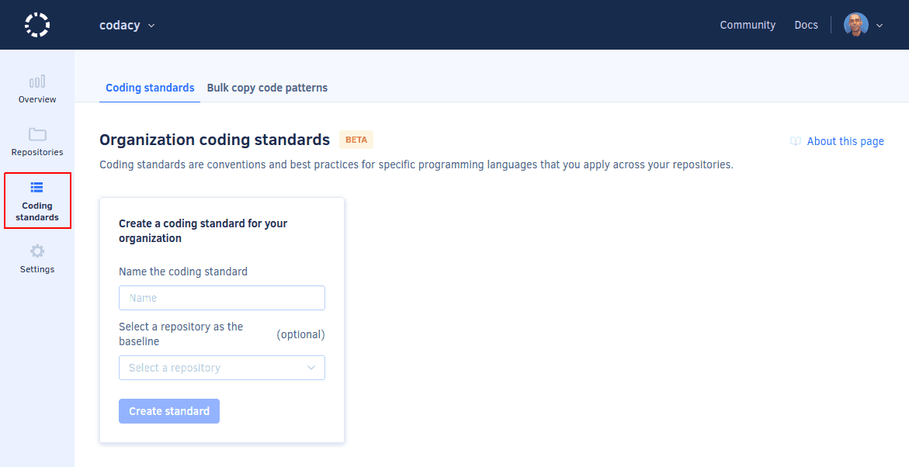

# Self-hosted v5.0.0

These release notes are for [Codacy Self-hosted v5.0.0](https://github.com/codacy/chart/releases/tag/5.0.0){: target="_blank"}, released on December 14, 2021. <!-- TODO Update release date -->

To upgrade Codacy, follow [these instructions](../../chart/maintenance/upgrade.md).

📢 [Visit the Codacy roadmap](https://roadmap.codacy.com) and <span class="skip-vale">let us know</span> your feedback on both new and planned product updates!

## Breaking changes

This version of Codacy Self-hosted introduces the following breaking changes:

-   Dropped support for legacy manual organizations.

    !!! important
        **If you're using legacy manual organizations** please contact <mailto:support@codacy.com> before upgrading to Codacy Self-hosted 5.0.0 or above so that <span class="skip-vale">we</span> can assist you with migrating your legacy organizations.

-   The Codacy components `codacy-activities`, `hotspots-api`, and `hotspots-worker` are no longer needed and were removed.

    Although the update process handles this change automatically by deleting the redundant pods from your cluster, it's recommended that after updating Codacy you manually delete:

    -   The databases `codacy-activities` and `hotspots` since they're no longer used.

    -   The following configuration file keys related to these components and their databases:

        ```text
        activities.*
        hotspots-api.*
        hotspots-worker.*
        global.activitiesdb.*
        global.hotspotsdb.*
        ```

## Product enhancements

-   Now, Codacy supports linting OpenAPI and AsyncAPI descriptions in either YAML or JSON files using [Spectral](https://stoplight.io/open-source/spectral/){: target="_blank"}. (CY-5088)

-   You can now [use an organization coding standard](https://docs.codacy.com/v5.0/organizations/using-a-coding-standard/) to apply the same coding best practices, conventions, or security rules to a group of repositories. (CY-4654)

    

## Bug fixes

-   Fixed an issue that could sometimes cause repository quality settings to be saved only <span class="skip-vale">partially</span>. (CY-5380)
-   Improved the visual feedback for the Jira integration status. (CY-5190)
-   Fixed an issue that prevented the message "Refresh the page to see the results" from being displayed on the commit and pull request pages after a re-analysis was completed. (CY-5187)
-   Fixed some default regular expressions on [<span class="skip-vale">codacy-checkstyle</span>](https://github.com/codacy/codacy-checkstyle){: target="_blank"} that could cause the code pattern PackageName to report false positives when configured using the Codacy UI. (CY-5185)
-   Fixed an issue that caused ESLint to report false positive issues regarding import statement organization if prettier was enabled. (CY-5143)
-   Fixed an issue that could allow triggering requests from the Codacy instance servers by injecting a URL into the cursor parameter of the API endpoint to list organization repositories. (CY-5139)
-   Added protection against CSRF attacks targeting the Codacy API v3. In the case of phishing, even if the victim opens a malicious link, the attack won't work. CVSS v3.1 score: 6.4 (Medium) (CY-5131)
-   Fixed an issue that prevented Codacy from displaying secondary email addresses from GitLab accounts. (CY-5130)
-   Fixed the issue cards in the context of a file to display the issue category. (CY-5125)
-   Fixed an issue that was causing organizations using a legacy plan to get wrong messages about missing members and to not be able to reanalyze commits and PRs. (CY-5112)
-   Added support for the JavaScript extension `.mjs`. (CY-5086)
-   [<span class="skip-vale">codacy-clang-tidy</span>](https://github.com/codacy/codacy-clang-tidy) is now also published as a macOS binary. (CY-5053)

## Tool versions

This version of Codacy Self-hosted includes the tool versions below. The tools that were updated on this version are highlighted in bold:

-   Ameba 0.13.1
-   Bandit 1.7.0
-   Brakeman 4.3.1
-   bundler-audit 0.6.1
-   Checkov 2.0.399
-   Checkstyle 8.44
-   Clang-Tidy 10.0.1
-   CodeNarc 2.2.0
-   CoffeeLint 2.1.0
-   Cppcheck 2.2
-   Credo 1.4.0
-   CSSLint 1.0.5
-   **detekt 1.19.0 (updated from 1.18.1)**
-   ESLint 7.32.0
-   Faux-Pas 1.7.2
-   Flawfinder 2.0.11
-   Gosec 2.8.1
-   Hadolint 1.18.2
-   Jackson Linter 2.10.2
-   JSHint 2.12.0
-   markdownlint 0.23.1
-   PHP Mess Detector 2.10.1
-   **PHP_CodeSniffer 3.6.1 (updated from 3.6.0)**
-   PMD 6.36.0
-   PMD (Legacy) 5.8.1
-   Prospector 1.3.1
-   PSScriptAnalyzer 1.18.3
-   Pylint 1.9.5
-   Pylint (Python 3) 2.7.4
-   remark-lint 7.0.1
-   Revive 1.0.2
-   **RuboCop 1.23.0 (updated from 1.21.0)**
-   Scalastyle 1.5.0
-   **ShellCheck v0.7.2 (updated from v0.7.1)**
-   **Sonar C# 8.30 (updated from 8.25)**
-   Sonar Visual Basic 8.15
-   **Spectral (new)**
-   SpotBugs 4.1.2
-   SQLint 0.1.9
-   Staticcheck 2020.1.6
-   Stylelint 13.13.1
-   **SwiftLint 0.43.1 (updated from 0.40.0)**
-   Tailor 0.12.0
-   TSLint 6.1.3
-   TSQLLint 1.11.1

## See also

-   Announcement for the [end of support for legacy manual organizations on Codacy Cloud](../cloud/cloud-2021-11-02-legacy-organizations.md)
