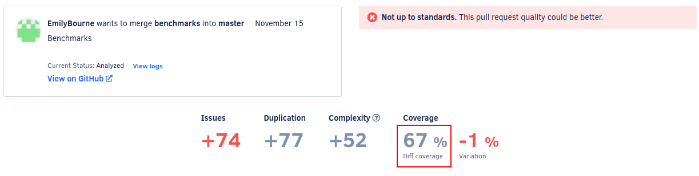
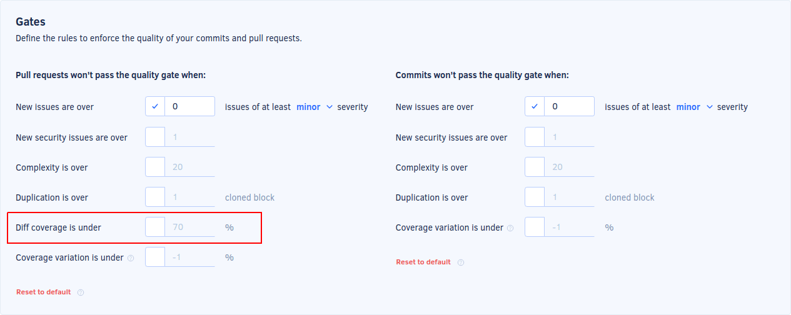

# Self-hosted v6.0.0

These release notes are for [Codacy Self-hosted v6.0.0](https://github.com/codacy/chart/releases/tag/6.0.0){: target="_blank"}, released on March 1, 2022.

📢 [Visit the Codacy roadmap](https://roadmap.codacy.com) and let us know your feedback on both new and planned product updates!

## Upgrading Codacy Self-hosted

Follow the steps below to upgrade to Codacy Self-hosted v6.0.0:

1.  [Check the release notes](../index.md#self-hosted) for all Codacy Self-hosted versions between your current version and the most recent version for breaking changes and follow the instructions provided carefully.

1.  Follow the instructions to [upgrade your Codacy Self-hosted instance](../../chart/maintenance/upgrade.md).

1.  Update your Codacy command-line tools to the versions with the Git tag `self-hosted-6.0.0`:

    -   [Codacy Analysis CLI](https://github.com/codacy/codacy-analysis-cli/releases/tag/self-hosted-6.0.0)
    -   [Codacy Coverage Reporter](https://github.com/codacy/codacy-coverage-reporter/releases/tag/self-hosted-6.0.0)

## Breaking changes

This version of Codacy Self-hosted introduces the following breaking changes:

-   [Dropped support for Kubernetes 1.14 and MicroK8s 1.14](https://docs.codacy.com/v6.0/chart/requirements/)

    Kubernetes 1.14 is an [old version first released in 2019](https://kubernetes.io/blog/2019/03/25/kubernetes-1-14-release-announcement/){: target="_blank"} that's no longer being maintained.

-   [Removed the tool **PMD (Legacy)**](../cloud/cloud-2022-02-16-pmd-legacy-removal.md)

    If you're currently using this tool to analyze your repositories and want to start using **PMD** instead, we recommend that you follow the next steps **before upgrading to this Codacy Self-hosted version**:

    1.  Take note of the code patterns that you have enabled on **PMD (Legacy)** and enable the corresponding code patterns on the new tool **PMD**.

        The new version of the tool includes different code patterns, so it's possible that not all code patterns will have a direct match on the new tool.

    1.  Disable **PMD (Legacy)** and enable **PMD**.

-   Dropped support for custom rules in PHP Mess Detector configuration files

    Now, any custom rules are filtered out from PHP Mess Detector configuration files before running the tool. This was done to protect Codacy's infrastructure against potential arbitrary code execution vulnerabilities.

## Product enhancements

-   Now, Codacy calculates the new metric [diff coverage for pull requests](https://docs.codacy.com/v6.0/repositories/pull-requests/#pull-request-quality-overview). (CY-5533)

    

    It's also possible to [set up a quality gate rule](https://docs.codacy.com/v6.0/repositories-configure/adjusting-quality-settings/#gates) for diff coverage. (CY-5534)

    

-   Updated the [codacy-rubocop](https://github.com/codacy/codacy-rubocop) plugins listed below. (CY-5550)

    -   [rubocop-shopify 2.4.0](https://rubygems.org/gems/rubocop-shopify/versions/2.4.0)
    -   [rubocop-sorbet 0.6.5](https://rubygems.org/gems/rubocop-sorbet/versions/0.6.5)
    -   [rubocop-rails 2.13.2](https://rubygems.org/gems/rubocop-rails/versions/2.13.2)
    -   [rubocop-performance 1.13.2](https://rubygems.org/gems/rubocop-performance/versions/1.13.2)
    -   [rubocop-graphql 0.12.3](https://rubygems.org/gems/rubocop-graphql/versions/0.12.3)
    -   [rubocop-ast 1.15.1](https://rubygems.org/gems/rubocop-ast/versions/1.15.1)

-   Now, the [**Issues breakdown** area on the Repository Dashboard](https://docs.codacy.com/v6.0/repositories/repository-dashboard/#issues-breakdown) displays all issue categories, including **Code complexity**. (CY-5463)

-   You can now use the Codacy configuration file to [adjust how PMD CPD detects duplicated code](https://docs.codacy.com/v6.0/repositories-configure/codacy-configuration-file/#pmd-cpd-duplication), giving you more flexibility to eliminate false positives. (CY-5184)

-   Now, Codacy supports static code analysis for Dart/Flutter projects using [dartanalyzer](https://github.com/dart-lang/sdk/tree/main/pkg/analyzer_cli){: target="_blank"}. The new tool checks your code for errors and warnings that are specified in the [Dart language specification](https://dart.dev/guides/language/spec){: target="_blank"}. (CY-4314)

## Bug fixes

-   Now, the **Coverage** column always appears on the Files page even when there's no coverage data, avoiding a jump in the view. (CY-5518)
-   Updated the Git URL used to clone public repositories to comply with the recent [GitHub protocol changes](https://github.blog/2021-09-01-improving-git-protocol-security-github/){: target="_blank"}. (CY-5436)
-   Fixed an issue that could prevent users from using the Codacy app website temporarily if they were exposed to a phishing attack. CVSS v3.1 score: 3.1 (Low) (CY-5420)
-   Fixed a security issue that, under rare circumstances, could allow an attacker to run arbitrary code on the **Ignored files** settings page. CVSS v3.1 score: 3.8 (Low) (CY-5419)
-   Added the plugin [eslint-plugin-storybook](https://www.npmjs.com/package/eslint-plugin-storybook) to [codacy-eslint](https://github.com/codacy/codacy-eslint). (CY-5406)

## Tool versions

This version of Codacy Self-hosted includes the tool versions below. The tools that were updated on this version are highlighted in bold:

-   Ameba 0.13.1
-   Bandit 1.7.0
-   Brakeman 4.3.1
-   bundler-audit 0.6.1
-   Checkov 2.0.399
-   Checkstyle 8.44
-   Clang-Tidy 10.0.1
-   CodeNarc 2.2.0
-   CoffeeLint 2.1.0
-   Cppcheck 2.2
-   Credo 1.4.0
-   CSSLint 1.0.5
-   **dartanalyzer 2.15.1 (new)**
-   detekt 1.19.0
-   ESLint 7.32.0
-   Faux-Pas 1.7.2
-   Flawfinder 2.0.11
-   Gosec 2.8.1
-   Hadolint 1.18.2
-   Jackson Linter 2.10.2
-   JSHint 2.12.0
-   markdownlint 0.23.1
-   PHP Mess Detector 2.10.1
-   PHP_CodeSniffer 3.6.2
-   PMD 6.36.0
-   Prospector 1.3.1
-   PSScriptAnalyzer 1.18.3
-   Pylint 1.9.5
-   Pylint (Python 3) 2.7.4
-   remark-lint 7.0.1
-   Revive 1.0.2
-   **RuboCop 1.25.1 (updated from 1.23.0)**
-   Scalastyle 1.5.0
-   ShellCheck v0.7.2
-   Sonar C# 8.30
-   Sonar Visual Basic 8.15
-   spectral-rulesets 1.2.7
-   **SpotBugs 4.5.3 (updated from 4.1.2)**
-   **SQLint 0.2.1 (updated from 0.1.9)**
-   Staticcheck 2020.1.6
-   **Stylelint 14.2.0 (updated from 14.1.0)**
-   SwiftLint 0.43.1
-   Tailor 0.12.0
-   TSLint 6.1.3
-   TSQLLint 1.11.1
