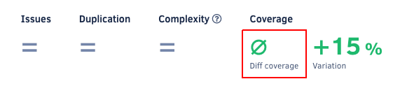

# Self-hosted v8.1.0

These release notes are for [Codacy Self-hosted v8.1.0](https://github.com/codacy/chart/releases/tag/8.1.0), released on June 17, 2022.

📢 [Visit the Codacy roadmap](https://roadmap.codacy.com) and let us know your feedback on both new and planned product updates!

## Upgrading Codacy Self-hosted

Follow the steps below to upgrade to Codacy Self-hosted v8.1.0:

1.  Check the [release notes for all Codacy Self-hosted versions](../index.md#self-hosted) **between your current version and the most recent version** for breaking changes and follow the instructions provided carefully.

1.  Follow the instructions to [upgrade your Codacy Self-hosted instance](https://docs.codacy.com/v8.1/chart/maintenance/upgrade/).

1.  Update your Codacy command-line tools to the versions with the Git tag `self-hosted-8.1.0`:

    -   [Codacy Analysis CLI](https://github.com/codacy/codacy-analysis-cli/releases/tag/self-hosted-8.1.0)
    -   [Codacy Coverage Reporter](https://github.com/codacy/codacy-coverage-reporter/releases/tag/self-hosted-8.1.0)

## Product enhancements

-   Codacy now supports using [expiring access tokens](https://docs.gitlab.com/ee/integration/oauth_provider.html#expiring-access-tokens) to integrate with GitLab. Users affected by issues connecting to GitLab should re-login on the Codacy UI **using their GitLab accounts**, or [revoke the GitLab integration on Codacy](https://docs.codacy.com/v8.1/getting-started/which-permissions-does-codacy-need-from-my-account/#revoking-access-to-integrations) if the issues persist. (CY-6117)
-   The Codacy Coverage Reporter now prints a more explicit error message when using an account API token from a user that [doesn't have permission to upload coverage data](https://docs.codacy.com/v8.1/organizations/roles-and-permissions-for-synced-organizations/). (CY-6084)
-   Codacy now [displays diff coverage as not applicable](https://docs.codacy.com/v8.1/repositories/pull-requests/#pull-request-quality-overview) (represented by `∅`) when there are no coverable lines included in a pull request, and correctly reports the pull request status on your Git provider in this scenario. (CY-5960)

    

-   [Pull request notification emails](https://docs.codacy.com/v8.1/account/emails/#managing-your-email-notifications) now display the diff coverage metric. (CY-5700)

## Bug fixes

-   Fixed an issue to allow saving coverage data for the first commit in a repository. (CY-6196)
-   Fixed an issue that could allow an attacker with an account on both the Codacy Self-hosted instance and on the Git provider to do destructive actions on **Codacy personal organizations**, such as removing members from Codacy or deleting the personal organization on Codacy. The issue didn't allow the attacker to see or change any information on the Git provider organization or repositories. CVSS v3.1 score: 7.3 (High) (CY-6184, CY-6187, CY-6188)
-   Fixed an issue that could allow an attacker with an account on both the Codacy Self-hosted instance and on the Git provider to join a **public Codacy organization** and know the email addresses of the organization members on Codacy. The issue didn't allow the attacker to see or change any information on the Git provider organization or repositories. CVSS v3.1 score: 3.1 (Low) (CY-6174)
-   Removed the username field from the Codacy UI and relevant API endpoints since it's no longer used and could be exploited to leak email addresses that are already in use on Codacy. (CY-6173)
-   Fixed an issue that caused commits to be in the "Analyzing" state indefinitely if the setting **Run the repository analysis on your build server** was off and a client-side result was uploaded to the repository. (CY-6136)
-   Fixed the parsing of dartanalyzer results containing many issues. (CY-6067)

## Tool versions

This version of Codacy Self-hosted includes the tool versions below. The tools that were updated on this version are highlighted in bold:

-   Ameba 0.13.1
-   Bandit 1.7.0
-   Brakeman 4.3.1
-   bundler-audit 0.6.1
-   Checkov 2.0.399
-   Checkstyle 8.44
-   Clang-Tidy 10.0.1
-   CodeNarc 2.2.0
-   CoffeeLint 2.1.0
-   Cppcheck 2.2
-   Credo 1.4.0
-   CSSLint 1.0.5
-   **[dartanalyzer 2.17.0](https://github.com/dart-lang/sdk/blob/main/CHANGELOG.md#2170---2022-05-11) (updated from 2.16.2)**
-   detekt 1.19.0
-   **[ESLint 8.15.0](https://github.com/eslint/eslint/releases/tag/v8.15.0) (updated from 8.14.0)**
-   ESLint (deprecated) 7.32.0
-   Faux-Pas 1.7.2
-   Flawfinder 2.0.19
-   Gosec 2.8.1
-   Hadolint 1.18.2
-   Jackson Linter 2.10.2
-   JSHint 2.12.0
-   markdownlint 0.23.1
-   PHP Mess Detector 2.10.1
-   PHP_CodeSniffer 3.6.2
-   PMD 6.36.0
-   Prospector 1.3.1
-   PSScriptAnalyzer 1.18.3
-   Pylint 1.9.5
-   Pylint (Python 3) 2.7.4
-   remark-lint 7.0.1
-   **[Revive 1.2.1](https://github.com/mgechev/revive/releases/tag/v1.2.1) (updated from 1.0.2)**
-   RuboCop 1.28.2
-   Scalastyle 1.5.0
-   ShellCheck 0.7.2
-   **[Sonar C# 8.39](https://github.com/SonarSource/sonar-dotnet/releases/tag/v8.39.0.47922) (updated from 8.33)**
-   Sonar Visual Basic 8.15
-   spectral-rulesets 1.2.7
-   SpotBugs 4.5.3
-   SQLint 0.2.1
-   Staticcheck 2020.1.6
-   Stylelint 14.2.0
-   SwiftLint 0.43.1
-   Tailor 0.12.0
-   TSLint 6.1.3
-   TSQLLint 1.11.1
