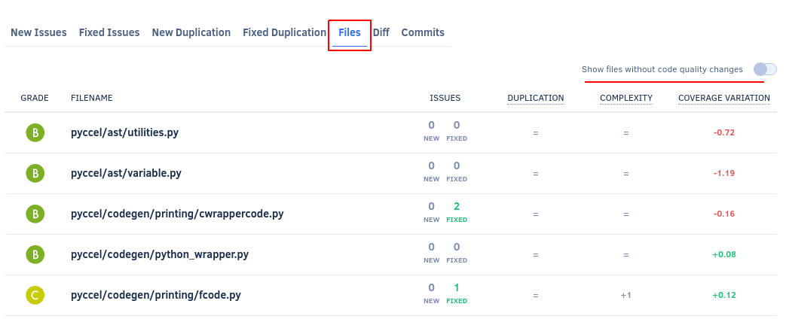

# Self-hosted v8.2.0

These release notes are for [Codacy Self-hosted v8.2.0](https://github.com/codacy/chart/releases/tag/8.2.0){: target="_blank"}, released on September 21, 2022.<!-- TODO Update release date -->

📢 [Visit the Codacy roadmap](https://roadmap.codacy.com) and let us know your feedback on both new and planned product updates!

<!--TODO Check these issues manually

Jira issues without release notes
-   https://codacy.atlassian.net/browse/CY-3958

Jira issues with disabled release notes
-   https://codacy.atlassian.net/browse/CY-6459
-   https://codacy.atlassian.net/browse/CY-6439
-   https://codacy.atlassian.net/browse/CY-6425
-   https://codacy.atlassian.net/browse/CY-6191
-->

## Upgrading Codacy Self-hosted

Follow the steps below to upgrade to Codacy Self-hosted v8.2.0:

1.  Check the [release notes for all Codacy Self-hosted versions](../index.md#self-hosted) **between your current version and the most recent version** for breaking changes and follow the instructions provided carefully.

1.  Follow the instructions to [upgrade your Codacy Self-hosted instance](https://docs.codacy.com/v8.2/chart/maintenance/upgrade/).

1.  Update your Codacy command-line tools to the versions with the Git tag `self-hosted-8.2.0`:

    -   [Codacy Analysis CLI](https://github.com/codacy/codacy-analysis-cli/releases/tag/self-hosted-8.2.0)
    -   [Codacy Coverage Reporter](https://github.com/codacy/codacy-coverage-reporter/releases/tag/self-hosted-8.2.0)

## Breaking changes

This version of Codacy Self-hosted requires [PostgreSQL version 10.20](https://docs.codacy.com/v8.2/chart/requirements/#postgresql-server-setup) since the previous major version [will reach end-of-life (EOL) later this year](https://www.postgresql.org/support/versioning/).

To upgrade PostgreSQL:

1.  Follow the instructions on [how to upgrade a PostgreSQL cluster](https://www.postgresql.org/docs/10/upgrading.html).

1.  After the upgrade, clean the Codacy databases with [vacuumdb](https://www.postgresql.org/docs/10/app-vacuumdb.html) to prevent the autovacuum</a> feature from momentarily affecting the performance of the databases at a later time.

## Product enhancements

-   The [GitHub integration](https://docs.codacy.com/v8.2/repositories-configure/integrations/github-integration/) now uses a GitHub Apps token instead of a personal one so that the following features continue working even if the person who created the integration leaves the organization on GitHub:

    -   Analyzing new commits and pull requests
    -   Updating the status check of pull requests
    -   Suggesting changes
    -   Creating comments and issues on GitHub for issues detected by Codacy

    Additionally, all activity related to the GitHub integration features now appear as having been performed by Codacy instead of the person who created the integration. (PLUTO-36, PLUTO-77)

    

-   Added the new API endpoint [searchOrganizationRepositoriesWithAnalysis](https://api.codacy.com/api/api-docs#searchorganizationrepositorieswithanalysis) to allow searching for repositories in more advanced use cases. For now, it's possible to search for repositories filtered by a list of names. (PLUTO-45)

-   Codacy now displays the coverage variation metric with a precision of two decimal places on the [Pull request](https://docs.codacy.com/v8.2/repositories/pull-requests/), [Commit](https://docs.codacy.com/v8.2/repositories/commits/), and [Files](https://docs.codacy.com/v8.2/repositories/files/) page, and you can [define quality gates](https://docs.codacy.com/v8.2/repositories-configure/adjusting-quality-settings/#gates) with a coverage variation threshold using the same precision.

    The increased precision of the metric reflects the code coverage changes better by reducing the false changes due to rounding errors. (IO-54, IO-92, IO-93)

    

-   Improved the Codacy Analysis CLI output to provide better feedback when tools fail to run. (IO-47)

-   Improved the error handling for the [Stylelint exit codes](https://stylelint.io/user-guide/usage/cli/#exit-codes). (IO-47)

-   Now, the **Files** tab on [pull request](https://docs.codacy.com/v8.2/repositories/pull-requests/#files-tab) and [commit](https://docs.codacy.com/v8.2/repositories/commits/#files-tab) pages displays only files with a variation of their code quality metrics, to make it more convenient to analyze the impact of your changes on the code quality of the files.

    You can still list all files that the pull request updated, even if their code quality metrics didn't change, by toggling the new option **Show files without code quality changes**. (CY-6455)

    

-   Codacy Self-hosted now supports [integrating with Bitbucket Server instances](https://docs.codacy.com/v8.2/chart/configuration/integrations/bitbucket-server/) that have been configured with [custom context paths](https://confluence.atlassian.com/bitbucketserver/change-bitbucket-s-context-path-776640153.html). (CY-6251)

-   After [enabling the analysis for a branch](https://docs.codacy.com/v8.2/repositories-configure/managing-branches/), Codacy now provides improved feedback about the progress of the first analysis of that branch. (CY-6166)

-   The [Organization Overview](https://docs.codacy.com/v8.2/organizations/organization-overview/) now allows filtering repositories to help you see and focus on the information for the repositories that matter most to your team. (CY-5573)

    

## Bug fixes

-   Codacy now supports user accounts with email addresses containing the special characters specified in [RFC 5322](https://www.rfc-editor.org/rfc/rfc5322#section-3.4.1). (PLUTO-73)
-   Fixed an issue that prevented changing code pattern configurations in a coding standard if Codacy added the code patterns only after the coding standard had been created. (PLUTO-37)
-   Fixed an issue in the Codacy Analysis CLI and the cloc metrics tool that made the tools fail when running for an empty set of files. (IO-47)
-   Fixed an issue that caused PMD to fail when called in some modes. (IO-47)
-   It's now possible to **Command+click** files on [pull request](https://docs.codacy.com/v8.2/repositories/pull-requests/#files-tab) and [commit](https://docs.codacy.com/v8.2/repositories/commits/#files-tab) pages to open the file details on new browser windows. (CY-6410)

## Tool versions

This version of Codacy Self-hosted includes the tool versions below. The tools that were updated on this version are highlighted in bold:

-   Ameba 0.13.1
-   Bandit 1.7.0
-   Brakeman 4.3.1
-   bundler-audit 0.6.1
-   **[Checkov 2.1.188](https://github.com/bridgecrewio/checkov/releases/tag/2.1.188) (updated from 2.0.399)**
-   **[Checkstyle 10.3.1](https://checkstyle.sourceforge.io/releasenotes.html#Release_10.3.1) (updated from 8.44)**
-   Clang-Tidy 10.0.1
-   CodeNarc 2.2.0
-   CoffeeLint 2.1.0
-   Cppcheck 2.2
-   Credo 1.4.0
-   CSSLint 1.0.5
-   dartanalyzer 2.17.0
-   detekt 1.19.0
-   **[ESLint 8.23.1](https://github.com/eslint/eslint/releases/tag/v8.23.1) (updated from 8.15.0)**
-   ESLint (deprecated) 7.32.0
-   Faux-Pas 1.7.2
-   Flawfinder 2.0.19
-   Gosec 2.8.1
-   Hadolint 1.18.2
-   Jackson Linter 2.10.2
-   JSHint 2.12.0
-   markdownlint 0.23.1
-   PHP Mess Detector 2.10.1
-   PHP_CodeSniffer 3.6.2
-   **[PMD 6.48.0](https://pmd.sourceforge.io/pmd-6.48.0/pmd_release_notes.html) (updated from 6.36.0)**
-   **[Prospector 1.7.7](https://github.com/PyCQA/prospector/releases/tag/1.7.7) (updated from 1.3.1)**
-   PSScriptAnalyzer 1.18.3
-   Pylint 1.9.5
-   **[Pylint (Python 3) 2.14.5](https://github.com/PyCQA/pylint/releases/tag/v2.14.5) (updated from 2.7.4)**
-   remark-lint 7.0.1
-   **[Revive 1.2.3](https://github.com/mgechev/revive/releases/tag/v1.2.3) (updated from 1.2.1)**
-   **[RuboCop 1.32.0](https://github.com/rubocop/rubocop/releases/tag/v1.32.0) (updated from 1.28.2)**
-   Scalastyle 1.5.0
-   **[ShellCheck 0.8.0](https://github.com/koalaman/shellcheck/blob/master/CHANGELOG.md#v080---2021-11-06) (updated from v0.7.2)**
-   Sonar C# 8.39
-   Sonar Visual Basic 8.15
-   spectral-rulesets 1.2.7
-   SpotBugs 4.5.3
-   SQLint 0.2.1
-   **[Staticcheck 2022.1.3](https://staticcheck.io/changes/2022.1/#2022.1.3) (updated from 2020.1.6)**
-   Stylelint 14.2.0
-   SwiftLint 0.43.1
-   Tailor 0.12.0
-   TSLint 6.1.3
-   TSQLLint 1.11.1
