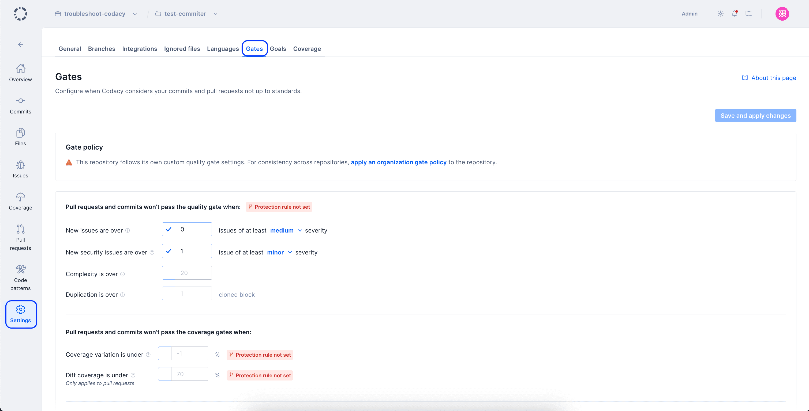

# Adjusting quality gates

You can adjust the **Gates** for the quality of your code to configure when Codacy reports your pull requests and commits as not up to standards.

Depending on the result of applying the quality gate rules, Codacy updates the color of the metrics on the [pull request or commit quality overview](../repositories/pull-requests.md#quality-overview) and reports the corresponding pull request status on your Git provider, if enabled.

!!! note
    [Integrate Codacy with your Git workflow](../getting-started/integrating-codacy-with-your-git-workflow.md) to report the pull request status to your Git provider and optionally block merging pull requests that aren't up to standards.

To access the quality gates, open your repository **Settings**, tab **Gates**. The following screenshot displays the default configuration values:

-   **New issues are over:** Pull requests or commits are marked not up to standards if the number of issues introduced that have at least the specified severity level is higher than the set value.
-   **New security issues are over:** Pull requests or commits are marked not up to standards if the number of security issues introduced is higher than the set value.
-   **Complexity is over:** Pull requests or commits are marked not up to standards if the introduced complexity is higher than the set value.
-   **Duplication is over:** Pull requests or commits are marked not up to standards if the number of clones introduced is higher than the set value.
-   **Diff coverage is under:** Pull requests are marked not up to standards if the diff coverage of the pull request is lower than the set value or `∅` ([not applicable](../faq/code-analysis/which-metrics-does-codacy-calculate.md#code-coverage)). This rule is only available for pull requests.
-   **Coverage variation is under:** Pull requests or commits are marked not up to standards if they introduce a variation to coverage lower than the set value.

    !!! tip
        **Set this gate to -0.10% or lower.** This will ensure that developers have a coverage drop margin so they aren't blocked [while performing some types of code refactors](../faq/code-analysis/why-does-codacy-show-unexpected-coverage-changes.md#example-pull-request-coverage-variation-is-negative-but-no-files-have-coverage-variation)

        To ensure that the changes in each pull request have a minimum level of coverage, use the gate **Diff coverage is under** instead.

## See also

-   [Which metrics does Codacy calculate?](../faq/code-analysis/which-metrics-does-codacy-calculate.md)
-   [Integrating Codacy with your Git workflow](../getting-started/integrating-codacy-with-your-git-workflow.md)
-   [Why does Codacy show unexpected coverage changes?](../faq/code-analysis/why-does-codacy-show-unexpected-coverage-changes.md)
-   [Diff coverage: we have a new metric and quality gate rule for PRs](https://blog.codacy.com/diff-coverage/)
