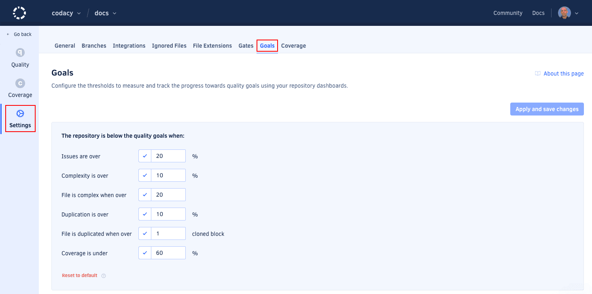

# Adjusting quality goals

Adjust the **quality goals** to help you monitor the progress of the code quality in your repository dashboard, and configure which files Codacy considers complex or duplicated.

Codacy displays the quality goals as dashed lines on the [quality evolution chart](../repositories/repository-dashboard.md#quality-evolution-chart) to help you monitor the progress and overall quality status of your repository.

To access the quality goals, open your repository **Settings**, tab **Goals**. The following screenshot displays the default configuration values:

-   **Issues are over:** Defines the threshold displayed on the tab **Issues** of the quality evolution chart.
-   **Complexity is over:** Defines the threshold displayed on the tab **Complexity** of the quality evolution chart.
-   **File is complex when over:** A file is considered complex when its complexity is over this value.
-   **Duplication is over:** Defines the threshold displayed on the tab **Duplication** of the quality evolution chart.
-   **File is duplicate when over:** A file is considered duplicated when it has more clones than this value.
-   **Coverage is under:** Defines the threshold displayed on the tab **Coverage** of the quality evolution chart.



## See also

-   [Which metrics does Codacy calculate?](../faq/code-analysis/which-metrics-does-codacy-calculate.md)
