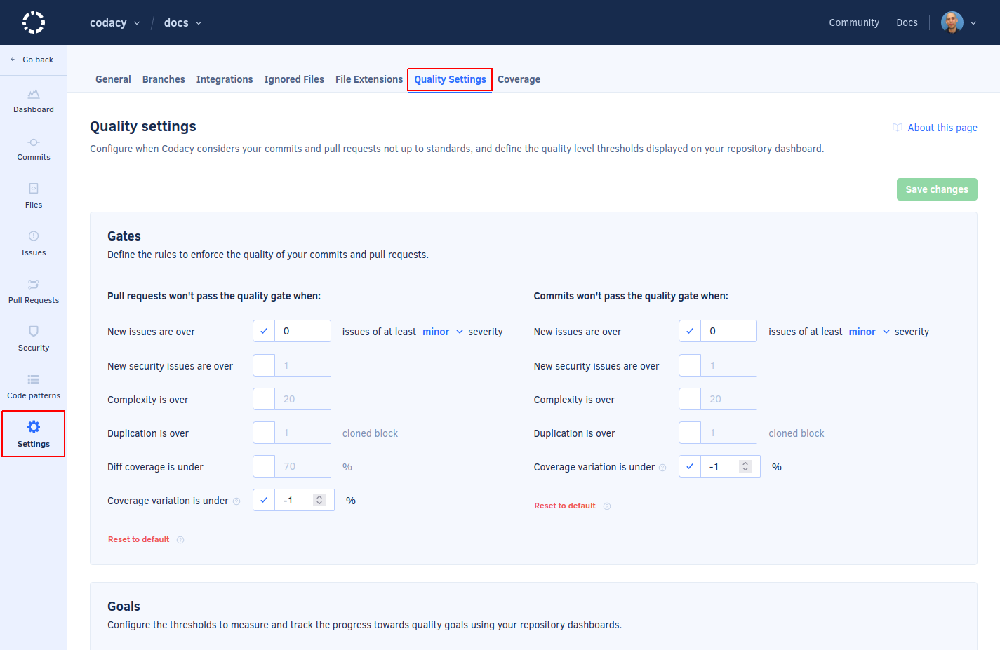
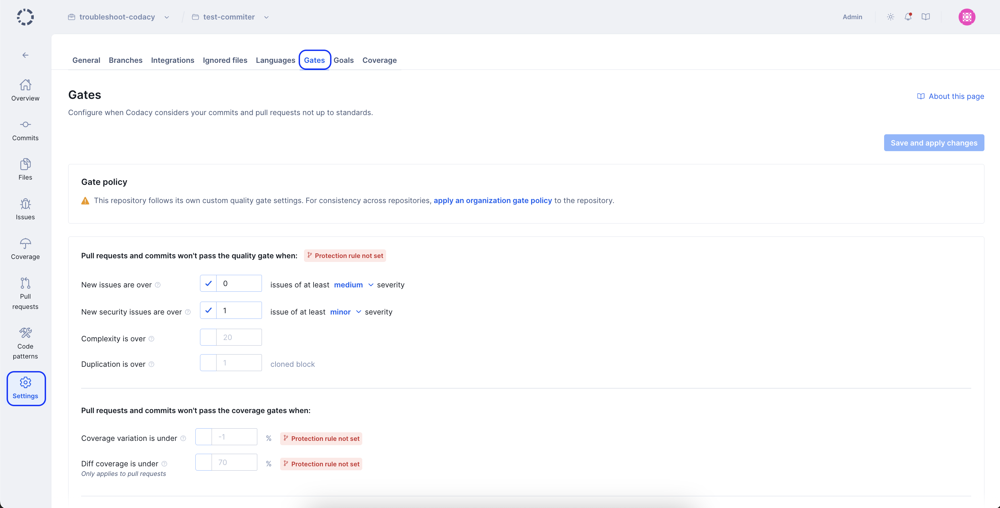
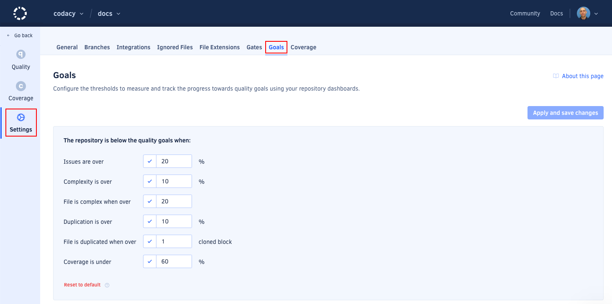

# Adjusting quality settings

The **Quality settings** give you control over how Codacy reports the status of analyzed pull requests and commits, as well as the quality standard thresholds in the [quality evolution chart](../repositories/repository-dashboard.md#quality-evolution-chart) of your repository.

To access the quality settings, open your repository **Settings**, tab **Quality Settings**:

The following sections explain the settings in detail.

## Gates

These settings configure the quality gates for pull requests and commits.

!!! tip
    After enabling these settings you can [set Codacy as a required check](../faq/repositories/how-do-i-set-codacy-as-a-required-check-to-merge-prs.md) before merging your pull requests.

-   **New issues are over:** Pull requests or commits are marked not up to standards if the number of issues introduced that have at least the specified severity level is higher than the set value. The default value is 0.
-   **New security issues are over:** Pull requests or commits are marked not up to standards if the number of security issues introduced is higher than the set value. By default, this setting is off.
-   **Complexity is over:** Pull requests or commits are marked not up to standards if the introduced complexity is higher than the set value. By default, this setting is off.
-   **Duplication is over:** Pull requests or commits are marked not up to standards if the number of clones introduced is higher than the set value. By default, this setting is off.
-   **Coverage variation is under:** Pull requests or commits are marked not up to standards if the coverage introduced is smaller than the set value. This value refers to the variation of coverage on your pull requests or commits. For example, if your repository has 90% coverage and you want to make sure that this value doesn't decrease, set the value to 0%. By default, this setting is off. The maximum value is 1%.

## Goals

These settings configure the quality standard thresholds for your repository that's displayed as a dashed line on the [quality evolution chart](../repositories/repository-dashboard.md#quality-evolution-chart), and which files Codacy considers complex and duplicated.

-   **Issues are over:** Defines the threshold displayed on the tab **Issues** of the quality evolution chart.
-   **Complexity of files is over:** Defines the threshold displayed on the tab **Complexity** of the quality evolution chart.
-   **File is complex when over:** A file is considered complex when its complexity is over this value.
-   **Duplication of files is over:** Defines the threshold displayed on the tab **Duplication** of the quality evolution chart.
-   **File is duplicate when over:** A file is considered duplicated when it has more clones than this value.
-   **Coverage is under:** Defines the threshold displayed on the tab **Coverage** of the quality evolution chart.
