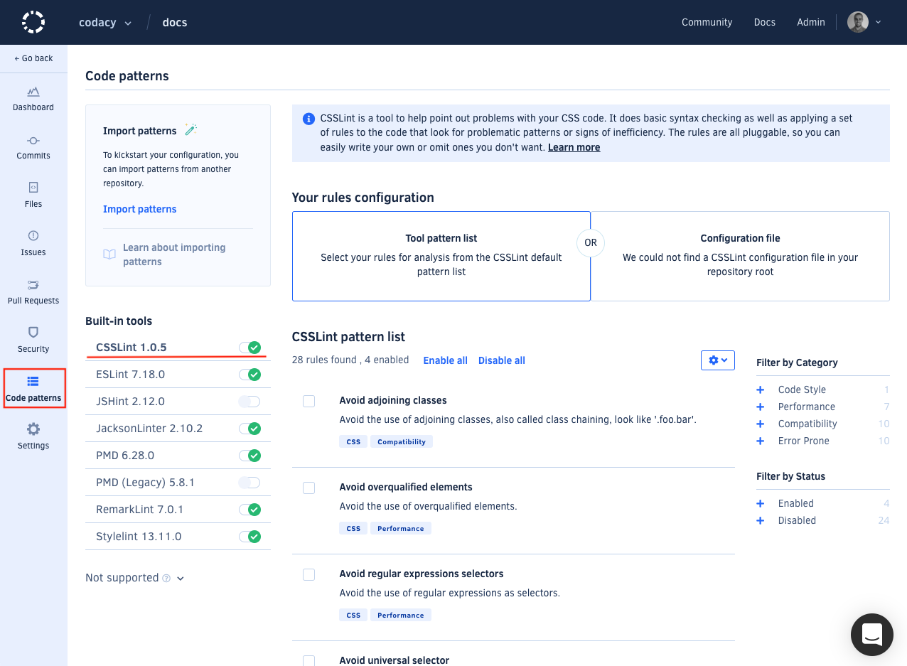
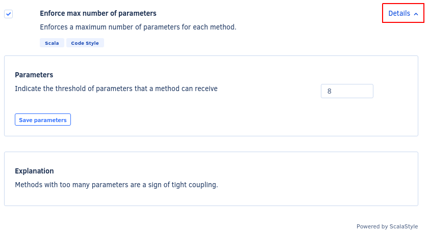
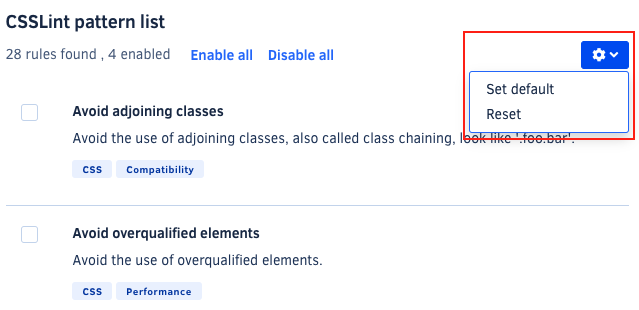
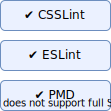
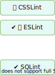
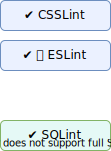
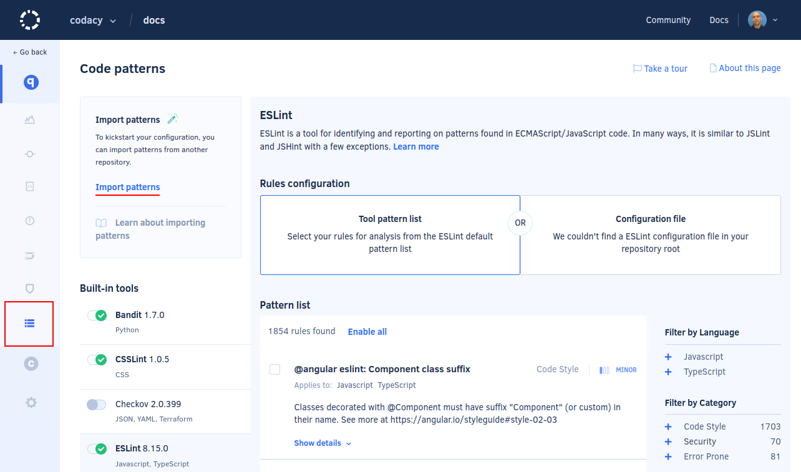
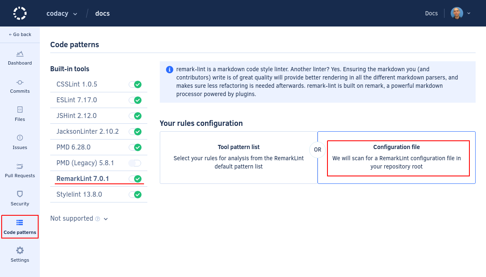

# Configuring code patterns

By default, Codacy uses a subset of the patterns that exist for each tool to analyze your repositories. These default patterns result from community feedback or existing coding standards.

However, you can create a coding standard adapted to your scenario by configuring the tool patterns that Codacy uses to analyze each repository:

1.  Open your repository **Code patterns** page and select the tool to configure:

    

1.  Enable or disable the patterns using the checkbox for each pattern.

    To see a detailed explanation about the issues that a pattern can detect and how to fix them, click **Details** on the top right-hand corner of the pattern. Some patterns also allow you to configure the rules:

    

1.  Optionally, [manually reanalyze your repository](../faq/repositories/how-do-i-reanalyze-my-repository.md) to immediately take the changes into account. Otherwise, Codacy will use the new configuration when it analyzes a new commit or pull request.

## Category filters

To make it easier to find relevant patterns, you can use the sidebar to filter the patterns by category:

The issues detected by Codacy belong to one of the following categories:

-   **Code Style:** Code formatting and syntax problems. For example, variable names style, enforcing the use of brackets and quotation marks
-   **Error Prone:** Code that may hide bugs and language keywords that should be used with caution. For example, the operator `==` in JavaScript or `Option.get` in Scala
-   **Code Complexity:** High complexity methods and classes that should be refactored
-   **Performance:** Code that could have performance problems
-   **Compatibility:** Used mainly for frontend code, detects compatibility problems across different browser versions
-   **Unused Code:** Unused variables and methods, code that can't be reached
-   **Security:** All security problems
-   **Documentation:** Detects methods and classes that don't have the correct comment annotations

## Setting a default configuration for new repositories {: id="set-default"}

If you're adding multiple repositories to Codacy that should reuse the same pattern configuration for a tool, you can define that configuration as the default. Codacy automatically applies that default configuration to new repositories.

To apply the same pattern configuration to multiple repositories:

1.  Add the first repository and configure the patterns on that repository for the relevant tools.

1.  For each tool, expand the menu at the top of the pattern list and select **Set default**.

    This option sets the current pattern configuration as the default for your account when adding new repositories to Codacy.

    

1.  Add the remaining repositories to Codacy.

    The new repositories will automatically use the tool pattern configuration that you set as default.

To reset the pattern configuration of a tool back to the default provided by Codacy:

1.  Expand the menu at the top of the pattern list for that tool and select **Reset** to revert the configuration back to the one provided by Codacy.

1.  Select **Set default** on the same menu to reset the default configuration.

## Importing pattern configurations from another repository {: id="import-patterns"}

Importing tool and pattern configurations from another repository can help you bootstrap and standardize the coding standard across your repositories.

For example, when adding a new repository on Codacy you can copy the tool and pattern configurations from an existing repository that's already configured, and then tweak and adapt the settings for your new repository.

!!! important
    Consider the following when importing tool and pattern configurations:

    -   **Tool matching:** Codacy only copies settings for tools that are available on both the source and target repositories, and overwrites the existing settings for these tools on the target repository.
    -   **Toggle status:** Codacy copies the enabled or disabled status of the matching tools from the source to the target repository.
    -   **Configuration files:** Codacy copies the UI configuration of all matching tools, even those set to use configuration files. However, the import does not include the configuration mode itself.

    The following example illustrates the points above:

    | Source repository | Target repository | Target repository after import |
    |-------------------|-------------------|--------------------------------|
    |  |  |  |

To import the tool and pattern configurations from another repository:

1.  Open your repository **Code patterns** and click **Import patterns**.

    

1.  Follow the instructions to select the source repository and complete the import.

1.  Review and adjust your tool and pattern configurations if necessary.

Codacy will use the updated configurations on the next analysis.

## Using your own tool configuration files

<!-- TODO Consider including the configuration file names reference somewhere else (see https://github.com/codacy/docs/issues/43) -->

Codacy supports configuration files for several tools. To use a configuration file for your static analysis tool:

1.  Add the configuration file to the root of your repository.

1.  Open your repository **Code patterns** page and select **Configuration file** for the respective tool:

    

The known file names for each tool are the following:

<table>
  <thead>
    <tr>
      <th>Tool name</th>
      <th>Language</th>
      <th>Files detected</th>
      <th>Other info</th>
    <tr>
  </thead>
  <tbody>
  <tr>
    <td>Ameba</td>
    <td>Crystal</td>
    <td><code>.ameba.yml</code></td>
    <td></td>
  </tr>
  <tr>
    <td><a href="https://docs.openstack.org/bandit/latest/config.html">Bandit</a></td>
    <td>Python</td>
    <td><code>bandit.yml</code>, <code>.bandit<code></td>
    <td>To solve flagged valid Python "assert" statements, create a <code>bandit.yml</code> in the root of the repository containing: <code>skips: \['B101'\]</code></td>
  </tr>
  <tr>
    <td>Brakeman</td>
    <td>Ruby</td>
    <td><code>config/brakeman.yml</code></td>
    <td></td>
  </tr>
  <tr>
    <td>Checkstyle</td>
    <td>Java</td>
    <td><code>checkstyle.xml</code></td>
    <td>Supports configuration file in directories other than root and can search up to 5 directories into the repository.</td>
  </tr>
  <tr>
    <td>CodeNarc</td>
    <td>Groovy</td>
    <td><code>.codenarcrc</code></td>
    <td></td>
  </tr>
  <tr>
    <td>Credo</td>
    <td>Elixir</td>
    <td><code>.credo.exs</code></td>
    <td></td>
  </tr>
  <tr>
    <td>CSSLint</td>
    <td>CSS</td>
    <td><code>.csslintrc</code></td>
    <td></td>
  </tr>
  <tr>
    <td>Detekt</td>
    <td>Kotlin</td>
    <td><code>default-detekt-config.yml</code>, <code>detekt.yml</code></td>
    <td>Supports configuration file in directories other than root and can search up to 5 directories into the repository.</td>
  </tr>
  <tr>
    <td><a href="https://eslint.org/docs/user-guide/configuring">ESLint</a></td>
    <td>JavaScript, Typescript, JSON</td>
    <td><code>.eslintrc.js</code>, <code>.eslintrc.yaml</code>, <code>.eslintrc.yml</code>, <code>.eslintrc.json</code>, <code>.eslintrc</td>
    <td><a href="https://github.com/codacy/codacy-eslint/blob/master/src/eslintDefaultOptions.ts#L26">Plugins in the UI</a> 
        <a href="https://github.com/codacy/codacy-eslint/blob/master/package.json#L119">Other Plugins</a></td>
  </tr>
  <tr>
    <td>Hadolint</td>
    <td>Docker</td>
    <td><code>.hadolint.yaml</code></td>
    <td></td>
  </tr>
  <tr>
    <td>JSHint</td>
    <td>JavaScript</td>
    <td><code>.jshintrc</code></td>
    <td></td>
  </tr>
  <tr>
    <td><a href="https://github.com/squizlabs/PHP_CodeSniffer/wiki/Advanced-Usage">PHP CodeSniffer</a></td>
    <td>PHP</td>
    <td><code>phpcs.xml</code>, <code>phpcs.xml.dist</code></td>
    <td></td>
  </tr>
  <tr>
    <td>PHPMD</td>
    <td>PHP</td>
    <td><code>codesize.xml</code></td>
    <td></td>
  </tr>
  <tr>
    <td>PMD</td>
    <td>Apex, Java, JavaScript, JSP, XML, Velocity and Visualforce</td>
    <td><code>ruleset.xml</code>, <code>apex-ruleset.xml</code></td>
    <td>Supports configuration file in directories other than root and can search up to 5 directories into the repository.</td>
  </tr>
  <tr>
    <td>Prospector</td>
    <td>Python</td>
    <td><code>.landscape.yml</code>, <code>.landscape.yaml</code>, <code>landscape.yml</code>, <code>landscape.yaml</code>, <code>.prospector.yml</code>, <code>.prospector.yaml</code>, <code>prospector.yml</code>, <code>prospector.yaml</code></td>
    <td></td>
  </tr>
  <tr>
    <td>Pylint</td>
    <td>Python</td>
    <td><code>pylintrc</code>, <code>.pylintrc</code></td>
    <td><a href="https://github.com/codacy/codacy-pylint/blob/master/requirements.txt">Plugins</a></td>
  </tr>
  <tr>
    <td>RemarkLint</td>
    <td>Markdown</td>
    <td><code>.remarkrc</code>, <code>.remarkrc.json</code>, <code>.remarkrc.yaml</code>, <code>.remarkrc.yml</code>, <code>.remarkrc.js</code></td>
    <td></td>
  </tr>
  <tr>
    <td>Rubocop</td>
    <td>Ruby</td>
    <td><code>.rubocop.yml</code></td>
    <td></td>
  </tr>
  <tr>
    <td>Scalastyle</td>
    <td>Scala</td>
    <td><code>scalastyle_config.xml</code>, <code>scalastyle-config.xml</code></td>
    <td></td>
  </tr>
  <tr>
    <td>SCSSLint</td>
    <td>SASS</td>
    <td><code>.scss-lint.yml</code></td>
    <td></td>
  </tr>
  <tr>
    <td>Sonar C#</td>
    <td>C#</td>
    <td><code>SonarLint.xml</code></td>
    <td></td>
  </tr>
  <tr>
    <td>SpotBugs</td>
    <td>Java, Scala</td>
    <td><code>findbugs.xml</code>, <code>findbugs-includes.xml</code>, <code>findbugs-excludes.xml</code></td>
    <td>Supports configuration file in directories other than root and can search up to 5 directories into the repository.</td>
  </tr>
  <tr>
    <td>Stylelint</td>
    <td>LESS, SASS, CSS</td>
    <td><code>.stylelintrc</code>, <code>stylelint.config.js</code>, <code>.stylelintrc.json</code>, <code>.stylelintrc.yaml</code>, <code>.stylelintrc.js</code>, <code>stylelintrc.yml</code></td>
    <td>Supports configuration file in directories other than root and can search up to 5 directories into the repository.</td>
  </tr>
  <tr>
    <td>SwiftLint</td>
    <td>Swift</td>
    <td><code>.swiftlint.yml</code></td>
    <td></td>
  </tr>
  <tr>
    <td>Tailor</td>
    <td>Swift</td>
    <td><code>.tailor.yml</code></td>
    <td></td>
  </tr>
  <tr>
    <td>TSLint</td>
    <td>TypeScript</td>
    <td><code>tslint.json</code></td>
    <td></td>
  </tr>
  <tr>
    <td>TSQLLint</td>
    <td>SQL</td>
    <td><code>.tsqllintrc</code></td>
    <td></td>
  </tr>
  <tr>
    <td>Revive</td>
    <td>Go</td>
    <td><code>revive.toml</code></td>
    <td></td>
  </tr>
  </tbody>
</table>

!!! note
    For performance reasons, if you make changes to pattern settings using configuration files, Codacy may display outdated messages for issues that have already been identified by those patterns.
