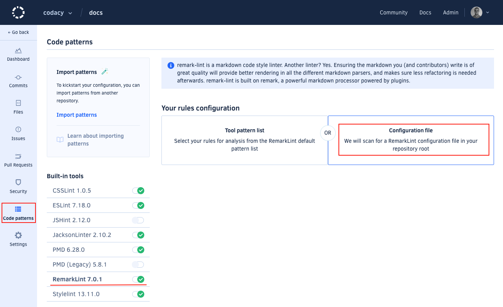

# Code patterns

You can configure the tool patterns that Codacy uses to analyze your repositories. This configuration can be different for each repository.

To configure the tool patterns for a repository:

1.  Open your repository **Code patterns** page.

1.  Select the tool to configure.

    

1.  Click the checkboxes to the left of the pattern names to enable or disable the patterns.

    To see a detailed explanation about the issues that a pattern can detect and how to fix them, click on **Details** on the top right-hand corner of the pattern:

    

1.  Optionally, [manually reanalyze your repository](../faq/repositories/how-do-i-reanalyze-my-repository.md) to immediately take the changes into account. Otherwise, Codacy will use the new configuration when it analyzes a new commit or pull request.

## Category filters

To make it easier to find relevant patterns, you can use the sidebar to filter the patterns by category:

The issues detected by Codacy belong to one of the following categories:

-   **Code Style:** Code formatting and syntax problems. For example, variable names style, enforcing the use of brackets and quotation marks
-   **Error Prone:** Code that may hide bugs and language keywords that should be used with caution. For example, the operator `==` in JavaScript or `Option.get` in Scala
-   **Code Complexity:** High complexity methods and classes that should be refactored
-   **Performance:** Code that could have performance problems
-   **Compatibility:** Used mainly for frontend code, detects compatibility problems across different browser versions
-   **Unused Code:** Unused variables and methods, code that can't be reached
-   **Security:** All security problems
-   **Documentation:** Detects methods and classes that don't have the correct comment annotations

## Setting a default configuration for new repositories {: id="set-default"}

If you're adding multiple repositories to Codacy that should reuse the same pattern configuration for a tool, you can define that configuration as the default. Codacy automatically applies that default configuration to new repositories.

To apply the same pattern configuration to multiple repositories:

1.  Add the first repository and configure the patterns on that repository for the relevant tools.

1.  For each tool, expand the menu at the top of the pattern list and select **Set default**.

    This option sets the current pattern configuration as the default for your account when adding new repositories to Codacy.

    

1.  Add the remaining repositories to Codacy.

    The new repositories will automatically use the tool pattern configuration that you set as default.

To reset the pattern configuration of a tool back to the default provided by Codacy:

1.  Expand the menu at the top of the pattern list for that tool and select **Reset** to revert the configuration back to the one provided by Codacy.

1.  Select **Set default** on the same menu to reset the default configuration.

## I have my own tool configuration file

<!-- TODO Refactor and improve this section.
          Consider including the configuration file names reference somewhere else (see https://github.com/codacy/docs/issues/43) -->

If you have configuration files for your static analysis tool of choice, add it to the root of your repository and Codacy will pick it up automatically.

Codacy supports configuration files for several tools. To have results according to your configuration file, you need to go to the Code Patterns view, select **Configuration file** for the respective tool, and select the option as shown in the example below.

The known file names for each tool are the following:

<table>
<tbody>
<tr>
<td>Tool name</td>
<td>Language</td>
<td>Files detected</td>
<td>Other info</td>
</tr>
<tr>
<td>Ameba</td>
<td>Crystal</td>
<td>.ameba.yml</td>
<td> </td>
</tr>
<tr>
<td><a href="https://docs.openstack.org/bandit/latest/config.html">Bandit</a></td>
<td>Python</td>
<td>bandit.yml, .bandit </td>
<td>To solve flagged valid Python "assert" statements, create a bandit.yml in the root of the repository containing: skips: \['B101'\]</td>
</tr>
<tr>
<td>Brakeman</td>
<td>Ruby</td>
<td>config/brakeman.yml</td>
<td> </td>
</tr>
<tr>
<td>Checkstyle</td>
<td>Java</td>
<td>checkstyle.xml </td>
<td>Supports configuration file in directories other than root and can search up to 5 directories into the repository.</td>
</tr>
<tr>
<td>CodeNarc</td>
<td>Groovy</td>
<td>.codenarcrc</td>
<td> </td>
</tr>
<tr>
<td>Credo</td>
<td>Elixir</td>
<td>.credo.exs</td>
<td> </td>
</tr>
<tr>
<td>CSSLint</td>
<td>CSS</td>
<td>.csslintrc</td>
<td> </td>
</tr>
<tr>
<td>Detekt</td>
<td>Kotlin</td>
<td>default-detekt-config.yml, detekt.yml</td>
<td>Supports configuration file in directories other than root and can search up to 5 directories into the repository.</td>
</tr>
<tr>
<td><a href="https://eslint.org/docs/user-guide/configuring">ESLint</a></td>
<td>JavaScript, Typescript, JSON</td>
<td>.eslintrc.js, .eslintrc.yaml,.eslintrc.yml, .eslintrc.json, 
.eslintrc</td>
<td><a href="https://github.com/codacy/codacy-eslint/blob/master/src/eslintDefaultOptions.ts#L26">Plugins in the UI</a> 
 <a href="https://github.com/codacy/codacy-eslint/blob/master/package.json#L119">Other Plugins</a></td>
</tr>
<tr>
<td>Hadolint</td>
<td>Docker </td>
<td>.hadolint.yaml</td>
<td> </td>
</tr>
<tr>
<td>JSHint</td>
<td>JavaScript </td>
<td>.jshintrc</td>
<td> </td>
</tr>
<tr>
<td><a href="https://github.com/squizlabs/PHP_CodeSniffer/wiki/Advanced-Usage">PHP CodeSniffer</a></td>
<td>PHP</td>
<td>phpcs.xml, phpcs.xml.dist</td>
<td> </td>
</tr>
<tr>
<td>PHPMD</td>
<td>PHP</td>
<td>codesize.xml</td>
<td> </td>
</tr>
<tr>
<td>PMD</td>
<td>Apex, Java, JavaScript, JSP, XML, Velocity and Visualforce</td>
<td>ruleset.xml, apex-ruleset.xml</td>
<td>Supports configuration file in directories other than root and can search up to 5 directories into the repository.</td>
</tr>
<tr>
<td>Prospector</td>
<td>Python</td>
<td>.landscape.yml, .landscape.yaml, landscape.yml, landscape.yaml, 
.prospector.yml, .prospector.yaml, prospector.yml, prospector.yaml</td>
<td> </td>
</tr>
<tr>
<td>Pylint</td>
<td>Python</td>
<td>pylintrc, .pylintrc </td>
<td><a href="https://github.com/codacy/codacy-pylint/blob/master/build.sbt#L39">Plugins</a> </td>
</tr>
<tr>
<td>RemarkLint</td>
<td>Markdown</td>
<td>.remarkrc, .remarkrc.json, .remarkrc.yaml, .remarkrc.yml, .remarkrc.js</td>
<td> </td>
</tr>
<tr>
<td>Rubocop</td>
<td>Ruby </td>
<td>.rubocop.yml</td>
<td> </td>
</tr>
<tr>
<td>Scalastyle</td>
<td>Scala </td>
<td>scalastyle_config.xml, scalastyle-config.xml</td>
<td> </td>
</tr>
<tr>
<td>SCSSLint</td>
<td>SASS </td>
<td>.scss-lint.yml</td>
<td> </td>
</tr>
<tr>
<td>Sonar C#</td>
<td>C#</td>
<td>SonarLint.xml</td>
<td> </td>
</tr>
<tr>
<td>SpotBugs</td>
<td>Java, Scala</td>
<td>findbugs.xml, findbugs-includes.xml, findbugs-excludes.xml</td>
<td>Supports configuration file in directories other than root and can search up to 5 directories into the repository.</td>
</tr>
<tr>
<td>Stylelint</td>
<td>LESS, SASS, CSS</td>
<td>.stylelintrc, stylelint.config.js, .stylelintrc.json, .stylelintrc.yaml, .stylelintrc.js, stylelintrc.yml</td>
<td>Supports configuration file in directories other than root and can search up to 5 directories into the repository.</td>
</tr>
<tr>
<td>SwiftLint</td>
<td>Swift</td>
<td>.swiftlint.yml</td>
<td> </td>
</tr>
<tr>
<td>Tailor</td>
<td>Swift</td>
<td> .tailor.yml</td>
<td> </td>
</tr>
<tr>
<td>TSLint</td>
<td>TypeScript</td>
<td>tslint.json</td>
<td> </td>
</tr>
<tr>
<td>tsqllint</td>
<td>SQL</td>
<td>.tsqllintrc</td>
<td> </td>
</tr>
<tr>
<td>Revive</td>
<td>Go</td>
<td>revive.toml</td>
<td> </td>
</tr>
</tbody>
</table>

For performance reasons, if you make changes to pattern settings using configuration files, Codacy may display outdated messages for issues that have already been identified by those patterns.

## Configuring the repository root directory for analysis

<!-- TODO Refactor / move this section somewhere else -->

By default, Codacy starts the analysis on the repository's root. However, you can set up a different repository folder on which to start the analysis using a [Codacy configuration file](codacy-configuration-file.md). This file must be named **".codacy.yaml"** or **".codacy.yml"** and must be placed in the repository's root.

See the example below:

    ---
    engines:
     rubocop:
     enabled: true
     exclude_paths:
     - config/engines.yml
     base_sub_dir: test/baseDir
