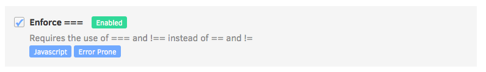

# Code Patterns

As a wise man once said, "You can't please everyone", and that is true for code patterns. But don't you worry! You can choose from a range of patterns to fit your needs.

## Pattern details and filters

Each pattern has a title and a short description. To see a detailed explanation you can click on Show Details in the top right corner (mouse over the pattern and the Show Details option will appear):

  

The pattern explanation shows more detail about the issues it can detect and how to fix them.

You can filter the patterns by category using the side menu: 

### The issues detected by Codacy belong to one of the following categories:

-   **Code Style:** Code formatting and syntax problems. For example, variable names style, enforcing the use of brackets and quotation marks

-   **Error Prone:** Code that may hide bugs and language keywords that should be used with caution. For example, the operator `==` in Javascript or `Option.get` in Scala

-   **Code Complexity:** High complexity methods and classes that should be refactored

-   **Performance:** Code that could have performance problems

-   **Compatibility:** Used mainly for frontend code, detects compatibility problems across different browser versions

-   **Unused Code:** Unused variables and methods, code that can't be reached

-   **Security:** All security problems

-   **Documentation:** Detects methods and classes that do not have the correct comment annotations

## Configure your repository patterns

To configure the patterns used to analyse your repository simply click on the checkbox on the left of the title:

 

When you change the enabled patterns you can reanalyse your repository. To do that, just enter the latest commit from your list on the **Commit** view and click to [reanalyse](/hc/en-us/articles/213840489-How-do-I-reanalyse-my-commit-). 

## Account vs repository patterns

### Account patterns

Here you can change the default selection of patterns by enabling / disabling  them for all future repositories added by you. Just
go to **Account Settings** and open **Default Patterns**:

### Repository patterns

Here you can specify the patterns you want to use for each repository. When you change your account patterns it doesn't affect pattern selection for repositories already added. You can go to **Code patterns**:

  
## I have my own tool configuration file

If you have configuration files for your static analysis tool of choice, just add it to the root of your repository and Codacy will pick it up automatically.

**Supported Configuration files**

Codacy currently supports configuration files for several tools. To have results according to your configuration file, you need to go to the Code Patterns view, select **Configuration file** for the respective tool, and select the option as shown in the example below.

The known file names for each tool are the following:

<table>
<tbody>
<tr>
<td>Tool name</td>
<td>Language</td>
<td>Files detected</td>
<td>Other info</td>
</tr>
<tr>
<td>Ameba</td>
<td>Crystal</td>
<td>.ameba.yml</td>
<td> </td>
</tr>
<tr>
<td><a href="https://docs.openstack.org/bandit/latest/config.html">Bandit</a></td>
<td>Python</td>
<td>bandit.yml, .bandit </td>
<td>To solve flagged valid Python "assert" statements, create a bandit.yml in the root of the repo containing: skips: \['B101'\]</td>
</tr>
<tr>
<td>Brakeman</td>
<td>Ruby</td>
<td>config/brakeman.yml</td>
<td> </td>
</tr>
<tr>
<td>Checkstyle</td>
<td>Java</td>
<td>checkstyle.xml </td>
<td>Supports config file in other dirs than root and can search up to 5 dirs into the repository.</td>
</tr>
<tr>
<td>Codenarc</td>
<td>Groovy</td>
<td>.codenarcrc</td>
<td> </td>
</tr>
<tr>
<td>credo</td>
<td>Elixir</td>
<td>.credo.exs</td>
<td> </td>
</tr>
<tr>
<td>CSSLint</td>
<td>CSS</td>
<td>.csslintrc</td>
<td> </td>
</tr>
<tr>
<td>detekt</td>
<td>Kotlin</td>
<td>default-detekt-config.yml, detekt.yml</td>
<td>Supports config file in other dirs than root and can search up to 5 dirs into the repository.</td>
</tr>
<tr>
<td><a href="https://eslint.org/docs/user-guide/configuring">ESLint</a></td>
<td>JavaScript, Typescript, JSON</td>
<td>.eslintrc.js, .eslintrc.yaml,.eslintrc.yml, .eslintrc.json, 
.eslintrc</td>
<td><a href="https://github.com/codacy/codacy-eslint/blob/master/src/eslintDefaultOptions.ts#L26">Plugins in the UI</a> 
 <a href="https://github.com/codacy/codacy-eslint/blob/master/package.json#L119">Other Plugins</a></td>
</tr>
<tr>
<td>Hadolint</td>
<td>Docker </td>
<td>.hadolint.yaml</td>
<td> </td>
</tr>
<tr>
<td>JSHint</td>
<td>JavaScript </td>
<td>.jshintrc</td>
<td> </td>
</tr>
<tr>
<td><a href="https://github.com/squizlabs/PHP_CodeSniffer/wiki/Advanced-Usage">PHP CodeSniffer</a></td>
<td>PHP</td>
<td>phpcs.xml, phpcs.xml.dist</td>
<td> </td>
</tr>
<tr>
<td>PHPMD</td>
<td>PHP</td>
<td>codesize.xml</td>
<td> </td>
</tr>
<tr>
<td>PMD</td>
<td>Apex, Java, Javascript, JSP, XML, Velocity and Visualforce</td>
<td>ruleset.xml, apex-ruleset.xml</td>
<td>Supports config file in other dirs than root and can search up to 5 dirs into the repository.</td>
</tr>
<tr>
<td>Prospector</td>
<td>Python</td>
<td>.landscape.yml, .landscape.yaml, landscape.yml, landscape.yaml, 
.prospector.yml, .prospector.yaml, prospector.yml, prospector.yaml</td>
<td> </td>
</tr>
<tr>
<td>Pylint</td>
<td>Python</td>
<td>pylintrc, .pylintrc </td>
<td><a href="https://github.com/codacy/codacy-pylint/blob/master/build.sbt#L39">Plugins</a> </td>
</tr>
<tr>
<td>RemarkLint</td>
<td>Markdown</td>
<td>.remarkrc, .remarkrc.json, .remarkrc.yaml, .remarkrc.yml, .remarkrc.js</td>
<td> </td>
</tr>
<tr>
<td>Rubocop</td>
<td>Ruby </td>
<td>.rubocop.yml</td>
<td> </td>
</tr>
<tr>
<td>ScalaStyle</td>
<td>Scala </td>
<td>scalastyle_config.xml, scalastyle-config.xml</td>
<td> </td>
</tr>
<tr>
<td>SCSSLint</td>
<td>SASS </td>
<td>.scss-lint.yml</td>
<td> </td>
</tr>
<tr>
<td>Sonar C#</td>
<td>C#</td>
<td>SonarLint.xml</td>
<td> </td>
</tr>
<tr>
<td>Spotbugs</td>
<td>Java, Scala</td>
<td>findbugs.xml, findbugs-includes.xml, findbugs-excludes.xml</td>
<td>Supports config file in other dirs than root and can search up to 5 dirs into the repository.</td>
</tr>
<tr>
<td>Stylelint</td>
<td>LESS, SASS, CSS</td>
<td>.stylelintrc, stylelint.config.js, .stylelintrc.json, .stylelintrc.yaml, .stylelintrc.js, stylelintrc.yml</td>
<td>Supports config file in other dirs than root and can search up to 5 dirs into the repository.</td>
</tr>
<tr>
<td>SwiftLint</td>
<td>Swift</td>
<td>.swiftlint.yml</td>
<td> </td>
</tr>
<tr>
<td>Tailor</td>
<td>Swift</td>
<td> .tailor.yml</td>
<td> </td>
</tr>
<tr>
<td>TSLint</td>
<td>TypeScript</td>
<td>tslint.json</td>
<td> </td>
</tr>
<tr>
<td>tsqllint</td>
<td>SQL</td>
<td>.tsqllintrc</td>
<td> </td>
</tr>
<tr>
<td>Revive</td>
<td>Go</td>
<td>revive.toml</td>
<td> </td>
</tr>
</tbody>
</table>

For performance reasons, if you make changes to pattern settings using configuration files, Codacy may display outdated messages for issues that have already been identified by those patterns.

## Configuring the repository root directory for analysis

By default, Codacy starts the analysis on the repository's root. However, you can set up a different repository folder on which to start the analysis using a [Codacy configuration file](/hc/en-us/articles/115002130625-Codacy-Configuration-File). This file needs to be named **".codacy.yaml"** or **".codacy.yml"** and must be placed in the repository's root.

See example below:

    ---
    engines:
     rubocop:
     enabled: true
     exclude_paths:
     - config/engines.yml
     base_sub_dir: test/baseDir
