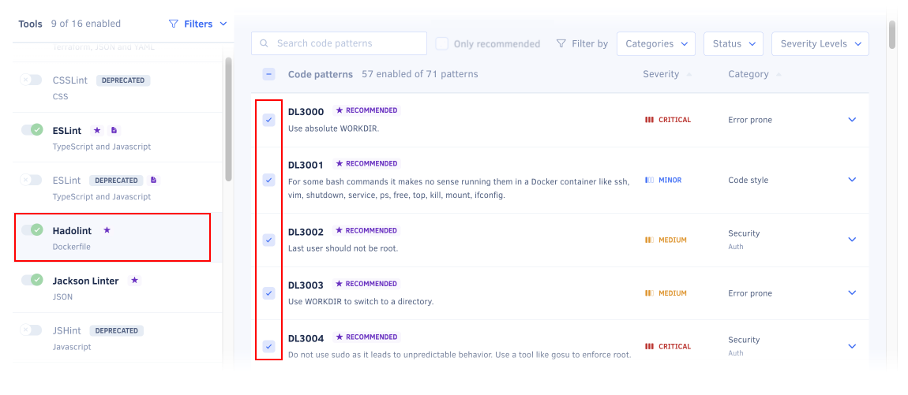
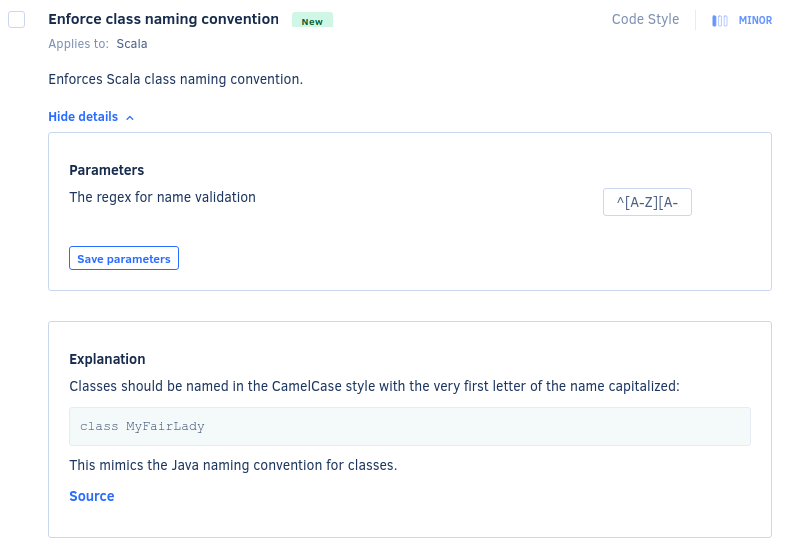
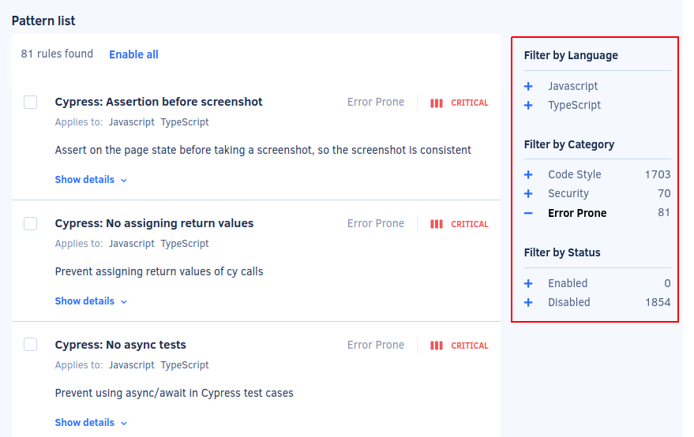
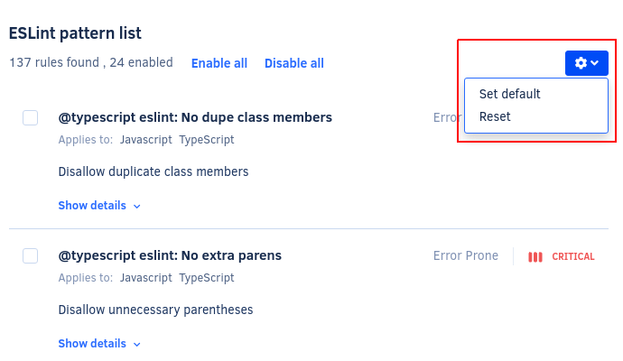
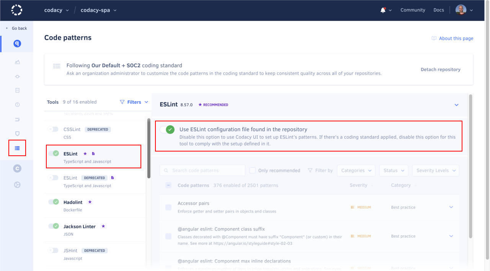

# Configuring code patterns

By default, Codacy uses a subset of the code patterns that exist for each tool to analyze your repositories. These default settings result from community feedback or existing coding standards.

However, you can create a coding standard adapted to your scenario by configuring the tools and code patterns that Codacy uses to analyze your repository:

1.  Open your repository **Code patterns** page and select the tool to configure:

    

1.  Enable or disable the code patterns using the checkbox for each pattern.

    To see an explanation of the issues that a pattern detects and how to fix them, click **Show details**. Some patterns also allow you to configure the rules for detecting issues:

    

1.  Optionally, [manually reanalyze your repository](../faq/repositories/how-do-i-reanalyze-my-repository.md) to immediately take the changes into account. Otherwise, Codacy will use the new configuration when it analyzes a new commit or pull request.

!!! tip
    Organization owners can [change who is allowed to configure code patterns](../organizations/roles-and-permissions-for-synced-organizations.md#change-analysis-configuration).

## Pattern filters

To make it easier to find relevant code patterns, you can use the sidebar to filter the patterns by language (only for tools that support multiple languages), category, or status:

!!! tip
    To enable **all code patterns** matching a specific category, use the filter to select the relevant patterns and click **Enable all**.

    For example, to enable all Security patterns of a tool, you can use the **Security** filter and click **Enable all**.

Issues detected by Codacy belong to one of the following categories:

<!--categories-start-->
-   **Code Style:** Code formatting and syntax problems, such as variable names style and enforcing the use of brackets and quotation marks
-   **Error Prone:** Code that may hide bugs and language keywords that should be used with caution, such as the operator `==` in JavaScript or `Option.get` in Scala
-   **Code Complexity:** High complexity methods and classes that should be refactored
-   **Performance:** Code that can have performance problems
-   **Compatibility:** Mainly for frontend code, compatibility problems across different browser versions
-   **Unused Code:** Unused variables and methods, code that can't be reached
-   **Security:** All security problems
-   **Documentation:** Methods and classes that don't have the correct comment annotations
<!--categories-end-->

## Importing pattern configurations from another repository {: id="import-patterns"}

Importing tool and code pattern configurations from another repository can help you bootstrap and standardize the coding standard across your repositories.

For example, when adding a new repository on Codacy you can copy the tool and code pattern configurations from an existing repository that's already configured, and then tweak and adapt the settings for your new repository.

!!! tip
    To ensure that multiple repositories consistently follow the same global tool and code pattern configurations, [use an organization coding standard](../organizations/using-a-coding-standard.md) instead.

    Alternatively, you can also copy the tool and code pattern configurations [from one repository to multiple target repositories](../organizations/copying-code-patterns-between-repositories.md).

<!--code-patterns-copy-start-->
!!! important
    Consider the following when using this feature:

    -   **Tool matching:** Codacy only copies settings for tools that are available on both the source and target repositories, and overwrites the existing settings for these tools on the target repository.
    -   **Toggle status:** Codacy copies the enabled or disabled status of the matching tools from the source to the target repository.
    -   **Configuration files:** Codacy copies the UI configuration of all matching tools, even those set to use configuration files. However, the import doesn't include the configuration mode itself.

    The following example illustrates the points above:

    | Source repository | Target repository | Target repository after import |
    |-------------------|-------------------|--------------------------------|
    |  |  |  |
<!--code-patterns-copy-end-->

To import the tool and code pattern configurations from another repository:

1.  Open your repository **Code patterns** and click **Import patterns**.

    

1.  Follow the instructions to select the source repository and complete the import.

1.  Review and adjust your tool and code pattern configurations if necessary.

Codacy will use the updated configurations on the next analysis.

## Setting a default configuration for new repositories {: id="set-default"}

If you're adding multiple repositories to Codacy that should reuse the same pattern configuration for a tool, you can define that configuration as the default. Codacy automatically applies that default configuration to new repositories.

To apply the same code pattern configuration to multiple repositories:

1.  Add the first repository and configure the code patterns on that repository for the relevant tools.

1.  Expand the menu at the top of the pattern list and select **Set default**.

    This option sets the current pattern configuration of all tools as the default for your account.

    

After defining the default code pattern configuration for your account, the tools in the new repositories that you add will automatically use those configurations.

Alternatively, you can also manually apply the default code pattern configuration for your account to all tools by expanding the menu at the top of the pattern list and selecting **Reset**.

## Using your own tool configuration files

<!-- TODO Consider including the configuration file names reference somewhere else (see https://github.com/codacy/docs/issues/43) -->

Codacy supports configuration files for several tools. To use a configuration file for your static analysis tool:

1.  Push the configuration file to the root of the branch [configured as the main branch on Codacy](managing-branches.md).

1.  Open your repository **Code patterns** page, select the tool that will use the configuration file, and select the option **Configuration file**:

    

After activating the option to use the configuration file:

-   Codacy will use the version of the configuration file **in the branch being analyzed**. For example, if you open a pull request that includes changes to the configuration file, the analysis results will take those changes into account.
-   If Codacy analyzes a branch that doesn't include the configuration file, Codacy reverts to using the code patterns configured for the tool before you selected the option **Configuration file** on the Code patterns page.

The table below lists the configuration file names that Codacy detects and supports for each tool:

<table>
  <thead>
    <tr>
      <th>Tool name</th>
      <th>Language</th>
      <th>Files detected</th>
      <th>Other info</th>
    <tr>
  </thead>
  <tbody>
  <tr>
    <td>Ameba</td>
    <td>Crystal</td>
    <td><code>.ameba.yml</code></td>
    <td></td>
  </tr>
  <tr>
    <td><a href="https://docs.openstack.org/bandit/latest/config.html">Bandit</a></td>
    <td>Python</td>
    <td><code>bandit.yml</code>, <code>.bandit</code></td>
    <td>To solve flagged valid Python "assert" statements, create a <code>bandit.yml</code> in the root of the repository containing: <code>skips: \['B101'\]</code></td>
  </tr>
  <tr>
    <td>Brakeman</td>
    <td>Ruby</td>
    <td><code>config/brakeman.yml</code></td>
    <td></td>
  </tr>
  <tr>
    <td>Checkstyle</td>
    <td>Java</td>
    <td><code>checkstyle.xml</code></td>
    <td>Supports configuration file in directories other than root and can search up to 5 directories into the repository.</td>
  </tr>
  <tr>
    <td>CodeNarc</td>
    <td>Groovy</td>
    <td><code>.codenarcrc</code></td>
    <td></td>
  </tr>
  <tr>
    <td>Credo</td>
    <td>Elixir</td>
    <td><code>.credo.exs</code>, <code>config/.credo.exs</code></td>
    <td></td>
  </tr>
  <tr>
    <td>CSSLint</td>
    <td>CSS</td>
    <td><code>.csslintrc</code></td>
    <td></td>
  </tr>
  <tr>
    <td>detekt</td>
    <td>Kotlin</td>
    <td><code>default-detekt-config.yml</code>, <code>detekt.yml</code></td>
    <td>Supports configuration file in directories other than root and can search up to 5 directories into the repository.</td>
  </tr>
  <tr>
    <td><a href="https://eslint.org/docs/user-guide/configuring">ESLint</a></td>
    <td>JavaScript, Typescript</td>
    <td><code>.eslintrc.js</code>, <code>.eslintrc.cjs</code>, <code>.eslintrc.yaml</code>, <code>.eslintrc.yml</code>, <code>.eslintrc.json</code>, <code>.eslintrc</code>,
        <code>.prettierrc</code>, <code>.prettierrc.yaml</code>, <code>.prettierrc.yml</code>, <code>.prettierrc.json</code>, <code>prettier.config.js</code>, <code>.prettierrc.js</code></td>
    <td><a href="https://github.com/codacy/codacy-eslint/blob/master/src/eslintDefaultOptions.ts#L26">Plugins in the UI</a> 
        <a href="https://github.com/codacy/codacy-eslint/blob/master/package.json#L119">Other Plugins</a></td>
  </tr>
  <tr>
    <td>Hadolint</td>
    <td>Dockerfile</td>
    <td><code>.hadolint.yaml</code></td>
    <td></td>
  </tr>
  <tr>
    <td>JSHint</td>
    <td>JavaScript</td>
    <td><code>.jshintrc</code></td>
    <td></td>
  </tr>
  <tr>
    <td>markdownlint</td>
    <td>Markdown</td>
    <td><code>.markdownlint.yaml</code>, <code>.markdownlint.jsonc</code>, <code>.markdownlint.json</code></td>
    <td></td>
  </tr>
  <tr>
    <td><a href="https://github.com/squizlabs/PHP_CodeSniffer/wiki/Advanced-Usage">PHP_CodeSniffer</a></td>
    <td>PHP</td>
    <td><code>phpcs.xml</code>, <code>phpcs.xml.dist</code></td>
    <td></td>
  </tr>
  <tr>
    <td>PHP Mess Detector</td>
    <td>PHP</td>
    <td><code>codesize.xml</code>, <code>phpmd.xml</code>, <code>phpmd.xml.dist</code></td>
    <td></td>
  </tr>
  <tr>
    <td>PMD</td>
    <td>Apex, Java, JavaScript, JSP, PL/SQL, XML, Velocity and Visualforce</td>
    <td><code>ruleset.xml</code>, <code>apex-ruleset.xml</code></td>
    <td>Supports configuration file in directories other than root and can search up to 5 directories into the repository.</td>
  </tr>
  <tr>
    <td>Prospector</td>
    <td>Python</td>
    <td><code>.prospector.yml</code>, <code>.prospector.yaml</code>, <code>prospector.yml</code>, <code>prospector.yaml</code>, <code>.landscape.yml</code>, <code>.landscape.yaml</code>, <code>landscape.yml</code>, <code>landscape.yaml</code></td>
    <td></td>
  </tr>
  <tr>
    <td>Pylint</td>
    <td>Python</td>
    <td><code>pylintrc</code>, <code>.pylintrc</code></td>
    <td><a href="https://github.com/codacy/codacy-pylint/blob/master/requirements.txt">Plugins</a></td>
  </tr>
  <tr>
    <td>remark-lint</td>
    <td>Markdown</td>
    <td><code>.remarkrc</code>, <code>.remarkrc.json</code>, <code>.remarkrc.yaml</code>, <code>.remarkrc.yml</code>, <code>.remarkrc.js</code></td>
    <td></td>
  </tr>
  <tr>
    <td>Revive</td>
    <td>Go</td>
    <td><code>revive.toml</code></td>
    <td></td>
  </tr>
  <tr>
    <td>RuboCop</td>
    <td>Ruby</td>
    <td><code>.rubocop.yml</code></td>
    <td></td>
  </tr>
  <tr>
    <td>Scalastyle</td>
    <td>Scala</td>
    <td><code>scalastyle-config.xml</code>, <code>scalastyle_config.xml</code></td>
    <td></td>
  </tr>
  <tr>
    <td>Sonar C#</td>
    <td>C#</td>
    <td><code>SonarLint.xml</code></td>
    <td></td>
  </tr>
  <tr>
    <td>Sonar VB</td>
    <td>Visual Basic</td>
    <td><code>SonarLint.xml</code></td>
    <td></td>
  </tr>
  <tr>
    <td>SpotBugs</td>
    <td>Java, Scala</td>
    <td><code>findbugs.xml</code>, <code>findbugs-includes.xml</code>, <code>findbugs-excludes.xml</code>, <code>spotbugs.xml</code>, <code>spotbugs-includes.xml</code>, <code>spotbugs-excludes.xml</code></td>
    <td>Supports configuration file in directories other than root and can search up to 5 directories into the repository.</td>
  </tr>
  <tr>
    <td>Stylelint</td>
    <td>CSS, LESS, SASS</td>
    <td><code>.stylelintrc</code>, <code>stylelint.config.js</code>, <code>.stylelintrc.json</code>, <code>.stylelintrc.yaml</code>, <code>.stylelintrc.yml</code>, <code>.stylelintrc.js</code></td>
    <td>Supports configuration file in directories other than root and can search up to 5 directories into the repository.</td>
  </tr>
  <tr>
    <td>SwiftLint</td>
    <td>Swift</td>
    <td><code>.swiftlint.yml</code></td>
    <td></td>
  </tr>
  <tr>
    <td>Tailor</td>
    <td>Swift</td>
    <td><code>.tailor.yml</code></td>
    <td></td>
  </tr>
  <tr>
    <td>TSLint</td>
    <td>TypeScript</td>
    <td><code>tslint.json</code></td>
    <td></td>
  </tr>
  <tr>
    <td>TSQLLint</td>
    <td>Transact-SQL</td>
    <td><code>.tsqllintrc</code></td>
    <td></td>
  </tr>
  </tbody>
</table>

!!! note
    Codacy doesn't support configuration files for the following tools:

    -   Cppcheck
    -   Clang-Tidy
    -   deadcode
    -   Checkov
    -   Staticcheck
    -   ShellCheck
    -   SQLint
    -   bundler-audit
    -   Jackson Linter
    -   Codacy ScalaMeta Pro
    -   CoffeeLint
    -   aligncheck
    -   Flawfinder
    -   PSScriptAnalyzer
    -   Faux Pas
    -   Gosec

    For performance reasons, if you make changes to pattern settings using configuration files, Codacy may display outdated messages for issues that have already been identified by those patterns.

## See also

-   [Applying a coding standard across multiple repositories](../organizations/using-a-coding-standard.md)
-   [Copying code patterns between repositories](../organizations/copying-code-patterns-between-repositories.md)
