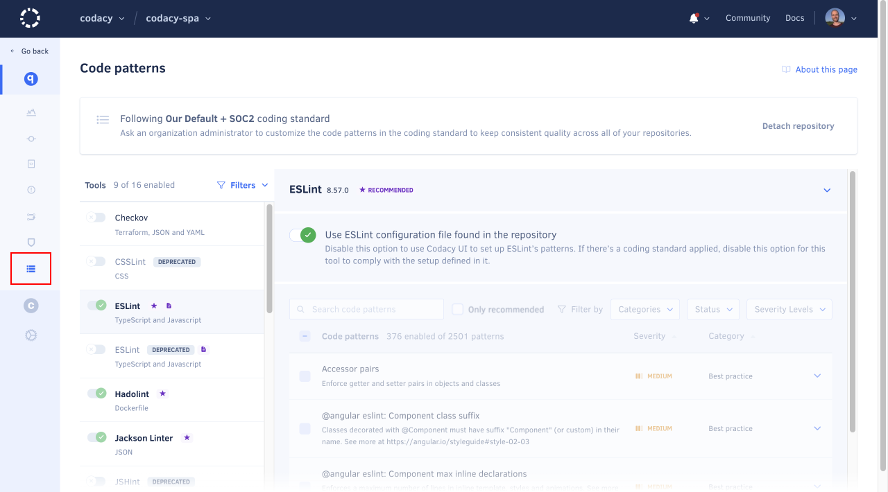
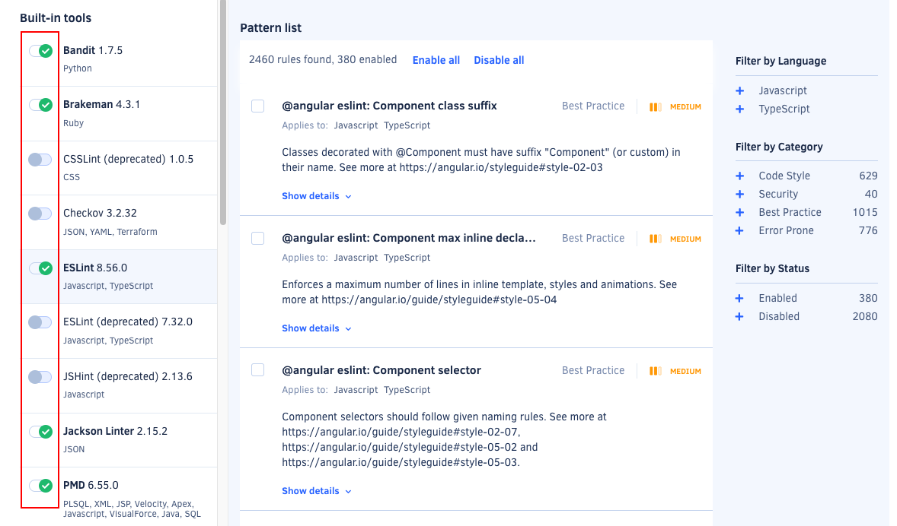

# Configuring code patterns

!!! note
    Organization admins can [change who is allowed to configure code patterns](../organizations/roles-and-permissions-for-organizations.md#change-analysis-configuration).

By default, Codacy analyzes your repositories using a subset of the supported static analysis tools and code patterns. These default settings are the result of community feedback and of existing coding standards.

You can adapt the default settings to your scenario by configuring the tools and code patterns that Codacy uses to analyze your repositories.

## Configuring tools and code patterns

!!! note
    If a repository follows an [organization coding standard](../organizations/using-coding-standards.md) and you update the tool or code pattern configurations for that repository:

    -   The repository stops following the coding standard
    -   Codacy copies the coding standard configurations to your repository so you can customize them

To configure the tools and code patterns for a repository:

1.  Open the repository **Code patterns** page.

    

1.  Enable or disable the tools that Codacy should use to analyze the repository.

    

1.  Select a tool to enable or disable its code patterns. Some patterns also allow you to configure the rules for detecting issues.

    To filter the patterns by language, category, or status, use the sidebar filters.

    To see an explanation of the issues that a pattern detects and how to fix them, click **Show details**.

    !!! tip
        -   To enable a group of code patterns, use the filter to select the relevant group of patterns and click **Enable all**.

            For example, to enable all Security patterns, click the **Security** filter and then click **Enable all**.

        - Codacy displays the tag **New** for one month next to the name of newly added code patterns.

    

1.  Codacy will use the new configuration when it analyzes a new commit or pull request.

    !!! tip
        To immediately take the changes into account, [reanalyze the repository manually](../faq/repositories/how-do-i-reanalyze-my-repository.md).

## Importing pattern configurations from another repository {: id="import-patterns"}

Importing tool and code pattern configurations from another repository can help you bootstrap and standardize the tool and code pattern configurations across your repositories.

For example, when adding a new repository on Codacy you can copy the tool and code pattern configurations from an existing repository that's already configured, and then tweak and adapt the settings for your new repository.

!!! tip
    To ensure that multiple repositories consistently follow the same global tool and code pattern configurations, [use an organization coding standard](../organizations/using-coding-standards.md) instead.

    Alternatively, you can also copy the tool and code pattern configurations [from one repository to multiple target repositories](../organizations/copying-code-patterns-between-repositories.md).

<!-- TODO DOCS-341 Can we simplify this? -->
<!--code-patterns-copy-start-->
!!! important
    Consider the following when using this feature:

    -   **Tool matching:** Codacy only copies settings for tools that are available on both the source and target repositories, and overwrites the existing settings for these tools on the target repository.
    -   **Toggle status:** Codacy copies the enabled or disabled status of the matching tools from the source to the target repository.
    -   **Configuration files:** Codacy copies the UI configuration of all matching tools, even those set to use configuration files. However, the import doesn't include the configuration mode itself and doesn't copy configuration files across repositories.

    The following example illustrates the points above:

    | Source repository | Target repository | Target repository after import |
    |-------------------|-------------------|--------------------------------|
    |  |  |  |
<!--code-patterns-copy-end-->

To import the tool and code pattern configurations from another repository:

1.  Open your repository **Code patterns** and click **Import patterns**.

<!-- TODO DOCS-341 Evaluate whether to keep -->
[//]: # (    ![Importing code patterns from another repository]&#40;images/code-patterns-import.png&#41;)

1.  Follow the instructions to select the source repository and complete the import.

1.  Review and adjust your tool and code pattern configurations if necessary.

Codacy will use the updated configurations on the next analysis.

## Using your own tool configuration files

Codacy [supports configuration files for several tools](../getting-started/supported-languages-and-tools.md#tool-configuration-files). To use a configuration file for your static analysis tool:

1.  Push the configuration file to the root of the branch [configured as the main branch on Codacy](managing-branches.md).

1.  Open your repository **Code patterns** page, select the tool that will use the configuration file, and select the option **Configuration file**.

<!-- TODO DOCS-341 Evaluate whether to keep -->
[//]: # (    ![Using a configuration file]&#40;images/code-patterns-config-file.png&#41;)

After activating the option to use the configuration file:

-   Codacy will use the version of the configuration file **in the branch being analyzed**. For example, if you open a pull request that includes changes to the configuration file, the analysis results will take those changes into account.
-   If Codacy analyzes a branch that doesn't include the configuration file, Codacy reverts to using the code patterns configured for the tool before you selected the option **Configuration file** on the Code patterns page.
-   Codacy will keep using the tool configuration file even if you exclude that file from the Codacy analysis [using the Codacy UI](ignoring-files.md) or a [Codacy configuration file](codacy-configuration-file.md).

!!! note
    For performance reasons, if you make changes to pattern settings using configuration files, Codacy may display outdated messages for issues that have already been identified by those patterns.<!-- TODO DOCS-341 Move this info to the appropriate step. It's almost invisible/out of context here. -->

## See also

-   [Applying a coding standard across multiple repositories](../organizations/using-coding-standards.md)
-   [Copying code patterns between repositories](../organizations/copying-code-patterns-between-repositories.md)
-   [How to implement Google JavaScript style guide with Codacy](https://blog.codacy.com/implement-google-javascript-style-guide-with-codacy/)<!-- TODO DOCS-341 Shouldn't we rather mention an internal docs page here? -->
