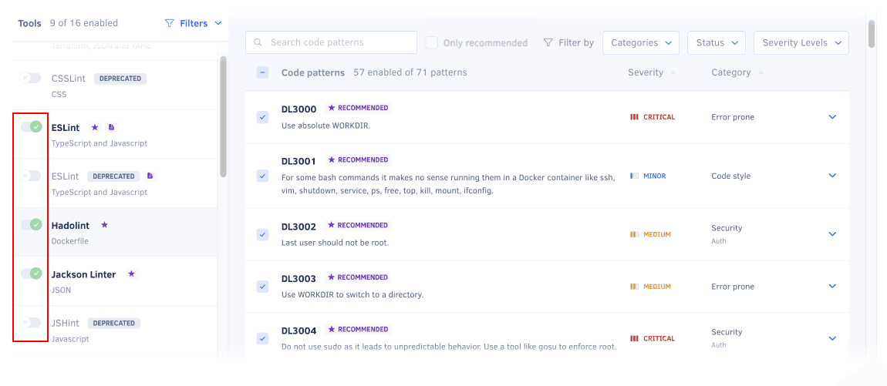

# Configuring code patterns



By default, Codacy analyzes your repositories using a subset of the supported analysis tools and code patterns. These defaults are based on current best practices and community feedback, and you can adapt them to your needs as follows:

-   [Configuring tools and code patterns using the Codacy UI](#configuring-tools-and-code-patterns-using-the-codacy-ui)
-   [Using tool configuration files](#using-your-own-tool-configuration-files)

## Configuring tools and code patterns using the Codacy UI

!!! note
    If you update the configurations of a repository that follows a [coding standard](../organizations/using-coding-standards.md), Codacy copies the coding standard configurations to the repository and the repository stops following the coding standard. You can then customize the repository configurations without affecting the coding standard.<!-- TODO ALA-1104 review (and potentially remove) -->

To configure the tools and code patterns for a repository using the Codacy UI:

1.  Open your repository **Code patterns** page.

    <!-- TODO ALA-1104 screenshot -->

1.  Enable or disable the tools that Codacy will use to analyze the repository.

    <!-- TODO ALA-1104 screenshot -->

1.  Select a tool to enable or disable its code patterns. To make it easier to find relevant patterns, use the sidebar filters. You can filter by language, [issue category](../faq/code-analysis/which-metrics-does-codacy-calculate.md#issues), or status.<!-- TODO ALA-1104 add new filter and search, review wording and structure -->

    To see an explanation of the issues that a pattern detects and how to fix them, click **Show details**. Some patterns also allow you to configure the rules for detecting issues.

    !!! tip
        -   To enable a group of code patterns, use the filter to select the relevant group of patterns and click **Enable all**. For example, to enable all Security patterns, click the **Security** filter and then click **Enable all**.<!-- TODO ALA-1104 confirm this is still valid -->

        -   Codacy displays the tag **New** for one month next to the name of newly added code patterns.<!-- TODO ALA-1104 confirm this is still valid -->

    <!-- TODO ALA-1104 screenshot -->

1.  Optionally, to take the changes into account immediately, [reanalyze the repository manually](../faq/repositories/how-do-i-reanalyze-my-repository.md). Otherwise, Codacy will use the updated configuration when analyzing new commits and pull requests.

## Using tool configuration files {: id="using-your-own-tool-configuration-files"}

<!-- TODO ALA-1104 confirm nothing needs to be updated here -->

<!--NOTE
    When adding a new supported tool, make sure that you update the following pages:

    docs/getting-started/supported-languages-and-tools.md
    docs/repositories-configure/local-analysis/client-side-tools.md (if the tool runs client-side)
    docs/organizations/managing-security-and-risk.md  (if the tool reports security issues)
    docs/repositories-configure/configuring-code-patterns.md (supported configuration files table, or list of tools that don't support configuration files)
    docs/repositories-configure/codacy-configuration-file.md (list of tool short names to use on the Codacy configuration file)
-->

!!! note
    -   After activating a configuration file for a tool, Codacy uses that configuration file even if you [exclude it from Codacy analysis](ignoring-files.md).

    -   When [using a tool configuration file alongside a coding standard](../organizations/using-coding-standards.md#using-with-tool-configuration), the configuration file controls the code patterns, while the coding standard controls whether the tool is enabled or disabled.

Codacy supports configuration files for several static analysis tools to help you streamline your setup.

To use a configuration file for a static analysis tool:

1.  Push the configuration file to the root of the [default Codacy branch](managing-branches.md).

1.  Open the repository **Code patterns** page, select the tool of interest, and select the option **Configuration file**.

    !!! note
        -   Codacy uses the version of the configuration file **in the branch being analyzed**. For example, if you open a pull request that includes changes to the configuration file, the analysis results take those changes into account.

        -   If Codacy analyzes a branch that doesn't include the configuration file, Codacy reverts to using the code patterns configured for the tool before you selected the option **Configuration file** on the Code patterns page.

        -   For performance reasons, when you update pattern settings using a configuration file, Codacy may display outdated messages for issues identified previously by those patterns.

    <!-- TODO ALA-1104 screenshot -->

The table below lists the configuration file names that Codacy detects and supports for each tool:

<table>
  <thead>
    <tr>
      <th>Tool name</th>
      <th>Languages</th>
      <th>Files detected</th>
      <th>Other info</th>
    <tr>
  </thead>
  <tbody>
  <tr>
    <td>Ameba</td>
    <td>Crystal</td>
    <td><code>.ameba.yml</code></td>
    <td></td>
  </tr>
  <tr>
    <td><a href="https://docs.openstack.org/bandit/latest/config.html">Bandit</a></td>
    <td>Python</td>
    <td><code>bandit.yml</code>, <code>.bandit</code></td>
    <td>To solve flagged valid Python "assert" statements, create a <code>bandit.yml</code> on the root of the repository containing: <code>skips: \['B101'\]</code></td>
  </tr>
  <tr>
    <td>Brakeman</td>
    <td>Ruby</td>
    <td><code>config/brakeman.yml</code></td>
    <td></td>
  </tr>
  <tr>
    <td>Checkstyle</td>
    <td>Java</td>
    <td><code>checkstyle.xml</code></td>
    <td>Supports configuration file in directories other than root and can search up to 5 directories into the repository.</td>
  </tr>
  <tr>
    <td>CodeNarc</td>
    <td>Groovy</td>
    <td><code>.codenarcrc</code></td>
    <td></td>
  </tr>
  <tr>
    <td>Credo</td>
    <td>Elixir</td>
    <td><code>.credo.exs</code>, <code>config/.credo.exs</code></td>
    <td></td>
  </tr>
  <tr>
    <td>dartanalyzer</td>
    <td>Dart</td>
    <td><code>analysis_options.yml</code></td>
    <td><a href="https://dart.dev/guides/language/analysis-options">Customizing static analysis</a></td>
  </tr>
  <tr>
    <td>detekt</td>
    <td>Kotlin</td>
    <td><code>default-detekt-config.yml</code>, <code>detekt.yml</code></td>
    <td>Supports configuration file in directories other than root and can search up to 5 directories into the repository.</td>
  </tr>
  <tr>
    <td><a href="https://eslint.org/docs/user-guide/configuring">ESLint</a></td>
    <td>JavaScript, TypeScript</td>
    <td><code>.eslintrc.js</code>, <code>.eslintrc.cjs</code>, <code>.eslintrc.yaml</code>, <code>.eslintrc.yml</code>, <code>.eslintrc.json</code></td>
    <td><a href="https://github.com/codacy/codacy-eslint/blob/master/src/eslintPlugins.ts">Plugins configurable on the Codacy UI</a> 
        <a href="https://github.com/codacy/codacy-eslint/blob/master/package.json#L58">Other supported plugins</a> 

        
If you're using <a href="https://eslint.org/docs/latest/user-guide/configuring/configuration-files#cascading-and-hierarchy">module-level ESLint configuration files</a>, you must also include a ESLint configuration file <strong>on the root of your repository</strong> for Codacy to detect that you're using configuration files. For example, add the following minimal <code>.eslintrc.json</code> configuration file:

        <pre><code>{ "root": true }</code></pre>
    </td>
  </tr>
  <tr>
    <td>Hadolint</td>
    <td>Dockerfile</td>
    <td><code>.hadolint.yaml</code></td>
    <td></td>
  </tr>
  <tr>
    <td>markdownlint</td>
    <td>Markdown</td>
    <td><code>.markdownlint.json</code></td>
    <td></td>
  </tr>
  <tr>
    <td><a href="https://github.com/squizlabs/PHP_CodeSniffer/wiki/Advanced-Usage">PHP_CodeSniffer</a></td>
    <td>PHP</td>
    <td><code>phpcs.xml</code>, <code>phpcs.xml.dist</code></td>
    <td></td>
  </tr>
  <tr>
    <td>PHP Mess Detector</td>
    <td>PHP</td>
    <td><code>codesize.xml</code>, <code>phpmd.xml</code>, <code>phpmd.xml.dist</code></td>
    <td></td>
  </tr>
  <tr>
    <td>PMD</td>
    <td>Apex, Java, JavaScript, JSP, PL/SQL, XML, Velocity and Visualforce</td>
    <td><code>ruleset.xml</code>, <code>apex-ruleset.xml</code></td>
    <td>Supports configuration file in directories other than root and can search up to 5 directories into the repository.</td>
  </tr>
  <tr>
    <td>Prospector</td>
    <td>Python</td>
    <td><code>.prospector.yml</code>, <code>.prospector.yaml</code>, <code>prospector.yml</code>, <code>prospector.yaml</code>, <code>.landscape.yml</code>, <code>.landscape.yaml</code>, <code>landscape.yml</code>, <code>landscape.yaml</code></td>
    <td></td>
  </tr>
  <tr>
    <td>Pylint</td>
    <td>Python</td>
    <td><code>pylintrc</code>, <code>.pylintrc</code></td>
    <td><a href="https://github.com/codacy/codacy-pylint-python3/blob/master/requirements.txt">Plugins</a></td>
  </tr>
  <tr>
    <td>remark-lint</td>
    <td>Markdown</td>
    <td><code>.remarkrc</code>, <code>.remarkrc.json</code>, <code>.remarkrc.yaml</code>, <code>.remarkrc.yml</code>, <code>.remarkrc.js</code></td>
    <td></td>
  </tr>
  <tr>
    <td>Revive</td>
    <td>Go</td>
    <td><code>revive.toml</code></td>
    <td></td>
  </tr>
  <tr>
    <td>RuboCop</td>
    <td>Ruby</td>
    <td><code>.rubocop.yml</code>, <code>.rubocop-codacy.yml</code></td>
    <td>Supports alternative configuration file <code>.rubocop-codacy.yml</code> for Codacy analysis, allowing exclusion of private gems. This prevents analysis issues caused by private gem references, ensuring proper validation by Codacy.</td>
  </tr>
  <tr>
    <td>Scalastyle</td>
    <td>Scala</td>
    <td><code>scalastyle-config.xml</code>, <code>scalastyle_config.xml</code></td>
    <td></td>
  </tr>
  <tr>
    <td>Semgrep</td>
    <td>Apex, C++, C#, Dockerfile, Elixir, GitHub Actions, Go, Java, JavaScript, Kotlin, PHP, Python, Ruby, Rust, Scala, Shell, Swift, Terraform, TypeScript</td>
    <td><code>.semgrep.yaml</code></td>
    <td></td>
  </tr>
  <tr>
    <td>SonarC#</td>
    <td>C#</td>
    <td><code>SonarLint.xml</code></td>
    <td></td>
  </tr>
  <tr>
    <td>SonarVB</td>
    <td>Visual Basic</td>
    <td><code>SonarLint.xml</code></td>
    <td></td>
  </tr>
 <tr>
    <td>Spectral</td>
    <td>AsyncAPI, OpenAPI</td>
    <td><code>.spectral.yaml</code>, <code>.spectral.yml</code>, <code>.spectral.json</code></td>
    <td></td>
  </tr>
  <tr>
    <td>SpotBugs</td>
    <td>Java, Scala</td>
    <td><code>findbugs.xml</code>, <code>findbugs-includes.xml</code>, <code>findbugs-excludes.xml</code>, <code>spotbugs.xml</code>, <code>spotbugs-includes.xml</code>, <code>spotbugs-excludes.xml</code></td>
    <td>Supports configuration file in directories other than root and can search up to 5 directories into the repository.</td>
  </tr>
  <tr>
    <td>Stylelint</td>
    <td>CSS, LESS, SASS</td>
    <td><code>.stylelintrc</code>, <code>stylelint.config.js</code>, <code>.stylelintrc.json</code>, <code>.stylelintrc.yaml</code>, <code>.stylelintrc.yml</code>, <code>.stylelintrc.js</code></td>
    <td>Supports configuration file in directories other than root and can search up to 5 directories into the repository.</td>
  </tr>
  <tr>
    <td>SwiftLint</td>
    <td>Swift</td>
    <td><code>.swiftlint.yml</code></td>
    <td></td>
  </tr>
  <tr>
    <td>TSQLLint</td>
    <td>Transact-SQL</td>
    <td><code>.tsqllintrc</code></td>
    <td></td>
  </tr>
  </tbody>
</table>

!!! note
    Codacy doesn't support configuration files for the following tools:

    -   aligncheck
    -   Checkov
    -   Clang-Tidy
    -   Codacy Scalameta Pro
    -   CoffeeLint
    -   Cppcheck
    -   deadcode
    -   Flawfinder
    -   Gosec
    -   Jackson Linter
    -   PSScriptAnalyzer
    -   ShellCheck
    -   SQLint
    -   Staticcheck
    -   Trivy
    -   Unity Roslyn Analyzers

## See also

-   [Applying a coding standard across multiple repositories](../organizations/using-coding-standards.md)
-   [How to implement Google JavaScript style guide with Codacy](https://blog.codacy.com/implement-google-javascript-style-guide-with-codacy/)
