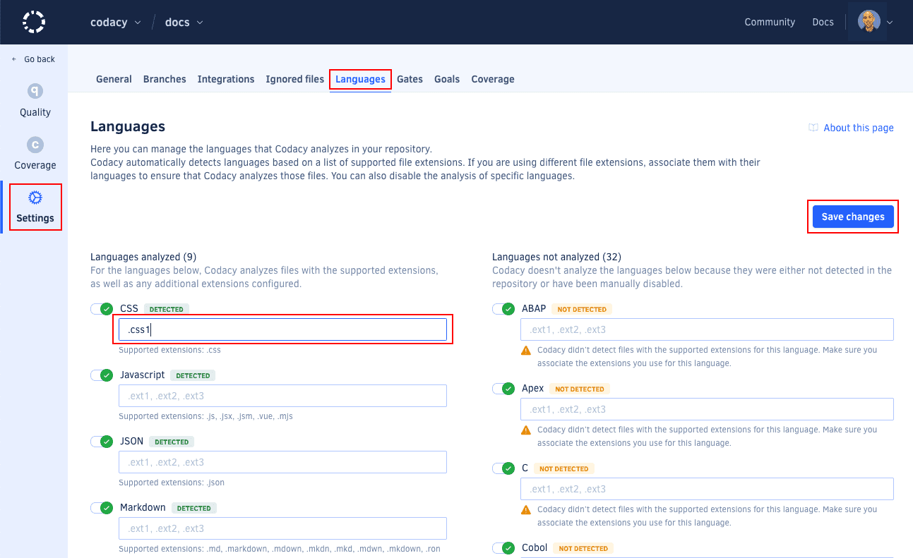

# Configuring file extensions

If your repository has source files with unrecognized extensions, you can force Codacy to include them in the next analysis:

1.  Go to your repository's **Settings**, **File Extensions**.

    

2.  Add the extensions you want to be recognized for each language.

3.  After clicking **Save**, you will be given the opportunity to retry the most recent commit with the new settings by clicking **Analyze now!** on the message that appears near the footer of the page.

    
