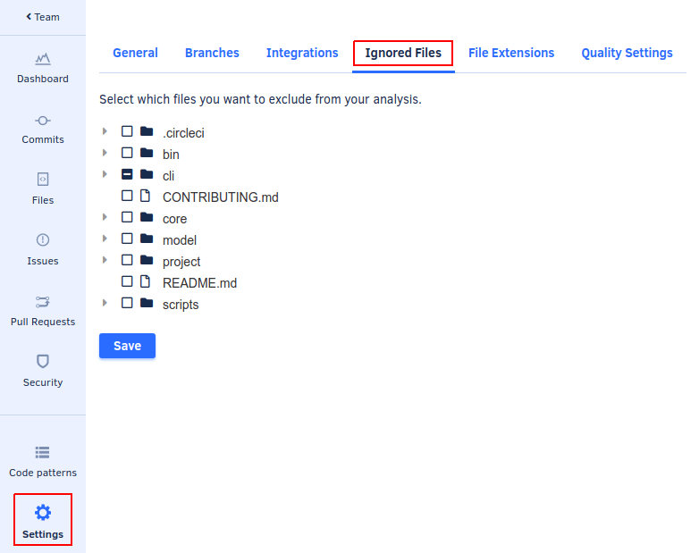

# Ignore files from Codacy analysis

In some situations, you may want to exclude files from Codacy's analyses.

You can exclude files from your repository analysis by opening your repository **Settings**, tab **Ignored Files**, and selecting the files you want to ignore. This view only shows the files on your main branch.



In some cases, you can also ignore some files using your own configuration files although this depends on this option being supported by the tool itself. If you need more flexibility in ignoring files, such as selecting only specific analysis categories (duplication, metrics, or coverage) or specific tools, use the [Codacy configuration file](codacy-configuration-file.md).

By default, Codacy also ignores files matching the following regular expressions:

```text
.*[\.-]min\.css
.*[\.-]min\.js
.*node_modules/.*
.*bower_components
.*vendor/.*
.*third[_-]?[Pp]arty
.*docs?/.*
.*samples
.*releases?/.*
.*builds
.*dist/.*
.*external
.*libs/.*
.*d3\.js
.*angular(-resource|)?\.js
.*select2(-resource|)?\.js
.*-ace\.js
.*typeahead\.js
.*jquery-ui\.js
.*reveal\.js
.*three\.js
.*chart\.js
.*jquery\.js
.*underscore\.js
.*lodash\.js
.*bootstrap\.js
.*bootstrap\.css
.*font-awesome\.css
```
