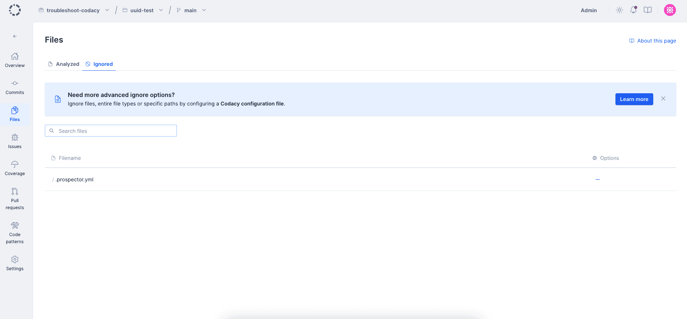

# Ignoring files

In some situations, you may want to ignore or exclude files from the Codacy analysis.

To exclude files from your repository analysis open your repository **Settings**, tab **Ignored Files**, and select the files you want to ignore. This view only shows the files on your main branch.



You can also ignore files using your own tool configuration files, although this depends on the option being supported by each tool.

If you need more flexibility in ignoring files, such as selecting only specific analysis categories (duplication, metrics, or coverage) or specific tools, [use a Codacy configuration file](codacy-configuration-file.md) instead.

By default, Codacy also ignores files matching the following regular expressions:

```text
.*[\.-]min\.css
.*[\.-]min\.js
.*node_modules/.*
.*bower_components
.*vendor/.*
.*third[_-]?[Pp]arty
.*docs?/.*
.*samples
.*releases?/.*
.*builds
.*dist/.*
.*external
.*libs/.*
.*d3\.js
.*angular(-resource|)?\.js
.*select2(-resource|)?\.js
.*-ace\.js
.*typeahead\.js
.*jquery-ui\.js
.*reveal\.js
.*three\.js
.*chart\.js
.*jquery\.js
.*underscore\.js
.*lodash\.js
.*bootstrap\.js
.*bootstrap\.css
.*font-awesome\.css
```
