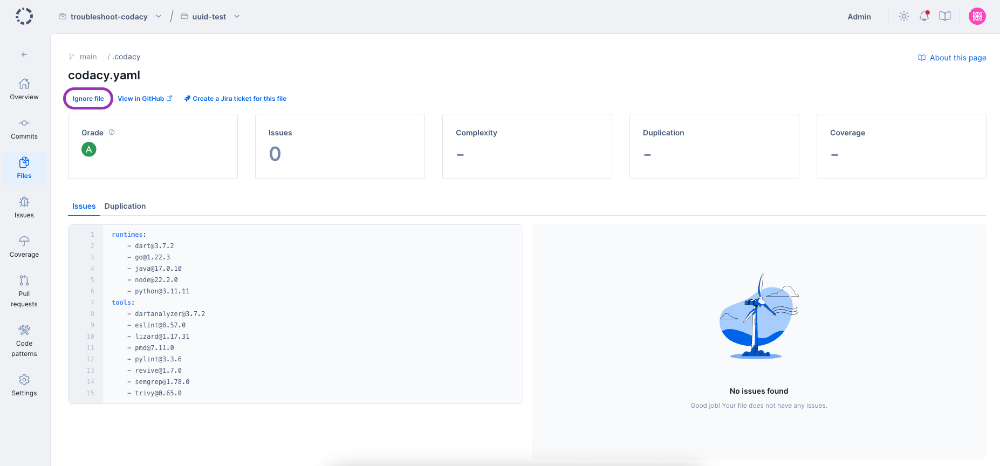
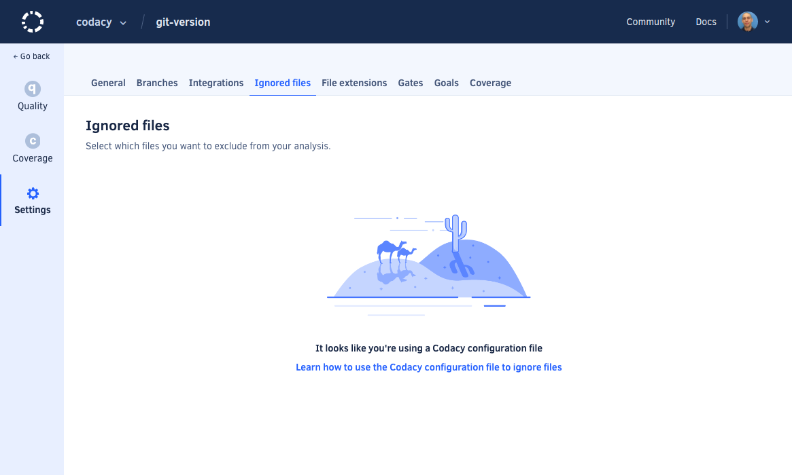

# Ignoring files



In some situations, you may want to ignore or exclude files from the Codacy analysis.

To exclude files from your repository analysis open your repository **Files**, page. From there, you can select a file and exclude it by clicking on the Ignore file button.



To view the current excluded files, select the **Ignored** tab on the same page.


!!! note
    -   See below the files that Codacy [ignores by default](#default-ignored-files).

    -   You can also ignore files using your own [tool configuration files](configuring-code-patterns.md#using-your-own-tool-configuration-files), although this depends on the option being supported by each tool.

    -   
    
    -  When excluding files from **Duplication** analysis, you must state the **entire path** to the files. Unlike quality analysis, wildcards will not work, resulting in files not being excluded.

If you need more flexibility in ignoring files, use a Codacy configuration file to [define a custom list of file paths to exclude](codacy-configuration-file.md#syntax-for-ignoring-files).

!!! important
    If your repository has a [Codacy configuration file](codacy-configuration-file.md), the **Ignored files** settings defined on the Codacy UI don't apply and you must [ignore files using the configuration file](codacy-configuration-file.md#ignore-files) instead.



## Default ignored files

By default, Codacy ignores all the files that match the regular expressions below. If you need to analyze files that match these regular expressions, use a Codacy configuration file to [define a custom list of file paths to include](./codacy-configuration-file.md#include-files).

```text
.*[\.-]min\.css
.*[\.-]min\.js
.*node_modules/.*
.*bower_components/.*
.*vendor/.*
.*third[_-]?[Pp]arty/.*
.*samples?/.*
.*releases?/.*
.*builds?/.*
.*dist/.*
.*external/.*
.*libs/.*
.*d3\.js
.*angular(-resource|)?\.js
.*select2(-resource|)?\.js
.*-ace\.js
.*typeahead\.js
.*jquery-ui\.js
.*reveal\.js
.*three\.js
.*chart\.js
.*jquery\.js
.*underscore\.js
.*lodash\.js
.*bootstrap\.js
.*bootstrap\.css
.*font-awesome\.css
.*\.[Dd]esigner\.cs
```
