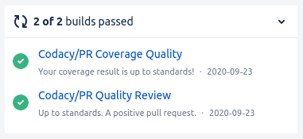
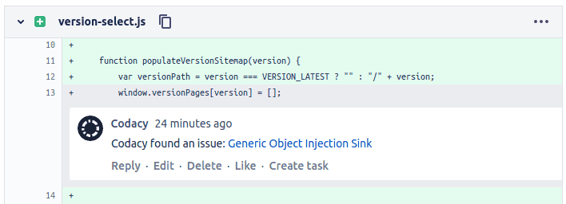
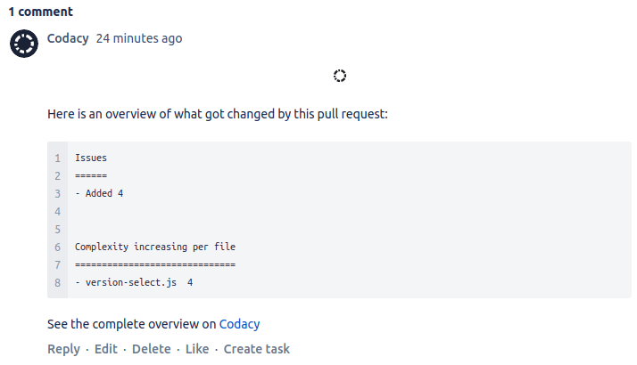

# Bitbucket integration

The Bitbucket integration incorporates Codacy on your existing Git provider workflows by reporting issues and the analysis status directly on your pull requests.

When the integration is enabled, you can also create pull request comments and Jira issues directly from Codacy when [browsing the existing issues](../../repositories/issues.md) on the repository:

## Enabling the Bitbucket integration {: id="enabling"}

To enable the Bitbucket integration, open your repository **Settings**, tab **Integrations**. When you add a new repository, the integration is already enabled by default with the [settings defined for your organization](../../organizations/default-git-provider-integration.md).

If you remove the integration, you can enable it again as follows:

1.  Click the button **Add integration** and select **Bitbucket** on the list.
1.  Click the button **Enable** and follow the instructions.

    !!! important
        The user that enables the integration [must have administrator access to the repository](../../organizations/roles-and-permissions-for-organizations.md#permissions-for-bitbucket). Codacy uses this Bitbucket user to create comments on pull requests.

    

## Configuring the Bitbucket integration {: id="configuring"}

To change the configuration of the Bitbucket integration, open your repository **Settings**, tab **Integrations**.

Depending on the options that you enable, Codacy will automatically update pull requests on Bitbucket with extra information when accepting pull requests:

### Pull Request Status

Adds a report to your pull requests showing whether your pull requests and coverage are up to standards or not as configured on the [quality gate rules](../../repositories-configure/adjusting-quality-gates.md) for your repository. You can then optionally [block merging pull requests that aren't up to standards](../../getting-started/integrating-codacy-with-your-git-workflow.md#blocking-pull-requests).



### Pull Request Comment

Adds comments on the lines of the pull request where Codacy finds new issues. Click on the links to open Codacy and see more details about the issues and how to fix them.

### Pull Request Summary

!!! note "This feature isn't available for Bitbucket Server"

Shows an overall view of the changes in the pull request, including new issues and metrics such as complexity and duplication.

## See also

-   [Integrating Codacy with your Git workflow](../../getting-started/integrating-codacy-with-your-git-workflow.md)
