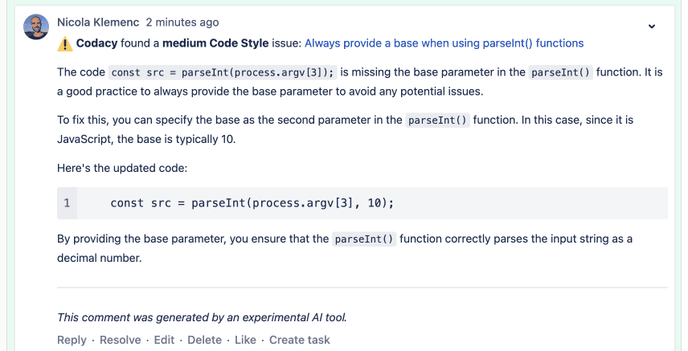
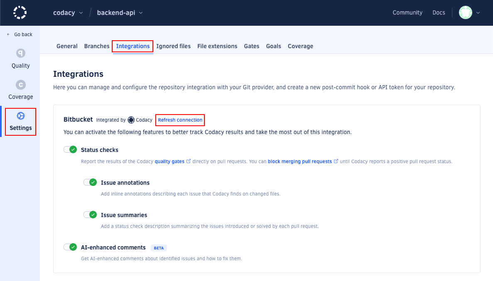
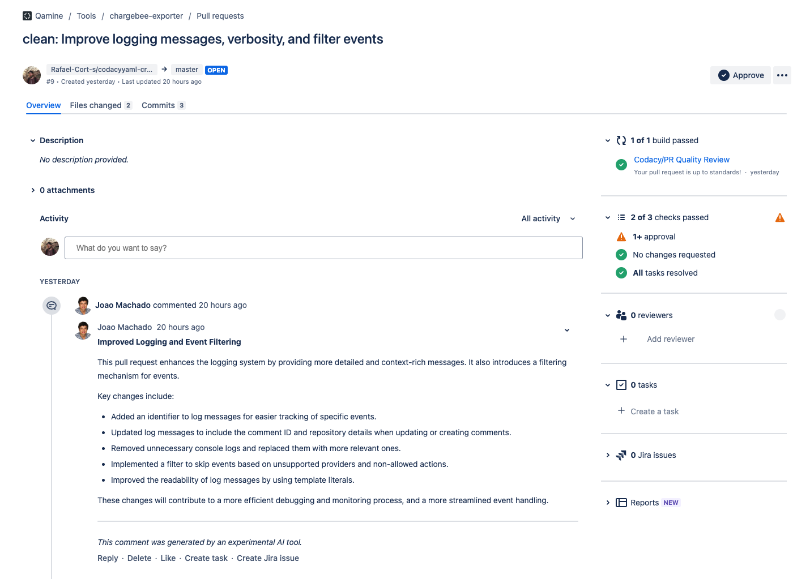

# Bitbucket integration

The Bitbucket integration incorporates Codacy on your existing Git provider workflows by reporting issues and the analysis status directly on your pull requests.

When you add a new repository, Codacy sets the Bitbucket integration using the [default settings for your organization](../../organizations/integrations/default-git-provider-integration-settings.md). You can then [customize the settings](#configuring) for the repository.


!!! important
    Codacy uses the Bitbucket user who added the repository to create comments on pull requests. If that user loses access to the repository, a repository admin must [refresh the Bitbucket integration](#refreshing).

## Configuring the Bitbucket integration {: id="configuring"}

To configure the Bitbucket integration, open your repository **Settings**, tab **Integrations**.

Depending on the options that you enable, Codacy will automatically update pull requests on Bitbucket with extra information when accepting pull requests.



### Status checks {: id="pull-request-status"}

Adds a report to your pull requests showing whether your pull requests and coverage are up to standards or not as configured on the [quality gate rules](../../repositories-configure/adjusting-quality-gates.md) for your repository. You can then optionally [block merging pull requests that aren't up to standards](../../getting-started/integrating-codacy-with-your-git-workflow.md#blocking-pull-requests).




### Issue annotations {: id="pull-request-comment"}

Adds comments on the lines of the pull request where Codacy finds new issues. Click on the links to open Codacy and see more details about the issues and how to fix them. To enable this option, you must enable **Status checks** first.


### Issue summaries {: id="pull-request-summary"}

!!! note "This feature isn't available for Bitbucket Server"

Shows an overall view of the changes in the pull request, including new issues and metrics such as complexity and duplication. To enable this option, you must enable **Status checks** first.


### AI-Enhanced Comments

Adds AI-enhanced comments with insights to help you fix identified issues.





## Refreshing the Bitbucket integration {: id="refreshing"}

If the user who added the repository to Codacy loses access to the repository, which may happen when the user leaves the team or the organization, Codacy won't be able to create comments on pull requests.

In this situation, another user with [administrator access to the repository](../../organizations/roles-and-permissions-for-organizations.md#permissions-for-bitbucket) needs to refresh the Bitbucket integration:



1.  Open the repository **Settings**, tab **Integrations**.

1.  On the Bitbucket integration area, click the link **Refresh connection**.

    

After refreshing the integration, Codacy will use the logged in Bitbucket user to create comments on new pull requests.

## Generating automatic pull request summaries

!!! info "This is a preview feature"
    This is an upcoming Codacy feature. If you're interested, contact <a href="mailto:support@codacy.com">support@codacy.com</a> for early access.

Codacy can provide a clear, high-level summary of the code changes introduced by a pull request, based on the committed code.
Codacy generates an overview of the changes in the pull request so that any reviewer can understand its intent and impact.



!!! note
    -   This feature uses only AWS services within Codacy's existing infrastructure. No information is shared with any other third party or used to train AI models.
    -   Summaries are generated using the pull request title, branch name, commit messages, and changes diff.

To enable this feature, add the following to the [Codacy configuration file](../codacy-configuration-file.md) `.codacy.yaml` in the root of your repository:

```yaml
---
reviews:
  high_level_summary: true
```

You can also enable this feature across your organization by creating the above file in the root of a repository named `.codacy`. This file will be used as the default configuration for all repositories in the organization and overridden by repository-specific configuration files.

Once enabled, summaries will be created when pull requests are opened and updated at each commit to reflect any changes to the pull request.

Pull requests opened by bots, such as Dependabot, are ignored.

If you see duplicated comments posted by Codacy on the same pull request, please ensure that your repository only has one configured webhook for Codacy.

## See also

-   [Integrating Codacy with your Git workflow](../../getting-started/integrating-codacy-with-your-git-workflow.md)
