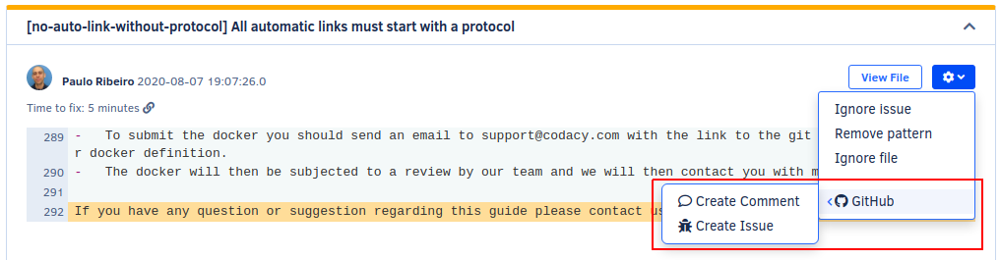
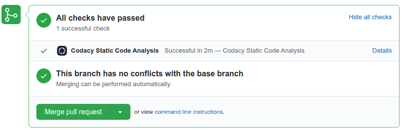
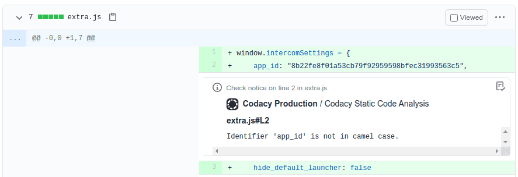
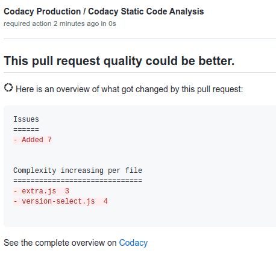
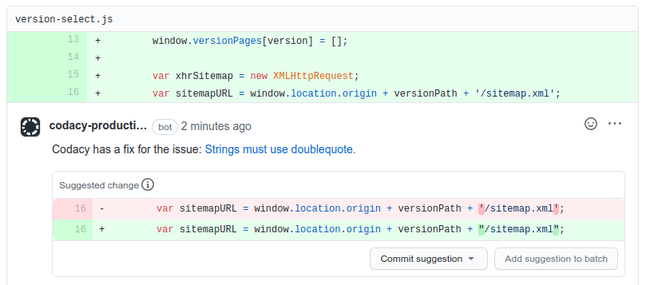

# GitHub integration

The GitHub integration incorporates Codacy on your existing Git provider workflows.

When the integration is enabled, you can create pull request comments and GitHub issues directly from Codacy when browsing the existing issues on the repository:

Depending on the configuration of the GitHub integration, Codacy can also report and notify you about issues directly on your pull requests.

## Enabling the GitHub integration {: id="enabling"}

To enable the GitHub integration, open your repository **Settings**, tab **Integrations**. When you add a new repository, the integration is already enabled by default.

If you remove the integration, you can enable it again as follows:

1.  Click the button **Add integration** and select **GitHub** on the list.
1.  Click the button **Enable** and follow the instructions.

    !!! important
        The user that enables the integration must have administrator access to the repository. Codacy uses this GitHub user to [suggest fixes](#suggest-fixes) on pull requests.

## Configuring the GitHub integration

To configure the GitHub integration, open your repository **Settings**, tab **Integrations**.

Depending on the options that you enable, Codacy will automatically update pull requests on GitHub with extra information when accepting pull requests:

### Status checks

Adds a report to your pull requests showing whether your pull requests and coverage are up to standards or not as configured on the [quality settings](../../repositories-configure/adjusting-quality-settings.md) of your repository. To see the coverage status check, ensure that you enable the option **Coverage** in the quality settings.

!!! tip
    After enabling this option, you can [set Codacy as a required check](../../faq/repositories/how-do-i-set-codacy-as-a-required-check-to-merge-prs.md#github) before merging your pull requests.

### Annotations

Adds annotations on the lines of the pull request where Codacy finds new issues. Codacy maps the severity of the issues reported by the tools to the severity levels of the annotations. To enable this option, you must enable **Status checks** first.

### Summary

Shows an overall view of the changes in the pull request, including new issues and metrics such as complexity and duplication. To enable this option, you must enable **Status checks** first.

### Suggested fixes {: id="suggest-fixes"}



Adds comments on the lines of the pull request where Codacy finds new issues with suggestions on how to fix the issues. Codacy doesn't apply any changes automatically. To apply the changes, [manually review and accept the suggestions](https://docs.github.com/en/github/collaborating-with-issues-and-pull-requests/incorporating-feedback-in-your-pull-request#applying-suggested-changes).

!!! note
    This feature is in early access and has the following limitations for now:

    -   The only supported Git providers are GitHub Cloud and GitHub Enterprise.
    -   The only two tools that suggest fixes are [ESLint](https://eslint.org/docs/rules/) and [markdownlint](https://github.com/DavidAnson/markdownlint/blob/main/doc/Rules.md). However, we're planning to support suggestions from more tools.
    -   Because of a limitation from GitHub, the author of the comments is the user that enabled the GitHub integration and not Codacy.

    📢 [Activate suggested fixes now](#enabling) and [let us know](mailto:support@codacy.com?subject=Feedback on Suggest fixes) what you think!
