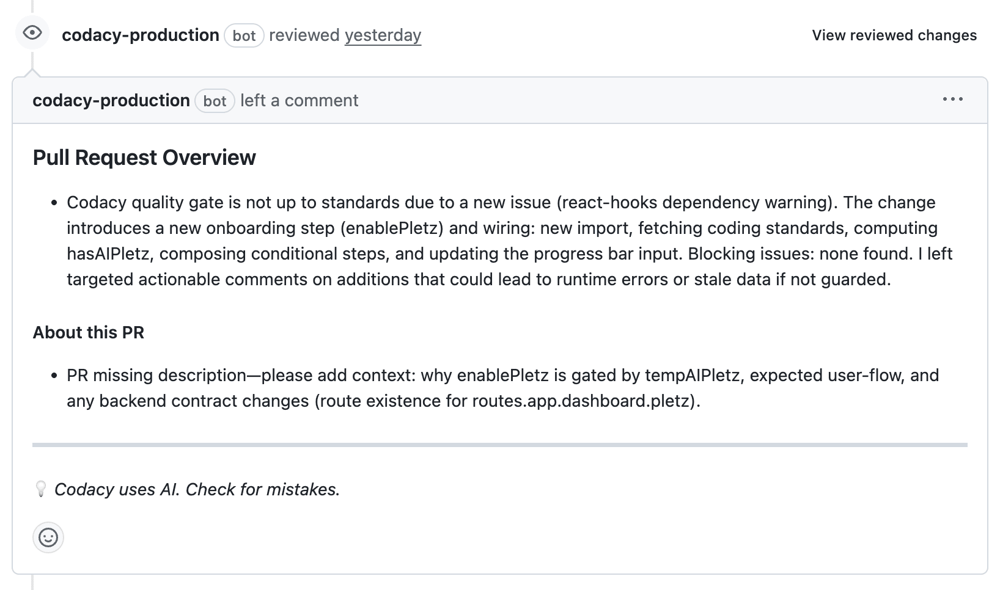
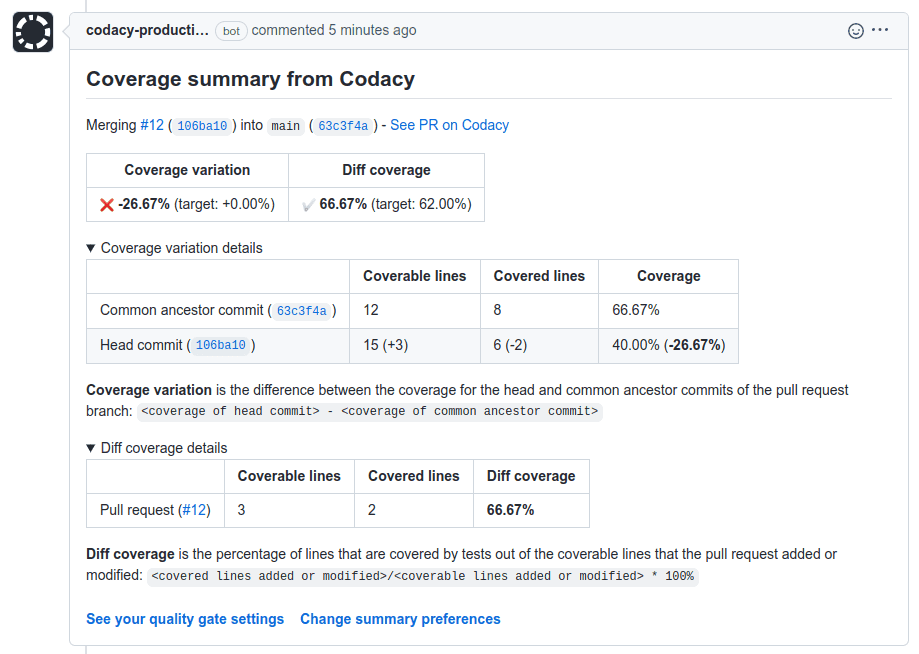
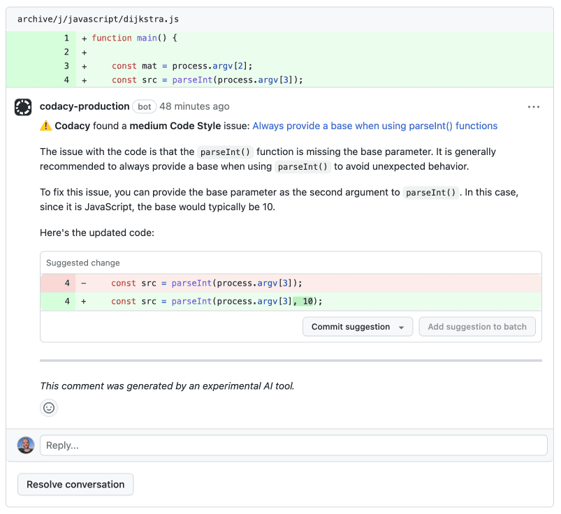

# GitHub integration

The GitHub integration incorporates Codacy on your existing Git provider workflows by reporting issues and the analysis status directly on your pull requests.

When you add a new repository, Codacy sets the GitHub integration using the [default settings for your organization](../../organizations/integrations/default-git-provider-integration-settings.md). You can then [customize the settings](#configuring) for the repository.

## Configuring the GitHub integration {: id="configuring"}

To configure the GitHub integration, open your repository **Settings**, tab **Integrations**.

Depending on the options that you enable, Codacy will automatically update pull requests on GitHub with extra information when accepting pull requests.



### Status checks

Adds a report to your pull requests showing whether your pull requests and coverage are up to standards or not as configured on the [quality gate rules](../../repositories-configure/adjusting-quality-gates.md) for your repository. You can then optionally [block merging pull requests that aren't up to standards](../../getting-started/integrating-codacy-with-your-git-workflow.md#blocking-pull-requests).



### AI Reviewer

The AI Reviewer combines the reliability of deterministic, rule-based static code analysis with the power of AI. It draws in the necessary context from source code and PR metadata to ensure the business intent matches the technical outcome, and can catch logic gaps that conventional scanners (and human reviewers) often miss.

It provides feedback on missing or weak tests, complex or duplicated code, and keeps security concerns up to date. Beyond that, it adds contextual insights about whether the changes follow the requirements, business rules, and logic used in the project.

!!! note
    This feature is only supported on GitHub.

### Issue annotations

Adds annotations on the lines of the pull request where Codacy finds new issues. Codacy maps the severity of the issues reported by the tools to the severity levels of the annotations. To enable this option, you must enable **Status checks** first.

### Issue summaries

Shows an overall view of the changes in the pull request, including new issues and metrics such as complexity and duplication. To enable this option, you must enable **Status checks** first.

### Coverage summaries

Adds a pull request comment showing an overall view of the coverage metrics for the pull request, including details about the data that Codacy used to calculate the coverage variation and diff coverage metrics.

When there are new coverage results, Codacy updates the last coverage summary comment if it's included in the last 5 comments of the pull request. Otherwise, Codacy creates a new comment.

!!! important
    **To get coverage summaries** you must also [add coverage to your repository](../../coverage-reporter/index.md).

!!! note
    This feature is only supported on GitHub and GitLab Cloud.

### Suggested fixes {: id="suggest-fixes"}



Adds comments on the lines of the pull request where Codacy finds new issues with suggestions on how to fix the issues. Codacy doesn't apply any changes automatically. To apply the changes, [manually review and accept the suggestions](https://docs.github.com/en/pull-requests/collaborating-with-pull-requests/reviewing-changes-in-pull-requests/incorporating-feedback-in-your-pull-request#applying-suggested-changes).

!!! tip
    Enable also **AI-enhanced comments** to get ready-to-commit AI-generated fixes.

### AI-enhanced comments

Adds AI-enhanced comments, providing insights and ready-to-commit AI-generated fixes for identified issues in cases where tool-suggested fixes are not supported. To enable this option, you must enable **Suggested fixes** first.



## See also

-   [Integrating Codacy with your Git workflow](../../getting-started/integrating-codacy-with-your-git-workflow.md)
