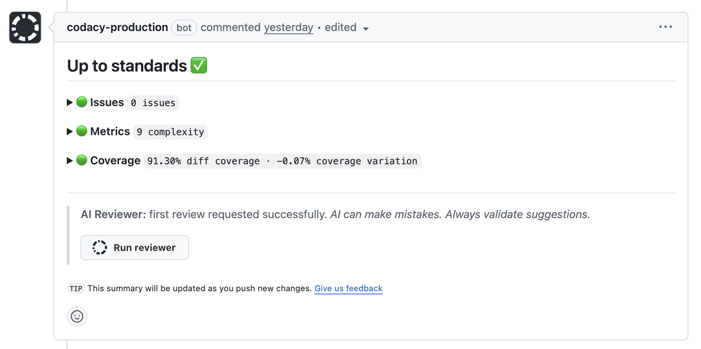

# GitHub integration

The GitHub integration incorporates Codacy on your existing Git provider workflows by reporting issues and the analysis status directly on your pull requests.

When you add a new repository, Codacy sets the GitHub integration using the [default settings for your organization](../../organizations/integrations/default-git-provider-integration-settings.md). You can then [customize the settings](#configuring) for the repository.

## Configuring the GitHub integration {: id="configuring"}

To configure the GitHub integration, open your repository **Settings**, tab **Integrations**.

Depending on the options that you enable, Codacy will automatically update pull requests on GitHub with extra information when accepting pull requests.



### Status checks

Adds a report to your pull requests showing whether your pull requests and coverage are up to standards or not as configured on the [quality gate rules](../../repositories-configure/adjusting-quality-gates.md) for your repository. You can then optionally [block merging pull requests that aren't up to standards](../../getting-started/integrating-codacy-with-your-git-workflow.md#blocking-pull-requests).

!!! important
    For open source repositories on GitHub, Codacy will not run analysis if **Status checks** is disabled. Make sure this setting is enabled to keep analysis running.



### Pull request summary {: id="pull-request-summary"}



!!! note
    This feature is only supported on GitHub.

When enabled, Codacy posts a comment on your pull requests each time a new analysis completes. The comment shows the quality gate result and breaks down issues, metrics (complexity and duplication), and coverage (diff coverage and coverage variation), giving you a full picture of the impact of your changes without leaving GitHub.

#### Enable AI Reviewer {: id="ai-reviewer"}

When enabled, the AI Reviewer posts a standalone code review on the pull request and adds a trigger section to the pull request summary comment, allowing you to run the reviewer on demand. When disabled, the trigger section does not appear in the pull request summary comment.

The AI Reviewer combines the reliability of deterministic, rule-based static code analysis with the enhanced context and prioritization capabilities of AI. It draws in the necessary context from PR metadata, Jira ticket if [integration exists](../../organizations/integrations/jira-integration.md), source code, and Codacy data to ensure the business intent matches the technical outcome, and can catch logic gaps that conventional scanners (and human reviewers) often miss.

It provides feedback on missing or weak tests, complex or duplicated code, and keeps security concerns up to date. Beyond that, it adds contextual insights about whether the changes follow the requirements, business rules, and logic used in the project.

Configure when the AI Reviewer runs using the **Run reviewer** setting:

| Mode | Behaviour |
|------|-----------|
| Automatically (first review only) | Codacy runs the reviewer once automatically when the pull request is opened, then requires manual triggering for subsequent updates. |
| Manually | Click **Run Reviewer** in the pull request summary comment or call our [public API](https://api.codacy.com/api/api-docs#triggerpullrequestaireview) to trigger a review on demand. |

!!! tip
    Improve the AI Reviewer results by providing custom instructions. [Learn how to do it here](../../codacy-ai/codacy-ai.md#custom-instructions).

### Issue annotations

Adds annotations on the lines of the pull request where Codacy finds new issues. Codacy maps the severity of the issues reported by the tools to the severity levels of the annotations. To enable this option, you must enable **Status checks** first.

### Issue summaries

Shows an overall view of the changes in the pull request, including new issues and metrics such as complexity and duplication. To enable this option, you must enable **Status checks** first.

### Suggested fixes {: id="suggest-fixes"}



Adds comments on the lines of the pull request where Codacy finds new issues with suggestions on how to fix the issues. Codacy doesn't apply any changes automatically. To apply the changes, [manually review and accept the suggestions](https://docs.github.com/en/pull-requests/collaborating-with-pull-requests/reviewing-changes-in-pull-requests/incorporating-feedback-in-your-pull-request#applying-suggested-changes).

## Merge queues {: id="merge-queues"}

To support GitHub **merge queues**, our GitHub App requires **Merge Groups** permissions so it can listen for and respond to the `checks_requested` action for merge group events.

When a merge group event is triggered for a pull request in the merge queue, Codacy automatically sends a green status check for **Codacy Static Code Analysis** to the relevant commit. By the time a pull request enters the merge queue, it has already gone through Codacy's analysis — either receiving a green status or being manually bypassed. Since the pull request was already unblocked before joining the queue, always responding with green is a safe and practical approach that keeps things moving without unnecessary friction.

## See also

-   [Integrating Codacy with your Git workflow](../../getting-started/integrating-codacy-with-your-git-workflow.md)
