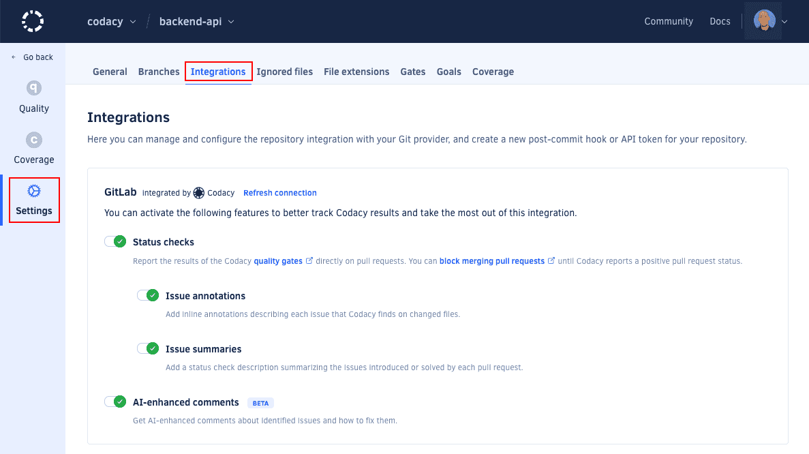
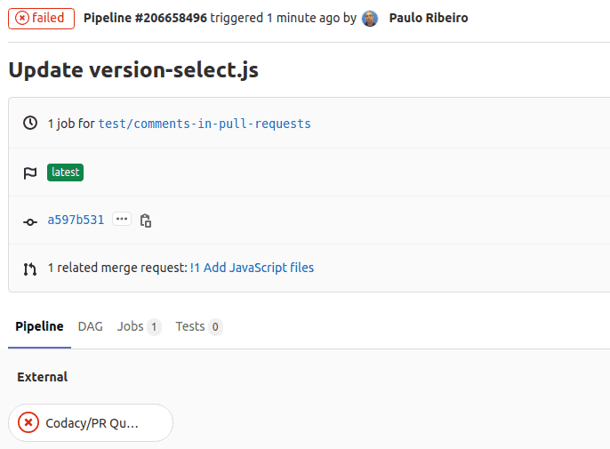
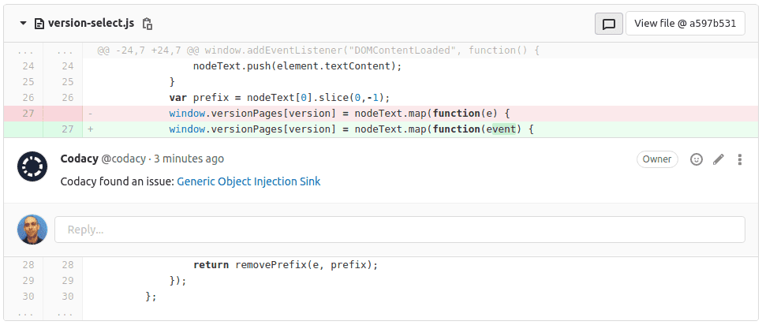
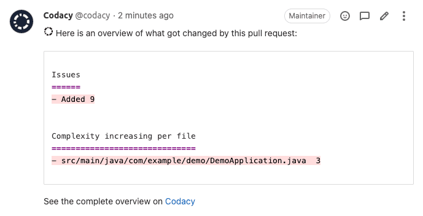

# GitLab integration

The GitLab integration incorporates Codacy on your existing Git provider workflows.

Depending on the configuration of the GitLab integration, Codacy can report and notify you about issues directly on your merge requests.

## Enabling the GitLab integration {: id="enabling"}

To enable the GitLab integration, open your repository **Settings**, tab **Integrations**. When you add a new repository, the integration is already enabled by default.

If you remove the integration, you can enable it again as follows:

1.  Click the button **Add integration** and select **GitLab** on the list.
1.  Click the button **Enable** and follow the instructions.

    !!! important
        The user that enables the integration must have administrator access to the repository. Codacy uses this GitLab user to create comments on merge requests.

    

## Configuring the GitLab integration

To configure the GitLab integration, open your repository **Settings**, tab **Integrations**.

Depending on the options that you enable, Codacy will automatically update merge requests on GitLab with extra information when accepting merge requests:

### Pull Request Status

Adds a report to your merge requests showing whether your merge requests and coverage are up to standards or not as configured on the [quality settings](../../repositories-configure/adjusting-quality-settings.md) of your project.

<!--NOTE Keep this admonition synced across all Git provider integrations -->
!!! important
    **To get a status for coverage** you must also:

    -   [Add coverage to your repository](../../coverage-reporter/index.md)
    -   Enable the rule **Coverage variation is under** on the [merge request quality gate](../../repositories-configure/adjusting-quality-settings.md#gates).

    **To block merging merge requests** that aren't up to standards you must [configure GitLab to only allow merge requests to be merged if the pipeline succeeds](https://docs.gitlab.com/ee/user/project/merge_requests/merge_when_pipeline_succeeds.html#only-allow-merge-requests-to-be-merged-if-the-pipeline-succeeds){: target="_blank"}.

### Pull Request Comment

Adds comments on the lines of the merge request where Codacy finds new issues. Click on the links to open Codacy and see more details about the issues and how to fix them.

### Pull Request Summary

Shows an overall view of the changes in the merge request, including new issues and metrics such as complexity and duplication.

