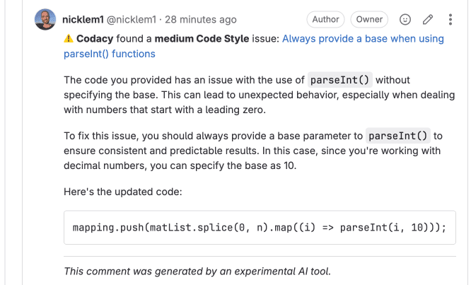

# GitLab integration

The GitLab integration incorporates Codacy on your existing Git provider workflows by reporting issues and the analysis status directly on your merge requests.

When you add a new repository, Codacy sets the GitLab integration using the [default settings for your organization](../../organizations/integrations/default-git-provider-integration-settings.md). You can then [customize the settings](#configuring) for the repository.

<!--TODO CY-6642 Update screenshot-->

!!! important
    Codacy uses the GitLab user who added the repository to create comments on merge requests. If that user loses access to the repository, a repository admin must [refresh the GitLab integration](#refreshing).

## Configuring the GitLab integration {: id="configuring"}

To configure the GitLab integration, open your repository **Settings**, tab **Integrations**.

Depending on the options that you enable, Codacy will automatically update merge requests on GitLab with extra information when accepting merge requests.



### Pull Request Status

Adds a report to your merge requests showing whether your merge requests and coverage are up to standards or not as configured on the [quality gate rules](../../repositories-configure/adjusting-quality-gates.md) for your project. You can then optionally [block merging merge requests that aren't up to standards](../../getting-started/integrating-codacy-with-your-git-workflow.md#blocking-pull-requests).



### Pull Request Comment

Adds comments on the lines of the merge request where Codacy finds new issues. Click on the links to open Codacy and see more details about the issues and how to fix them.

### AI-Enhanced Comments

Adds AI-enhanced comments with insights to help you fix identified issues.



### Pull Request Summary

Shows an overall view of the changes in the merge request, including new issues and metrics such as complexity and duplication.

## Refreshing the GitLab integration {: id="refreshing"}

If the user who added the repository to Codacy loses access to the repository, which may happen when the user leaves the team or the organization, Codacy won't be able to create comments on merge requests.

In this situation, another user with [administrator access to the repository](../../organizations/roles-and-permissions-for-organizations.md#permissions-for-gitlab) needs to refresh the GitLab integration:



1.  Open the repository **Settings**, tab **Integrations**.

1.  On the GitLab integration area, click the link **Refresh connection**.

    <!--TODO CY-6642 Update screenshot-->

After refreshing the integration, Codacy will use the logged in GitLab user to create comments on merge requests.

## See also

-   [Integrating Codacy with your Git workflow](../../getting-started/integrating-codacy-with-your-git-workflow.md)
