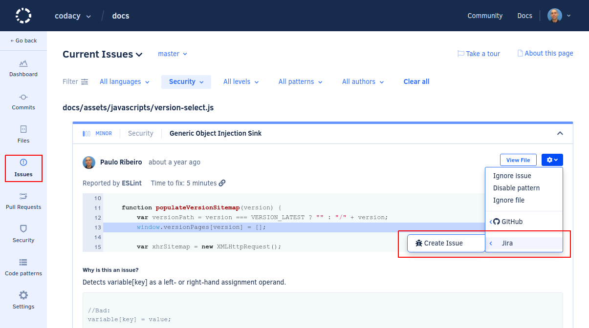
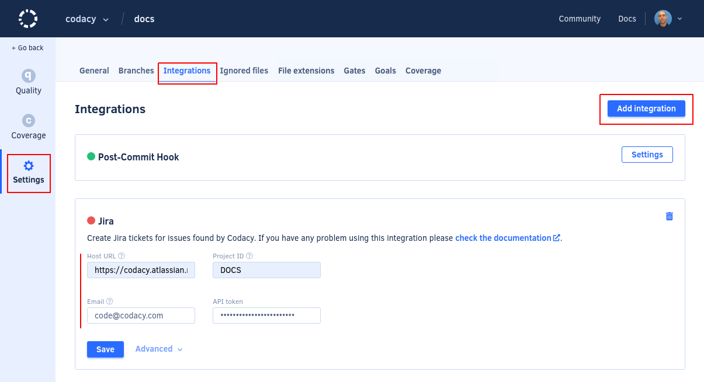

# Jira integration

The Jira integration incorporates Codacy on your existing Jira workflows.

When the integration is enabled, you can create issues on a Jira project directly from Codacy when browsing the existing issues on the repository:

## Enabling the Jira integration

To enable the Jira integration:

1.  Open your project **Settings**, tab **Integrations**.

1.  Click the button **Add integration** and select **Jira** on the list.

1.  Configure the Jira integration fields as follows:

    

    -   **Host URL:** Base URL of your Jira instance, including the protocol. For example, `https://mycompany.atlassian.net/`.
    -   **Repository ID:** Key of the Jira project where Codacy will create issues. You can obtain the project key from the prefix of Jira issue numbers in that project. For example, `DOCS` for a project with the issue DOCS-42.
    -   **Email:** Email address of the user account that Codacy will use to create new issues in Jira.
    -   **API token:** [Jira API token](https://confluence.atlassian.com/cloud/api-tokens-938839638.html#APItokens-CreateanAPItoken){: target="_blank"} for the user account that Codacy will use to create new issues in Jira. The Jira integration only supports HTTP basic authentication.

    !!! important
        It's recommended that you use a dedicated Jira account for the integration. Jira issues created by Codacy will appear as being reported by this user account.

1.  Click **Save** and make sure that Codacy can successfully establish a connection with Jira.

1.  Click **Advanced** to configure the issue type and any built-in or custom Jira fields of new issues created by Codacy.

    
